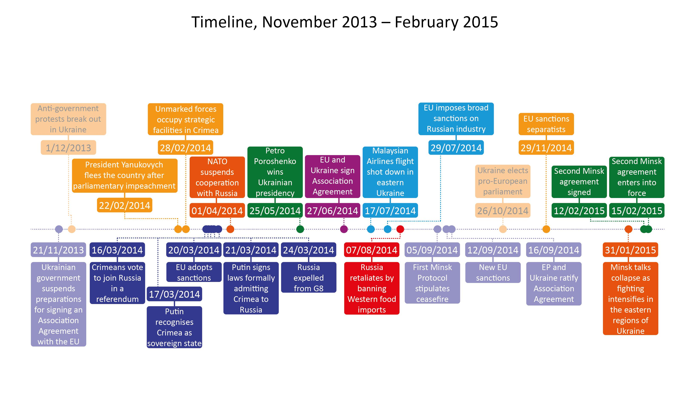
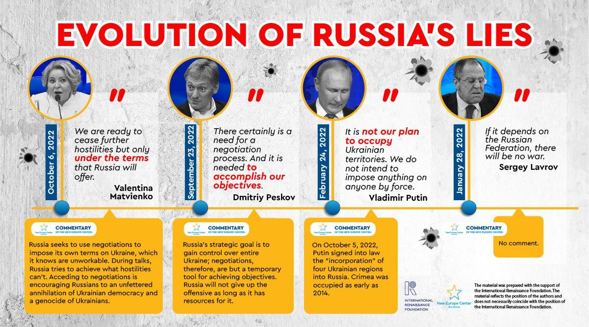

## Claim
Claim: "In early 2025, Ukraine and Russia had reached a peace deal in their years-long war."

## Actions
```
image_search("Ukraine Russia peace deal 2025")
```

## Evidence
### Evidence from `image_search`
CNN published an image from June 2, 2025, in Istanbul, showing a meeting with flags of Russia, Turkey, and Ukraine. ([Source](https://www.cnn.com/2025/06/02/europe/russia-ukraine-peace-talks-turkey-drone-attack-intl))  The Atlantic Council discusses a Putin-friendly peace deal. ([Source](https://www.atlanticcouncil.org/blogs/ukrainealert/a-putin-friendly-peace-deal-would-be-disastrous-for-global-security/)) 

The search result contains an image of a meeting in Istanbul on June 2, 2025, with flags of Russia, Turkey, and Ukraine. ([Source](https://www.cfr.org/article/russia-and-ukraine-agree-prisoner-swap)) 


## Elaboration
The evidence suggests that there were meetings between Russia and Ukraine in Istanbul in June 2025. However, the evidence does not explicitly state that a peace deal was reached in early 2025. The CNN article mentions peace talks, but it does not confirm a deal. The Atlantic Council discusses a potential peace deal, but it does not confirm that one was reached.

Therefore, the claim cannot be fully verified based on the provided evidence. More information is needed to confirm whether a peace deal was reached in early 2025.


## Actions
```
image_search("Ukraine Russia peace deal early 2025")
```

## Evidence
No new evidence found.

## Elaboration
The evidence shows meetings took place in Istanbul in June 2025, involving Russia, Turkey, and Ukraine. However, the evidence does not confirm that a peace deal was reached in early 2025. The search for additional evidence did not yield any new information.

Therefore, the claim remains unverified due to a lack of explicit confirmation of a peace deal in early 2025.


## Actions
```
image_search("Ukraine Russia war peace agreement timeline")
```

## Evidence
### Evidence from `image_search`
The European Parliament's search result provides a timeline from November 2013 to February 2015, detailing events related to the conflict between Ukraine and Russia, including the Minsk peace agreement.  Another search result from New Europe provides an image showing the "Evolution of Russia's Lies" with statements from October 6, 2022, to January 28, 2022. 

*   [https://epthinktank.eu/2015/02/13/minsk-peace-agreement-still-to-be-consolidated-on-the-ground/eprs-briefing-548991-minsk-peace-summit-fig1-timeline/](https://epthinktank.eu/2015/02/13/minsk-peace-agreement-still-to-be-consolidated-on-the-ground/eprs-briefing-548991-minsk-peace-summit-fig1-timeline/)
*   [https://www.aa.com.tr/en/russia-ukraine-war/ukraine-wants-countries-including-turkiye-as-security-guarantors/2549218](https://www.aa.com.tr/en/russia-ukraine-war/ukraine-wants-countries-including-turkiye-as-security-guarantors/2549218)
*   [https://neweurope.org.ua/en/media-post/peregovorna-pastka-putina-chomu-zahid-maye-dosluhatysya-do-ukrayiny/](https://neweurope.org.ua/en/media-post/peregovorna-pastka-putina-chomu-zahid-maye-dosluhatysya-do-ukrayiny/)


## Elaboration
The evidence provides timelines and discussions related to the Russia-Ukraine conflict, including the Minsk peace agreement. However, none of the evidence confirms that a peace deal was reached in early 2025. The search results show events from 2013-2015 and discussions about negotiations, but they do not provide any information about a peace deal in early 2025.

Therefore, the claim remains unverified.


## Final Judgement
The search results show meetings and discussions related to the Russia-Ukraine conflict, including a meeting in Istanbul in June 2025. However, the evidence does not explicitly confirm that a peace deal was reached in early 2025. The available information is insufficient to verify the claim.

`false`


### Verdict: FALSE

### Justification
The fact-check revealed evidence of meetings between Russia, Turkey, and Ukraine in Istanbul in June 2025, as shown in a [CNN article](https://www.cnn.com/2025/06/02/europe/russia-ukraine-peace-talks-turkey-drone-attack-intl). However, the provided sources do not explicitly confirm that a peace deal was reached in early 2025, thus the claim remains unverified.
