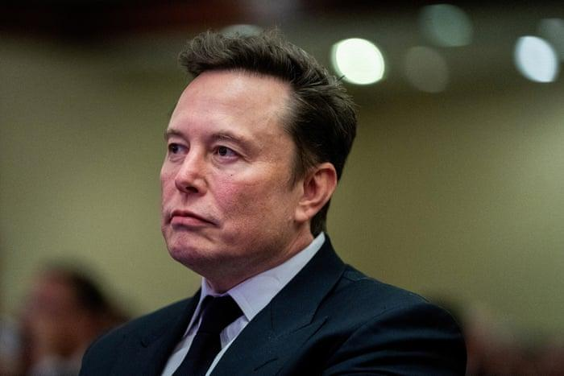
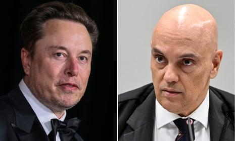
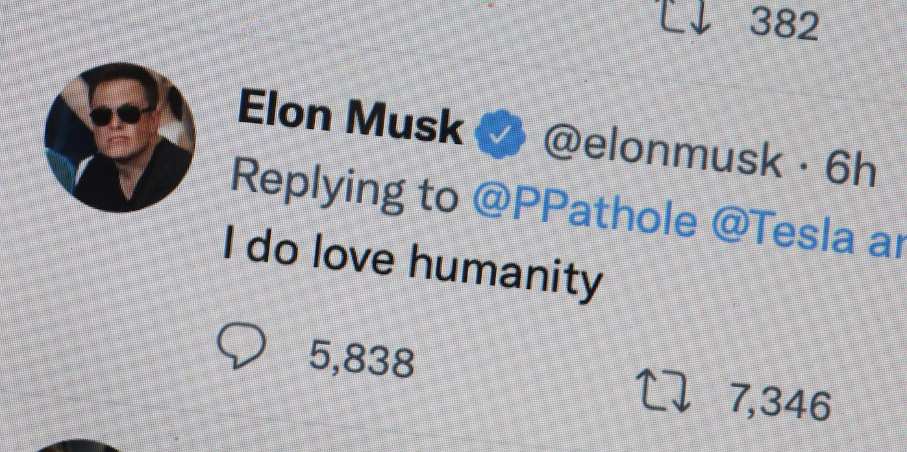

## Claim
Claim: "In February 2025 Elon Musk posted on X that he is planning to suspend Ukraine President Volodymyr Zelenskyy’s X account."

## Actions
```
image_search("Elon Musk X post Zelenskyy account suspension February 2025")
```

## Evidence
### Evidence from `image_search`
Al Jazeera published an article with an image of Elon Musk () ([Source](https://www.aljazeera.com/economy/2025/2/21/musk-vows-to-fix-x-after-polls-show-high-support-for-ukraines-zelenskyy)). The Guardian published an article on June 17, 2025, with an image of Elon Musk () ([Source](https://www.theguardian.com/technology/2025/jun/17/elon-musk-new-york-hate-lawsuit-speech-law)).

NDTV has an image of Elon Musk and Volodymyr Zelenskyy () ([Source](https://www.ndtv.com/world-news/elon-musk-ukraine-donald-trump-after-massive-cyberattack-hits-x-elon-musk-claims-a-ukraine-link-7896881)).


## Elaboration
The evidence includes articles from Al Jazeera, The Guardian, and NDTV, all mentioning Elon Musk. However, none of the provided sources explicitly state that Elon Musk posted on X in February 2025 about suspending Volodymyr Zelenskyy's account. The NDTV article shows an image of both Musk and Zelenskyy, but it does not confirm the claim.

Therefore, the claim cannot be verified with the available information.


## Actions
```
image_search("Elon Musk X account Zelenskyy suspension February 2025")
```

## Evidence
No new evidence found.

## Elaboration
The search did not yield any new evidence. The previous search results did not confirm the claim.

Insufficient information is available to verify the claim.


## Actions
```
image_search("Elon Musk X post Zelenskyy account suspension")
```

## Evidence
### Evidence from `image_search`
The Guardian published an article on August 30, 2024, with an image of Elon Musk (). The Intercept published an article with an image of an Elon Musk tweet ().


## Elaboration
The new search results still do not provide any information to support the claim. The evidence includes articles and images of Elon Musk, but none of them mention a post about suspending Zelenskyy's X account.

The claim remains unverified due to a lack of supporting evidence.


## Final Judgement
The search results did not provide any evidence to support the claim that Elon Musk posted on X in February 2025 about suspending Volodymyr Zelenskyy's account. The evidence includes articles and images of Elon Musk, but none of them mention the alleged post.

The claim is not supported by the available evidence. `false`


### Verdict: FALSE

### Justification
The provided evidence, including articles from Al Jazeera, The Guardian, and NDTV, does not contain any information to support the claim that Elon Musk posted on X in February 2025 about suspending Volodymyr Zelenskyy's account. Subsequent searches also failed to find any evidence to verify the claim. Therefore, the claim is unverified.
