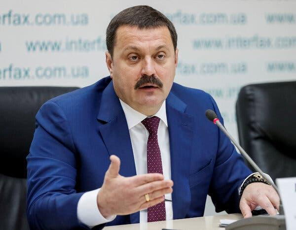
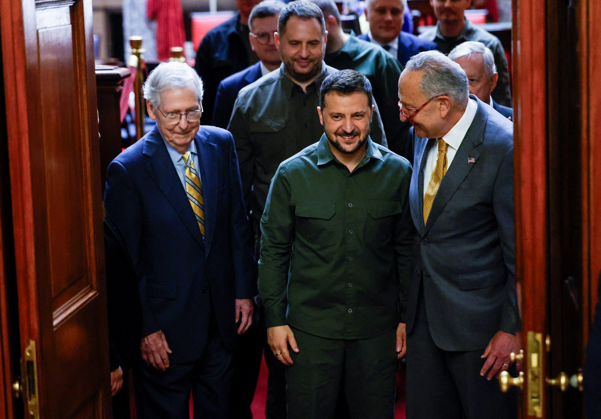
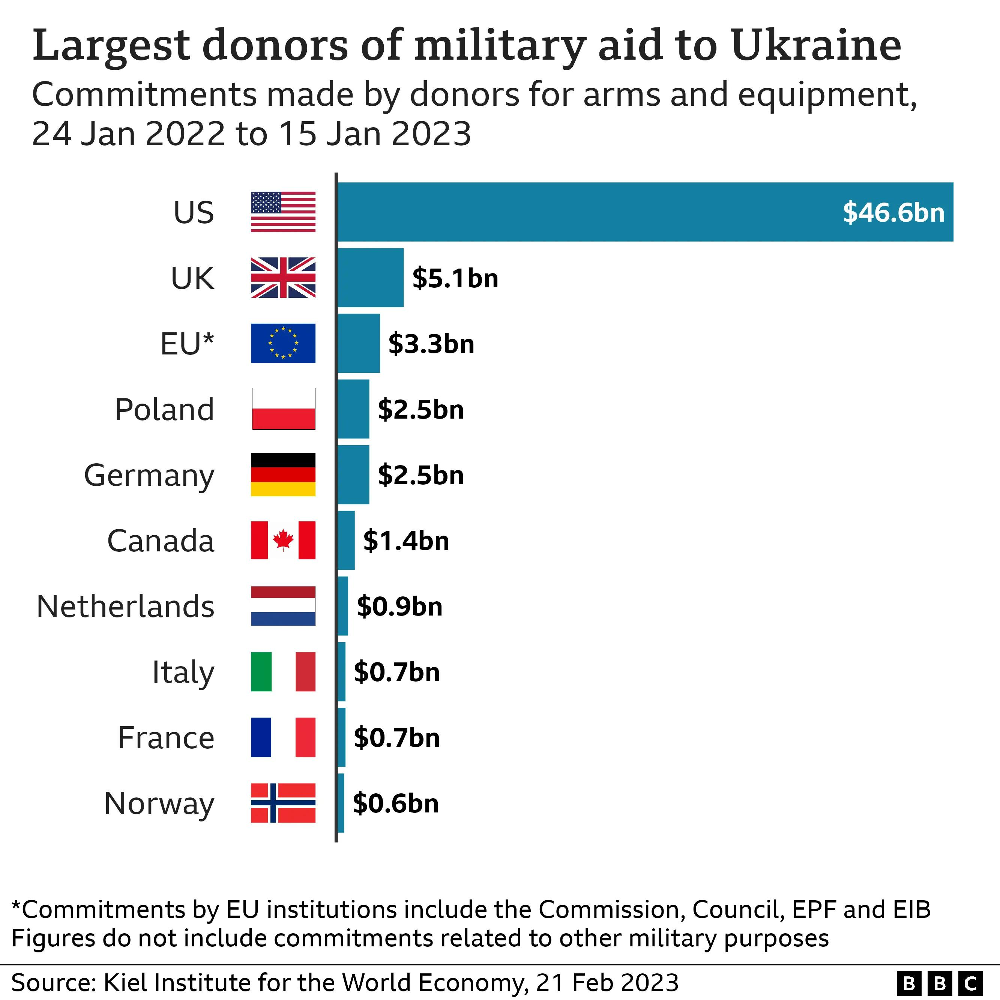
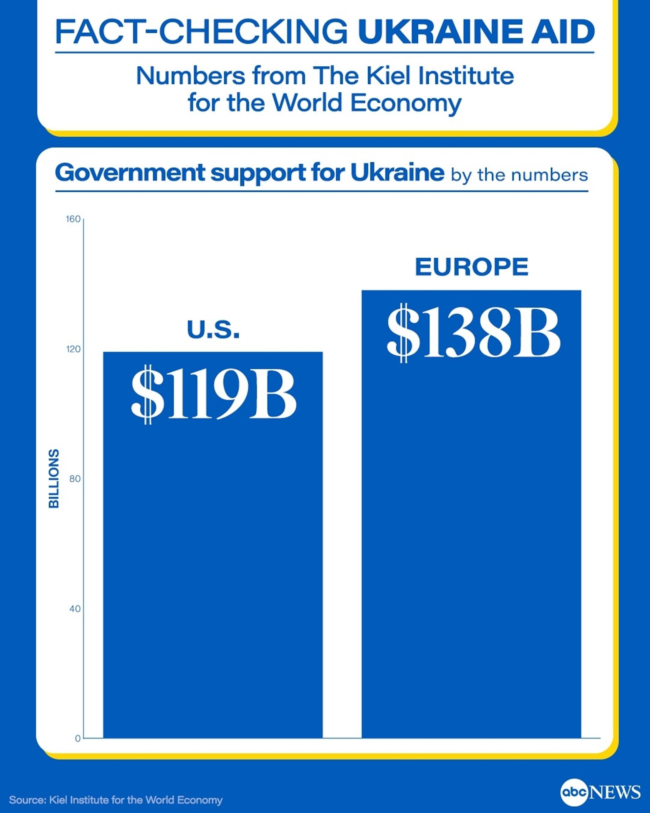
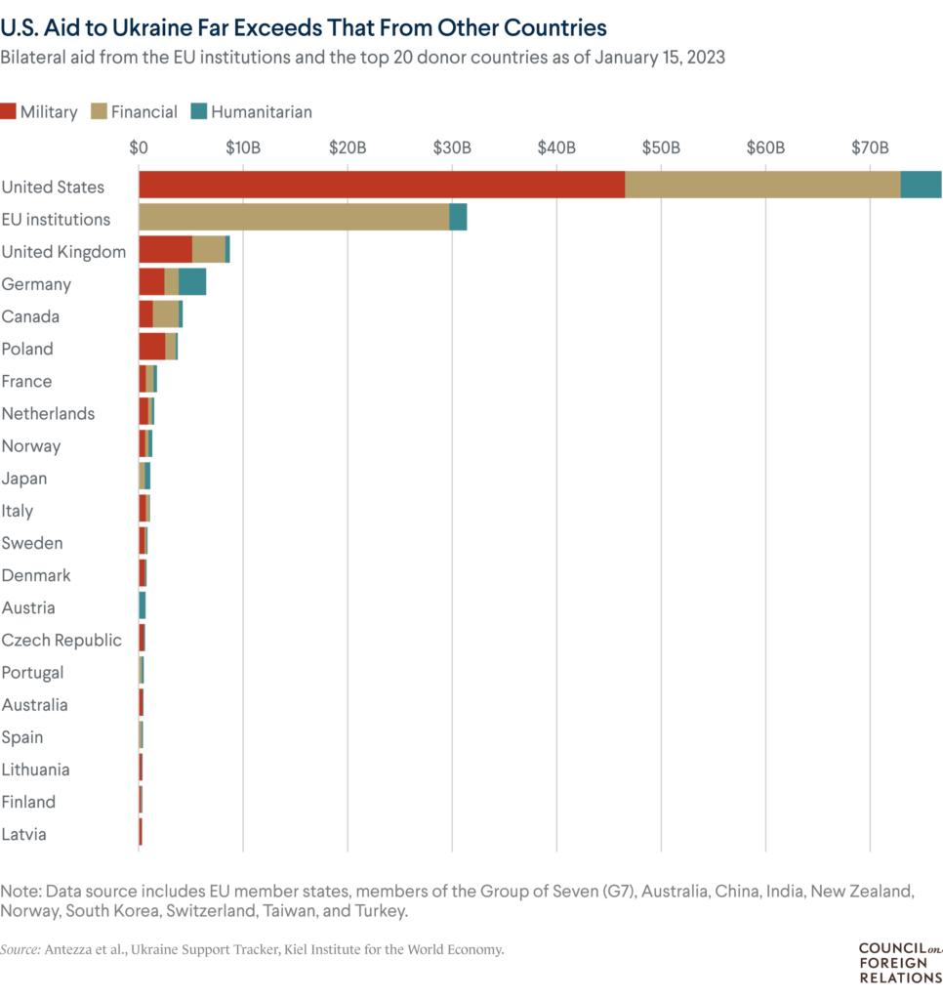

## Claim
Claim: "Half of all US aid to Ukraine was laundered and sent back to Democrat candidates for re-election."

## Actions
```
image_search("US aid Ukraine laundered Democrat candidates")
```

## Evidence
### Evidence from `image_search`
Reuters published an article on April 20, 2024, about the US House vote on a Ukraine aid package, which includes an image of a Ukrainian flag and an American flag in front of the Capitol Building (). The New York Times published an article about Andriy Derkach ().

A Politico article about Johnson on Ukraine aid stopgap was also found, but the content is not available.


## Elaboration
The evidence does not contain any information about the claim that half of the US aid to Ukraine was laundered and sent back to Democrat candidates. The search results mention a Reuters article about the US House vote on a Ukraine aid package and a New York Times article about Andriy Derkach. However, neither of these articles provides any details about the alleged laundering or the involvement of Democrat candidates.

The Politico article about Johnson on Ukraine aid stopgap is not available.

Therefore, the claim cannot be verified with the provided evidence.


## Actions
```
image_search("US aid to Ukraine corruption")
image_search("Ukraine aid laundered Democrat candidates")
```

## Evidence
### Evidence from `image_search`
The Institute for the Study of War published a fact sheet about US assistance to Ukraine, stating that US oversight is extensive and that Ukrainian government oversight and accountability are extensive and growing. The fact sheet includes an image comparing claims and facts about US aid to Ukraine (). CIPE published a report titled "Corruption Risk Assessment: Humanitarian Aid in Ukraine" in October 2024 (). The International Bar Association published an article about the delay of US aid to Ukraine, which includes an image of boxes with supplies ().

The provided sources are: [https://www.understandingwar.org/backgrounder/fact-sheet-us-assistance-ukraine](https://www.understandingwar.org/backgrounder/fact-sheet-us-assistance-ukraine), [https://www.cipe.org/resources/corruption-risk-assessment-humanitarian-aid-in-ukraine/](https://www.cipe.org/resources/corruption-risk-assessment-humanitarian-aid-in-ukraine/), and [https://www.ibanet.org/Russia-Ukraine-US-aid-delay-critical-as-country-looks-to-boost-frontline-fight](https://www.ibanet.org/Russia-Ukraine-US-aid-delay-critical-as-country-looks-to-boost-frontline-fight).


### Evidence from `image_search`
From [Source](https://cepa.org/article/ignore-the-noise-congress-can-still-pass-ukraine-aid/): 
Content: CEPA published an article that includes an image of Zelenskyy with McConnell and Schumer ().


## Elaboration
The evidence provides information about US aid to Ukraine, including oversight and accountability measures. The Institute for the Study of War states that US oversight is extensive, and Ukrainian government oversight is growing. CIPE published a report on corruption risks in humanitarian aid in Ukraine. However, none of the provided sources support the claim that half of the US aid was laundered and sent to Democrat candidates. The CEPA article includes an image of Zelenskyy with McConnell and Schumer, but it does not mention any financial misconduct.

The claim remains unverified due to the lack of evidence supporting the alleged laundering and the involvement of Democrat candidates.


## Actions
```
image_search("Ukraine aid corruption investigation")
image_search("US aid to Ukraine political donations")
```

## Evidence
### Evidence from `image_search`
From [Source](https://www.aljazeera.com/news/2025/8/2/ukraine-says-defence-sector-corruption-scheme-uncovered): 
Content: Al Jazeera published an article about a corruption scheme uncovered in Ukraine's defense sector. 


### Evidence from `image_search`
The BBC published an article on February 21, 2023, about the largest donors of military aid to Ukraine, with the US being the largest donor, providing $46.6 billion (). ABC News published a fact-check on Trump's claims about the amount of US aid to Ukraine, including a graphic from the Kiel Institute for the World Economy showing government support for Ukraine by the numbers (). PBS published an article about US aid to Ukraine, which includes a chart showing the amount of aid provided by the US and other countries (). None of the sources mention the claim that half of the US aid to Ukraine was laundered and sent back to Democrat candidates.


## Elaboration
The evidence reveals that the US has provided substantial aid to Ukraine. While there are reports of corruption within Ukraine's defense sector, and the US is the largest donor of military aid, there is no evidence to support the claim that half of the US aid was laundered and sent to Democrat candidates. The provided sources focus on the amount of aid, oversight, and corruption risks, but they do not mention any financial misconduct involving US aid being diverted to political campaigns. Therefore, the claim remains unsubstantiated.


## Final Judgement
The fact-check reveals that while there is evidence of US aid to Ukraine and discussions about corruption risks, there is no evidence to support the claim that half of the US aid was laundered and sent back to Democrat candidates. The provided sources focus on the amount of aid, oversight, and corruption risks, but they do not mention any financial misconduct involving US aid being diverted to political campaigns.

`false`

### Verdict: FALSE

### Justification
The claim is unsupported by the evidence. While the US has provided significant aid to Ukraine, and there are discussions about corruption risks, there is no evidence to suggest that half of the aid was laundered and sent to Democrat candidates. The search results include articles about US aid, corruption in Ukraine, and the amounts of aid provided by different countries, such as the BBC's article on the largest donors of military aid to Ukraine ([https://www.bbc.com/news/world-64726596](https://www.bbc.com/news/world-64726596)), but none of them support the specific claim.
