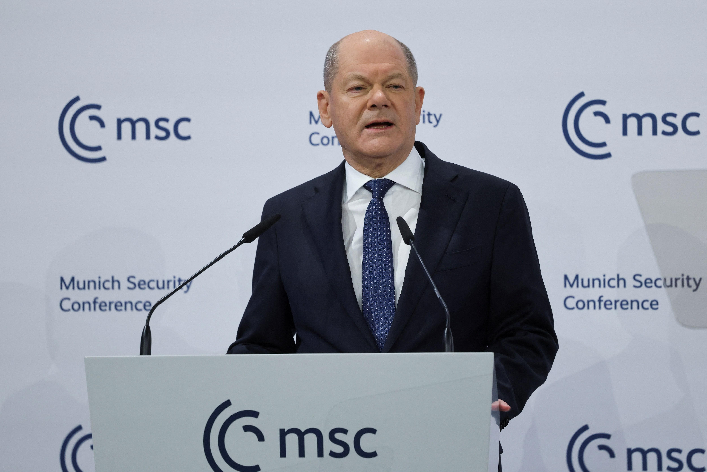
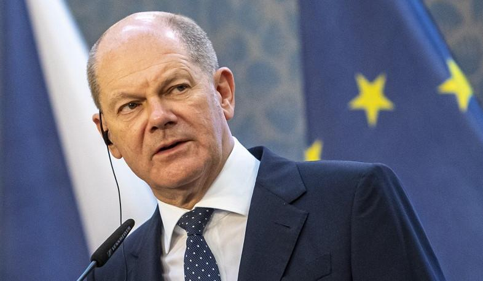
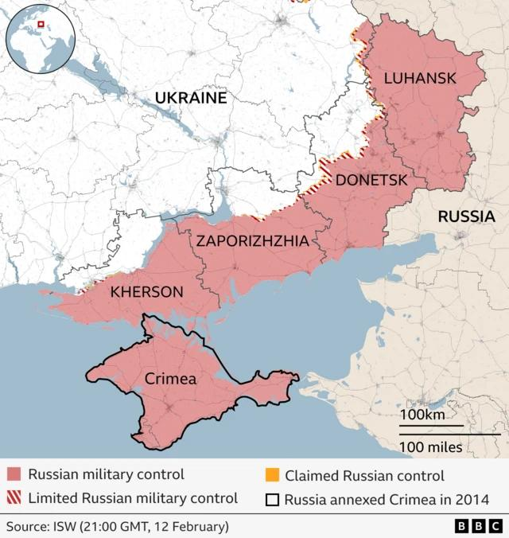
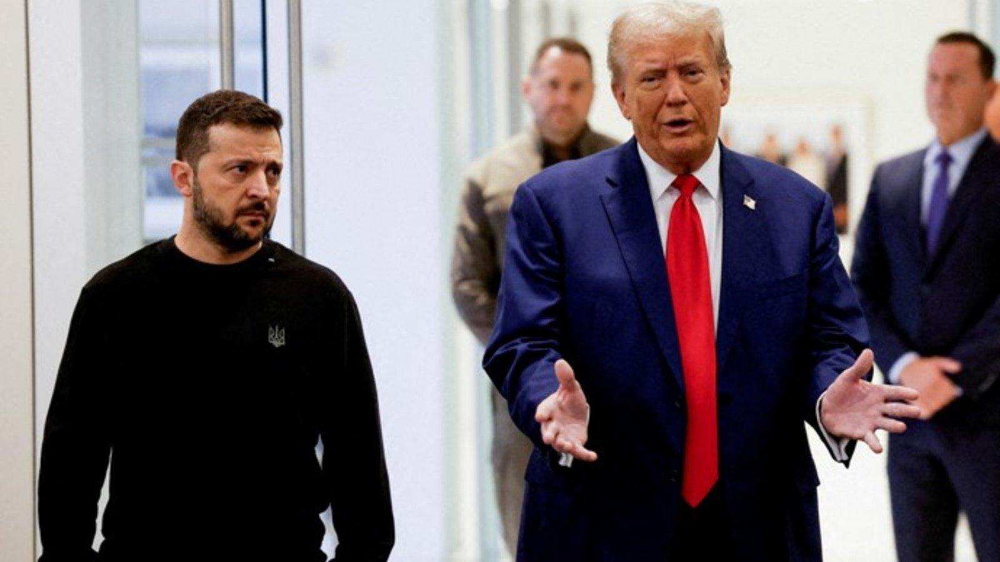

## Claim
Claim: "In February 2025 German Chancellor Olaf Scholz declared a state of emergency in Germany due to US President Donald Trump's peace plan for Ukraine."

## Actions
```
image_search("Olaf Scholz state of emergency Germany February 2025")
image_search("Donald Trump peace plan Ukraine February 2025")
```

## Evidence
### Evidence from `image_search`
Euronews published a fact-check stating that Scholz did not call for a German state of emergency over Russia-US peace talks (). Reuters published an article on February 15, 2025, about Olaf Scholz ().

An article from 1lurer.am, published on February 15, 2025, discusses Germany potentially declaring a state of emergency to support Ukraine, featuring an image of Olaf Scholz ().


### Evidence from `image_search`
The BBC published a map showing the areas of Ukraine under Russian military control as of February 12.  ABC News contains an image of Donald Trump, Volodymyr Zelenskyy, and Vladimir Putin. 

The Council on Foreign Relations includes an image of Donald Trump and Volodymyr Zelenskyy. 


## Elaboration
Based on the evidence, the claim is false. Euronews published a fact-check stating that Scholz did not declare a state of emergency. The evidence does not provide any information about the details of a "peace plan" by Donald Trump.


## Final Judgement
The fact-check indicates that Olaf Scholz did not declare a state of emergency in Germany. The evidence does not mention any peace plan by Donald Trump. Therefore, the claim is demonstrably false. `false`

### Verdict: FALSE

### Justification
The claim is false. A fact-check by Euronews indicates that Olaf Scholz did not declare a state of emergency in Germany. The search results do not provide any information about a peace plan by Donald Trump.
