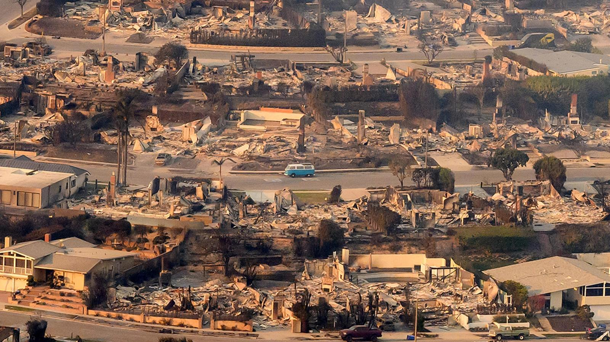
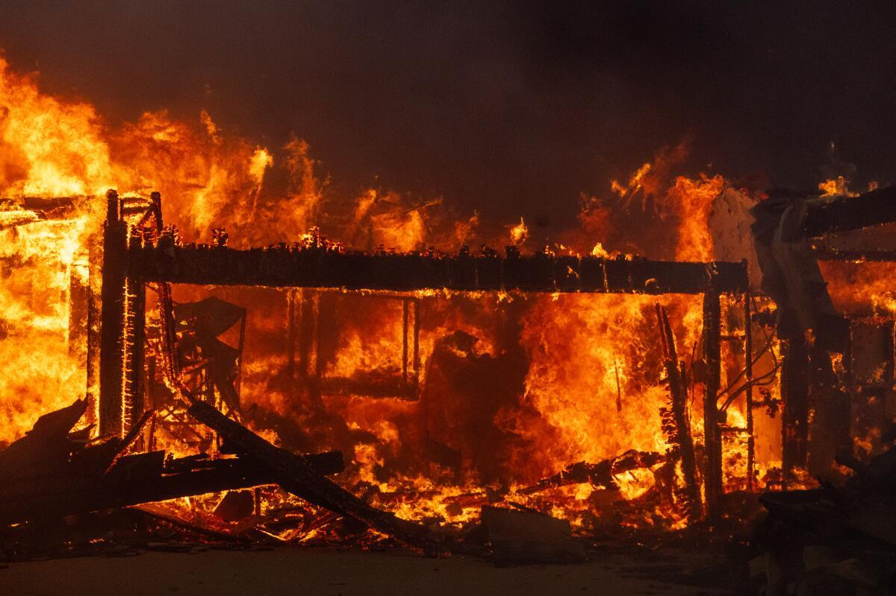
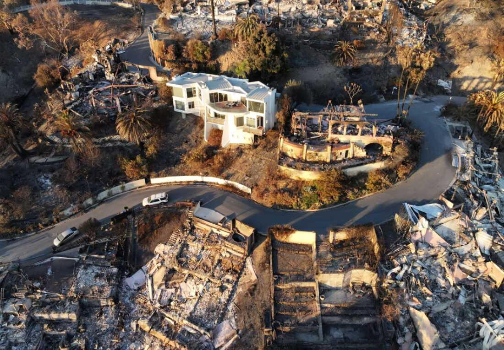
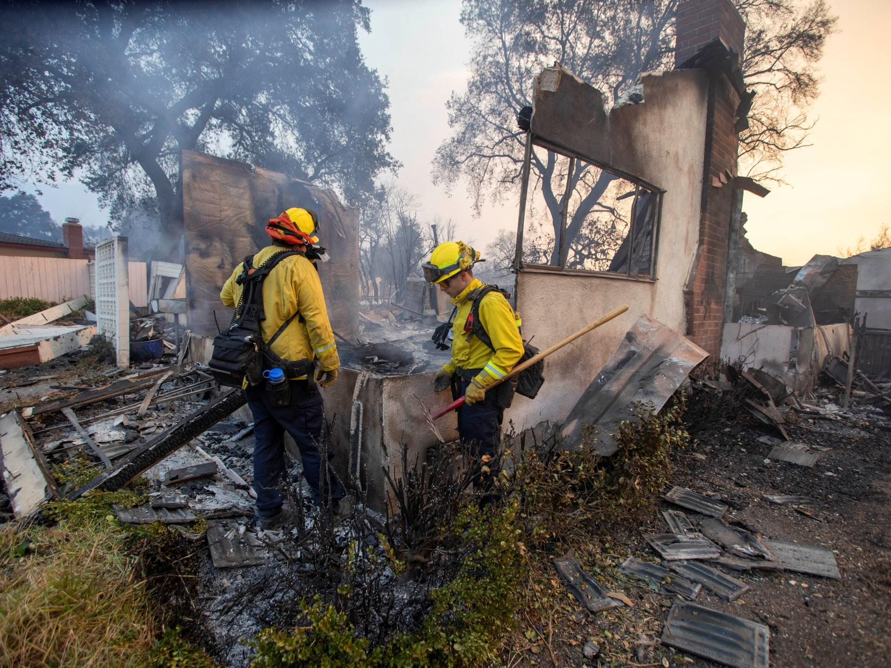

## Claim
Claim: "During the January 2025 wildfires, eight mansions belonging to Ukrainian military officials burned down in Los Angeles, California."

## Actions
```
image_search("January 2025 wildfires Los Angeles")
image_search("Ukrainian military officials mansions burned Los Angeles")
```

## Evidence
### Evidence from `image_search`
The search results contain images of wildfires in Los Angeles. One source ([Source](https://unu.edu/inweh/collection/january-2025-los-angeles-wildfires-once-generation-events-now-happen-frequently)) shows an image of wildfires .

Reuters ([Source](https://www.reuters.com/pictures/scenes-los-angeles-wildfires-rage-2025-01-08/3TQRCJ3GGFNF5I6YEQ3524YLTE/)) published images of wildfires . Britannica.com ([Source](https://www.britannica.com/event/Los-Angeles-wildfires-of-2025)) shows an image of a house on fire during the Los Angeles wildfires of 2025 .


### Evidence from `image_search`
The search results include an image of a burned-down building near a beach and a road from [NPR](https://www.npr.org/transcripts/nx-s1-5259842) . The New York Times published an article about wildfires in Los Angeles on February 2, 2025, which is available at [The New York Times](https://www.nytimes.com/2025/02/02/us/la-wildfires-palisades-eaton-preparations.html) . Another source contains an image of a neighborhood destroyed by fire  from [CFR](https://www.cfr.org/expert-brief/after-fires-how-rebuild-los-angeles).


## Elaboration
The evidence confirms that wildfires occurred in Los Angeles in January 2025, causing significant damage to buildings and neighborhoods. However, the search results do not provide any information about the ownership of the destroyed properties.

The claim that eight mansions belonging to Ukrainian military officials burned down cannot be verified with the available evidence. The evidence does not mention the owners of the destroyed properties.

To verify the claim, information about the owners of the destroyed mansions is needed.


## Actions
```
image_search("Los Angeles wildfires 2025 property owners")
```

## Evidence
### Evidence from `image_search`
The Los Angeles Times published an article about the Los Angeles wildfires, including an image of a burning building , available at [Source](https://www.latimes.com/business/story/2025-01-09/la-fires-property-home-insurance-crisis-fair-plan-lara-state-farm-allstate-palisades-eaton-altadena-wildfires). NPR published an image of houses that survived the Los Angeles wildfires , available at [Source](https://www.npr.org/2025/01/17/nx-s1-5261859/los-angeles-wildfires-houses-survived-defensible-space).


## Elaboration
The new evidence still does not provide any information about the owners of the destroyed properties. Therefore, the claim remains unverified.

To verify the claim, information about the owners of the destroyed mansions is needed.


## Actions
```
image_search("Los Angeles wildfires 2025 Ukrainian military officials mansions")
```

## Evidence
### Evidence from `image_search`
From [Source](https://www.aljazeera.com/news/liveblog/2025/1/9/los-angeles-wildfires-live-news-130000-ordered-to-evacuate): 
Content: Al Jazeera published an image of firefighters inspecting a burned house .


## Elaboration
The search results do not contain any information about Ukrainian military officials or their mansions. Therefore, the claim cannot be verified.

The claim is missing information about the owners of the destroyed properties.


## Final Judgement
The search results confirm the occurrence of wildfires in Los Angeles in January 2025, causing significant damage. However, the search results do not provide any information about the ownership of the destroyed properties, nor do they mention Ukrainian military officials. Therefore, the claim that eight mansions belonging to Ukrainian military officials burned down in Los Angeles cannot be verified.

`false`

### Verdict: FALSE

### Justification
The fact-check confirms the occurrence of wildfires in Los Angeles in January 2025, as evidenced by sources like [Reuters](https://www.reuters.com/pictures/scenes-los-angeles-wildfires-rage-2025-01-08/3TQRCJ3GGFNF5I6YEQ3524YLTE/) and [Britannica.com](https://www.britannica.com/event/Los-Angeles-wildfires-of-2025). However, the search results do not provide any information about the ownership of the destroyed properties or any connection to Ukrainian military officials. Therefore, the claim remains unverified.
