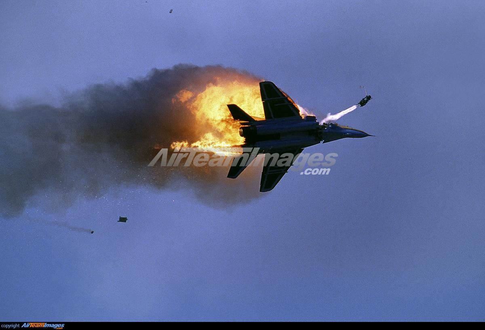

## Claim
Claim: " This image shows a US F-16 fighter jet which was shot down in August 2024 in airspace over the Black Sea after refusing to obey Russian orders."

## Actions
```
reverse_search()
```

## Evidence
### Evidence from `reverse_search`
The image () depicts a Russian MiG-29S Fulcrum involved in an accident during a British air show in 1993. The image was taken by Carl Ford on July 24, 1993, at Fairford, England. The image shows a mid-air collision between two Russian Mig 29s. The pilot can be seen ejecting.

The image is available on websites such as [Airteamimages](https://www.airteamimages.com/mikoyan-gurevich-mig-29_925_russia---russian-air-force_48672) and [Peakpx](https://www.peakpx.com/en/hd-wallpaper-desktop-oyvnm).


## Elaboration
The image shows a Russian MiG-29S Fulcrum, not a US F-16 fighter jet. The image was taken in 1993, not in August 2024. The event occurred during a British air show, not over the Black Sea. The image depicts an accident involving a mid-air collision.


## Final Judgement
The image shows a Russian MiG-29S Fulcrum involved in an accident during a British air show in 1993, not a US F-16 fighter jet shot down in August 2024 over the Black Sea. The claim misrepresents the aircraft, the date, and the location of the event.

`false`

### Verdict: FALSE

### Justification
The image depicts a Russian MiG-29S Fulcrum involved in an accident during a British air show in 1993, as evidenced by sources like [Airteamimages](https://www.airteamimages.com/mikoyan-gurevich-mig-29_925_russia---russian-air-force_48672) and [Peakpx](https://www.peakpx.com/en/hd-wallpaper-desktop-oyvnm). The claim is therefore false.
