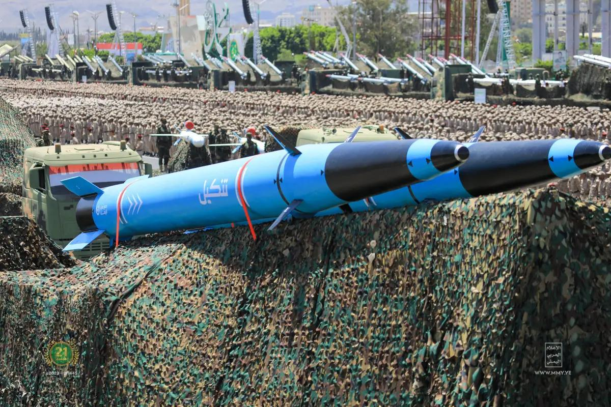
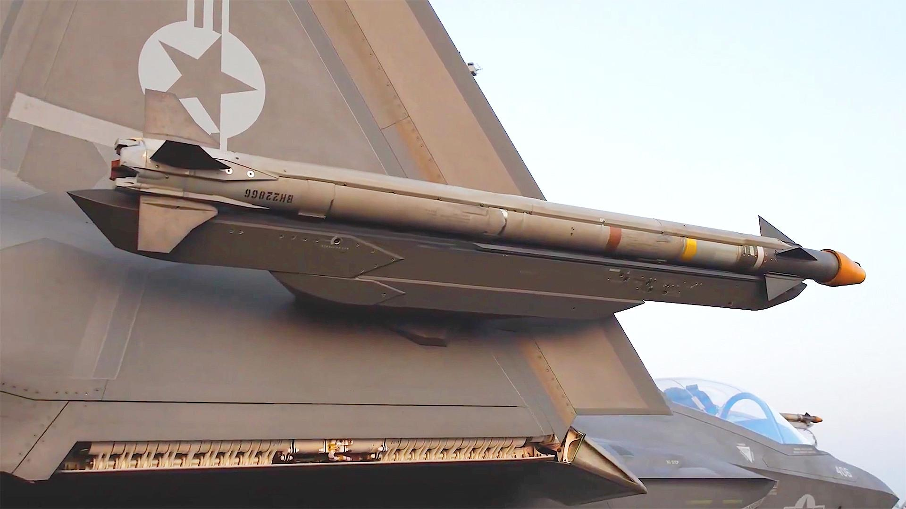
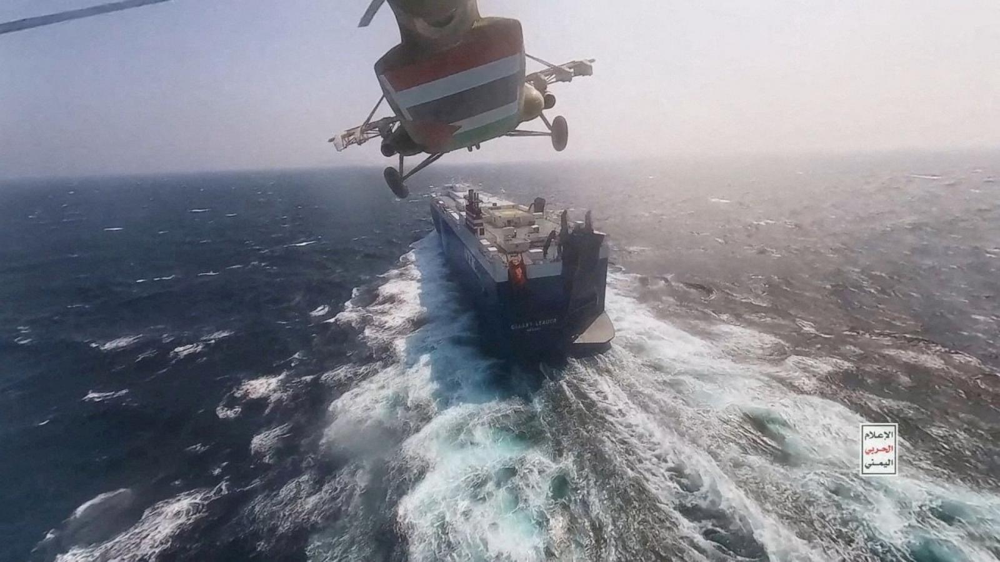

## Claim
Claim: " This image shows a US drone which was shot down in March 2025 by the Houthis using Russian missiles."

## Actions
```
reverse_search()
```

## Evidence
### Evidence from `reverse_search`
The image 

## Elaboration
The reverse image search did not yield any results. Therefore, the claim cannot be verified. More information is needed to determine the veracity of the claim.


## Actions
```
image_search("drone shot down March 2025 Houthis Russian missiles")
```

## Evidence
### Evidence from `image_search`
The USNI News article from January 17, 2025, discusses the Houthis' claims of attacks and includes an image of a missile . The War Zone's search result contains an image of a missile attached to an aircraft . An ABC News article discusses the US shooting down a Houthi drone and ballistic missile in the Red Sea .


## Elaboration
The image search results provide some context but do not directly support the claim. The evidence includes images of missiles and discussions of Houthi attacks, but none of the images match the one in the claim. The ABC News article mentions the US shooting down a Houthi drone, but this does not confirm the claim.

The claim cannot be verified with the provided evidence. More information is needed to confirm the image's origin and the circumstances surrounding the alleged drone incident.


## Actions
```
geolocate()
```

## Evidence
### Evidence from `geolocate`
The most likely countries where the image was taken are: {'Israel': 0.64, 'Palestine': 0.13, 'United Arab Emirates': 0.12, 'Jordan': 0.08, 'Tunisia': 0.01, 'Albania': 0.0, 'Andorra': 0.0, 'Argentina': 0.0, 'Australia': 0.0, 'Austria': 0.0}

## Elaboration
The geolocation analysis suggests the image was most likely taken in Israel. This contradicts the claim that the event occurred in a location where the Houthis would be operating. The evidence does not support the claim.


## Final Judgement
The image search and geolocation analysis do not support the claim. The geolocation analysis suggests the image was most likely taken in Israel, which contradicts the claim that the event occurred in a location where the Houthis would be operating. The reverse image search did not yield any results.

`false`

### Verdict: FALSE

### Justification
The claim is false. The image's geolocation analysis suggests it was taken in Israel, not in a location where the Houthis would be operating. Additionally, the reverse image search did not yield any results, and the image search did not provide any evidence to support the claim.
