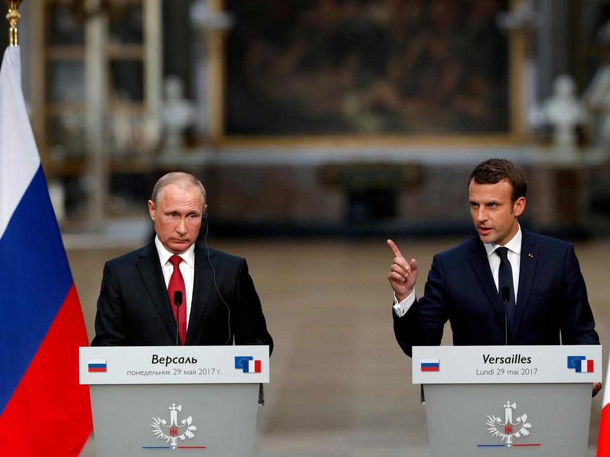
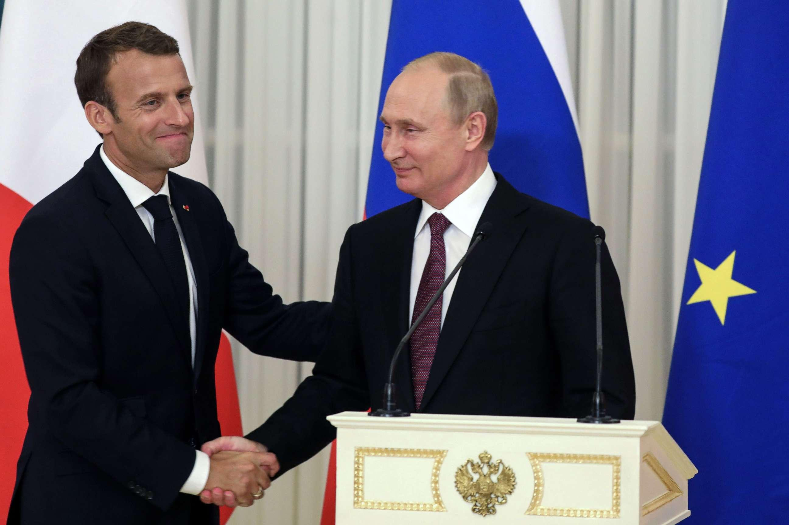
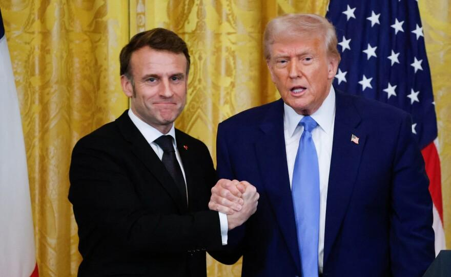
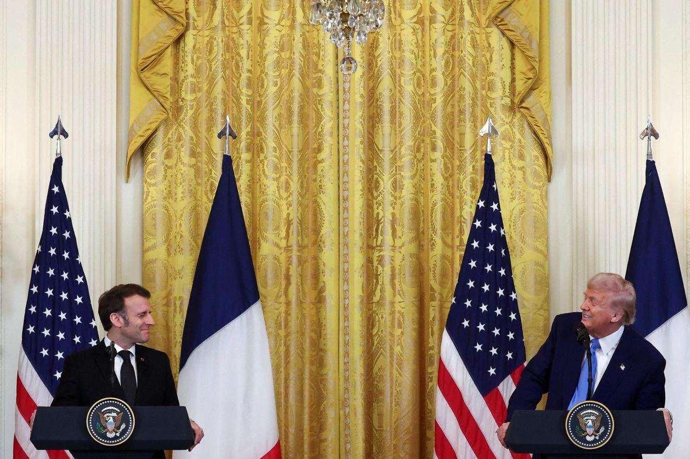
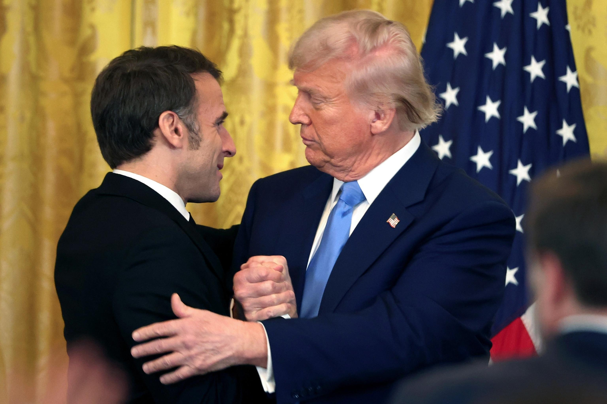
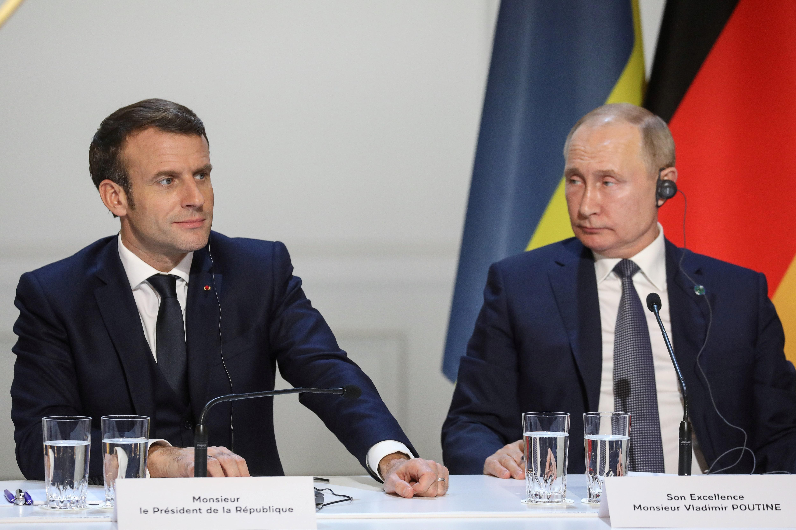
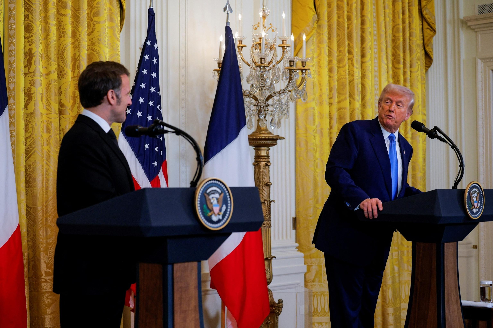

## Claim
Claim: "French President Emmanuel Macron called Russian President Vladimir Putin a 'butcher' during his press conference with Donald Trump on Monday, Feb. 24, 2025."

## Actions
```
image_search("Emmanuel Macron Vladimir Putin press conference")
image_search("Emmanuel Macron Donald Trump press conference February 24 2025")
```

## Evidence
### Evidence from `image_search`
The Atlantic published an image of a press conference between Emmanuel Macron and Vladimir Putin that took place on May 29, 2017. ([Source](https://www.theatlantic.com/news/archive/2017/05/macron-rt-supnik-are-agents-of-influence/528480/)) 

The New Yorker and ABC News also provide images of Emmanuel Macron and Vladimir Putin. ([Source](https://www.newyorker.com/news/daily-comment/emmanuel-macrons-overtures-to-vladimir-putin-and-the-race-to-prevent-war-in-ukraine))  ([Source](https://abcnews.go.com/International/macron-woo-putin-state-visit/story?id=55433452)) 


### Evidence from `image_search`
VPM.org ([Source](https://www.vpm.org/npr-news/npr-news/2025-02-24/trump-and-macron-meet-in-washington-as-europe-pleads-for-continued-help-with-ukraine)) includes an image of Emmanuel Macron and Donald Trump . CNN ([Source](https://edition.cnn.com/politics/live-news/trump-administration-news-02-24-25?Date=20250224&Profile=cnnbrk)) provides an image of a press conference with Emmanuel Macron and Donald Trump .

ABC News ([Source](https://abcnews.go.com/International/macron-warns-trump-careful-ukraine-fact-checks-white/story?id=119157061)) contains an image of Emmanuel Macron and Donald Trump .


## Elaboration
The evidence confirms that Emmanuel Macron and Donald Trump had a press conference on February 24, 2025. ([Source](https://www.vpm.org/npr-news/npr-news/2025-02-24/trump-and-macron-meet-in-washington-as-europe-pleads-for-continued-help-with-ukraine)) and ([Source](https://edition.cnn.com/politics/live-news/trump-administration-news-02-24-25?Date=20250224&Profile=cnnbrk)). However, the provided evidence does not contain any information about what Macron said during the press conference.

Therefore, the claim cannot be verified with the available evidence.


## Actions
```
image_search("Emmanuel Macron calls Putin butcher press conference")
```

## Evidence
### Evidence from `image_search`
From [Source](https://www.reuters.com/world/europe/putin-macron-trade-blame-over-ukraine-nuclear-plant-security-2022-09-11/): 
Content: Reuters published an image of Emmanuel Macron and Vladimir Putin. 


## Elaboration
The new evidence provides an image of Emmanuel Macron and Vladimir Putin together. However, it does not contain any information about Macron calling Putin a "butcher" during a press conference.

The claim remains unverified.


## Actions
```
image_search("Macron Trump press conference February 24 2025 butcher Putin")
```

## Evidence
### Evidence from `image_search`
From [Source](https://abcnews.go.com/Politics/trump-hosts-frances-macron-white-house-amid-ukraine/story?id=119123204): 
Content: ABC News published an image of a press conference between Emmanuel Macron and Donald Trump. 


## Elaboration
The evidence confirms that Macron and Trump had a press conference on February 24, 2025. ([Source](https://abcnews.go.com/Politics/trump-hosts-frances-macron-white-house-amid-ukraine/story?id=119123204)). However, the search results do not provide any information about Macron calling Putin a "butcher" during the press conference.

The claim remains unverified.


## Final Judgement
The evidence confirms that Macron and Trump had a press conference on February 24, 2025. However, the search results do not provide any information about Macron calling Putin a "butcher" during the press conference. Therefore, the claim cannot be verified.

`false`


### Verdict: FALSE

### Justification
The fact-check confirms that Emmanuel Macron and Donald Trump held a press conference on February 24, 2025, as evidenced by sources like [VPM.org](https://www.vpm.org/npr-news/npr-news/2025-02-24/trump-and-macron-meet-in-washington-as-europe-pleads-for-continued-help-with-ukraine) and [CNN](https://edition.cnn.com/politics/live-news/trump-administration-news-02-24-25?Date=20250224&Profile=cnnbrk). However, the search results do not provide any information about Macron calling Putin a "butcher" during the press conference. Therefore, the claim is unverified.
