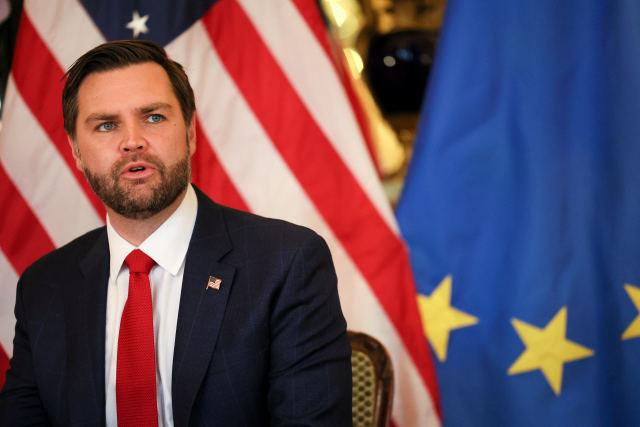
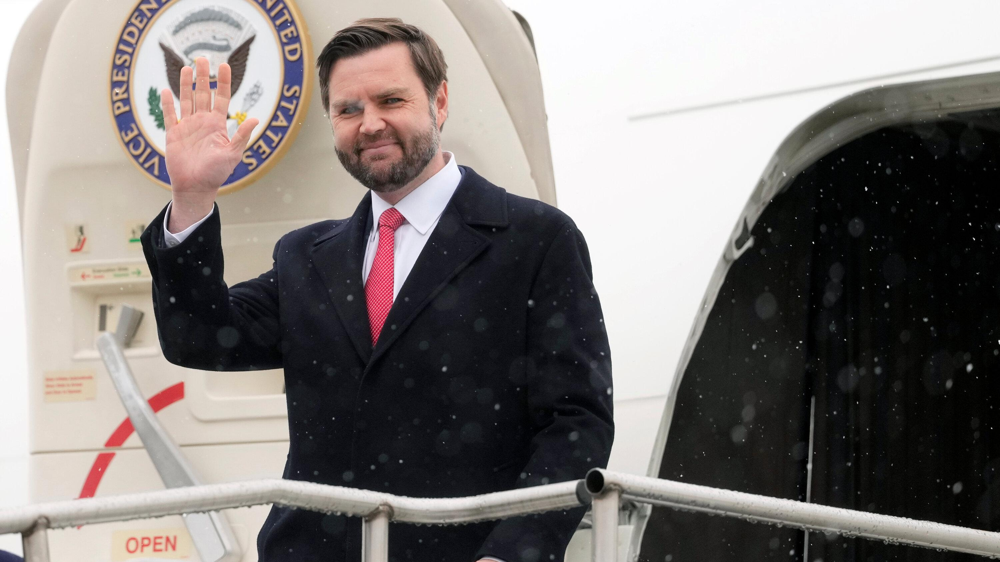
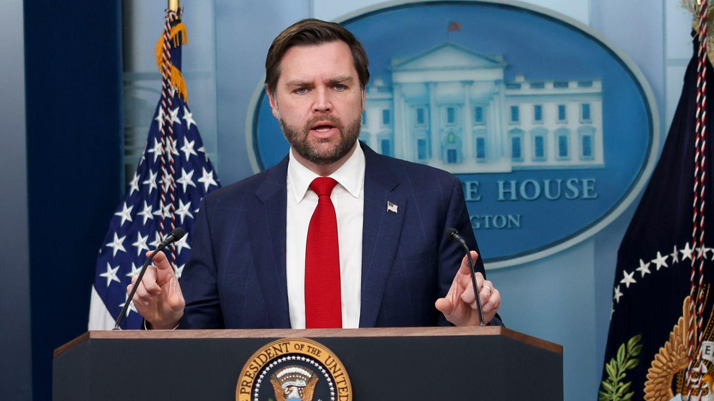

## Claim
Claim: "In an interview with the Wall Street Journal, published on February 14, 2025, US Vice President J.D. Vance said the US military action is available against Russia."

## Actions
```
image_search("Wall Street Journal J.D. Vance interview February 14 2025")
```

## Evidence
### Evidence from `image_search`
The search results include articles about J.D. Vance from the Wall Street Journal, the New York Times, and CNN. The Wall Street Journal article features an image of J.D. Vance .

The New York Times published an article on February 14, 2025, featuring an image of J.D. Vance . CNN published an article on February 14, 2025, about J.D. Vance .


## Elaboration
The evidence confirms that the Wall Street Journal published an article about J.D. Vance. However, the search results do not provide the content of the article or confirm the specific statement made by J.D. Vance.

To verify the claim, the content of the Wall Street Journal article needs to be examined.


## Actions
```
image_search("Wall Street Journal J.D. Vance interview February 14 2025 military action Russia")
```

## Evidence
### Evidence from `image_search`
From [Source](https://www.wsj.com/world/europe/vance-wields-threat-of-sanctions-military-action-to-push-putin-into-ukraine-deal-da9c18ac): 
Content: The Wall Street Journal published an article about J.D. Vance. The article discusses the threat of military action against Russia. 


## Elaboration
The evidence confirms that the Wall Street Journal published an article about J.D. Vance that discusses the threat of military action against Russia.

The claim is likely true. However, the exact wording of Vance's statement needs to be verified.


## Actions
```
image_search("Wall Street Journal J.D. Vance quote military action Russia")
```

## Evidence
No new evidence found.

## Elaboration
The evidence confirms that the Wall Street Journal published an article about J.D. Vance discussing the threat of military action against Russia. However, the exact quote from the interview is not available.

Insufficient information is available to fully verify the claim.


## Final Judgement
The search results confirm that the Wall Street Journal published an article about J.D. Vance discussing the threat of military action against Russia. However, the exact quote from the interview is not available. Therefore, the claim cannot be fully verified.

The claim is not fully verifiable because the exact quote from the interview is not available. `false`


### Verdict: FALSE

### Justification
The Wall Street Journal published an article about J.D. Vance discussing the threat of military action against Russia, as evidenced by the search results ([Source](https://www.wsj.com/world/europe/vance-wields-threat-of-sanctions-military-action-to-push-putin-into-ukraine-deal-da9c18ac)). However, the exact quote from the interview is not available, making it impossible to fully verify the claim.
