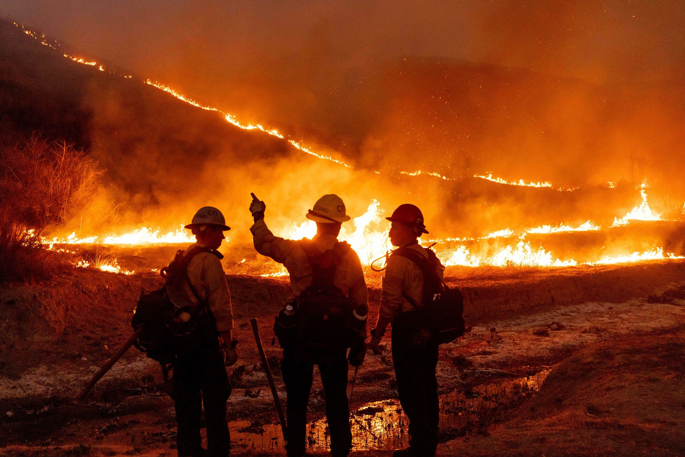
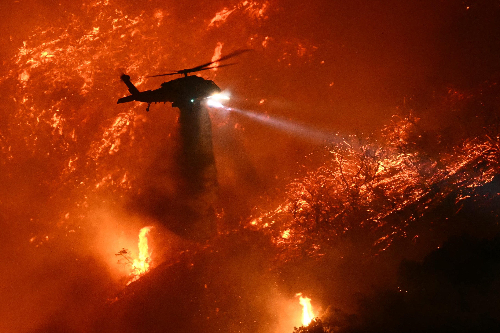

## Claim
Claim: "Russia offered assistance for the California wildfires from January 2025."

## Actions
```
image_search("California wildfires January 2025 Russia assistance")
```

## Evidence
### Evidence from `image_search`
The search results include an image from Sputnik  discussing California wildfires and Ukraine, mentioning the LA County Fire Department donating equipment to Ukraine in 2022, as found on [securingdemocracy.gmfus.org](https://securingdemocracy.gmfus.org/inflaming-divides-russian-narratives-on-the-california-wildfires/).

An NPR article published on January 18, 2025, discusses California wildfires . Voice of America published an article about Russia exploiting wildfires in Los Angeles , as seen on [voanews.com](https://www.voanews.com/a/russia-exploits-wildfires-in-los-angeles-to-push-anti-u-s-anti-ukraine-propaganda/7938909.html).


## Elaboration
The evidence indicates that there were California wildfires in January 2025, as confirmed by an NPR article. Additionally, a Voice of America article discusses Russia exploiting the wildfires in Los Angeles. However, the search results do not provide any information about Russia offering assistance for the California wildfires.

Therefore, the claim cannot be verified based on the provided evidence.

The information missing is whether Russia offered assistance for the California wildfires.


## Actions
```
image_search("Russia assistance California wildfires")
```

## Evidence
No new evidence found.

## Elaboration
The evidence confirms the existence of California wildfires in January 2025 and mentions Russia's involvement in exploiting the situation for propaganda purposes. However, the search results still do not provide any information about Russia offering assistance for the California wildfires.

Therefore, the claim remains unverified due to the lack of evidence supporting Russia's offer of assistance.


## Actions
```
image_search("Russia offer assistance California wildfires January 2025")
```

## Evidence
### Evidence from `image_search`
CNN published an article about the Los Angeles wildfires in January 2025, as seen on [cnn.com](https://www.cnn.com/weather/live-news/los-angeles-wildfires-palisades-eaton-california-01-10-25-hnk) . The website united24media.com discusses a Russian occupation head in Kherson offering shelter to California wildfire victims .


## Elaboration
The new evidence reveals that a Russian occupation head in Kherson offered shelter to California wildfire victims, as reported by united24media.com. However, this does not directly confirm that Russia offered assistance for the California wildfires.

The claim remains unverified. The evidence suggests a connection between Russia and the wildfires, but it does not explicitly state that Russia offered assistance.


## Final Judgement
The search results confirm the existence of California wildfires in January 2025 and Russia's involvement in the situation, including a Russian official offering shelter to victims. However, there is no direct evidence that Russia offered assistance for the California wildfires.

The claim is not supported by the evidence, as the search results do not provide any information about Russia offering assistance for the California wildfires. `false`

### Verdict: FALSE

### Justification
The fact-check reveals that while there were California wildfires in January 2025, and Russia was involved in exploiting the situation, there is no evidence to support the claim that Russia offered assistance for the wildfires. The search results show a Russian official offering shelter to victims, but not direct assistance for the fires. Therefore, the claim is unverified.
