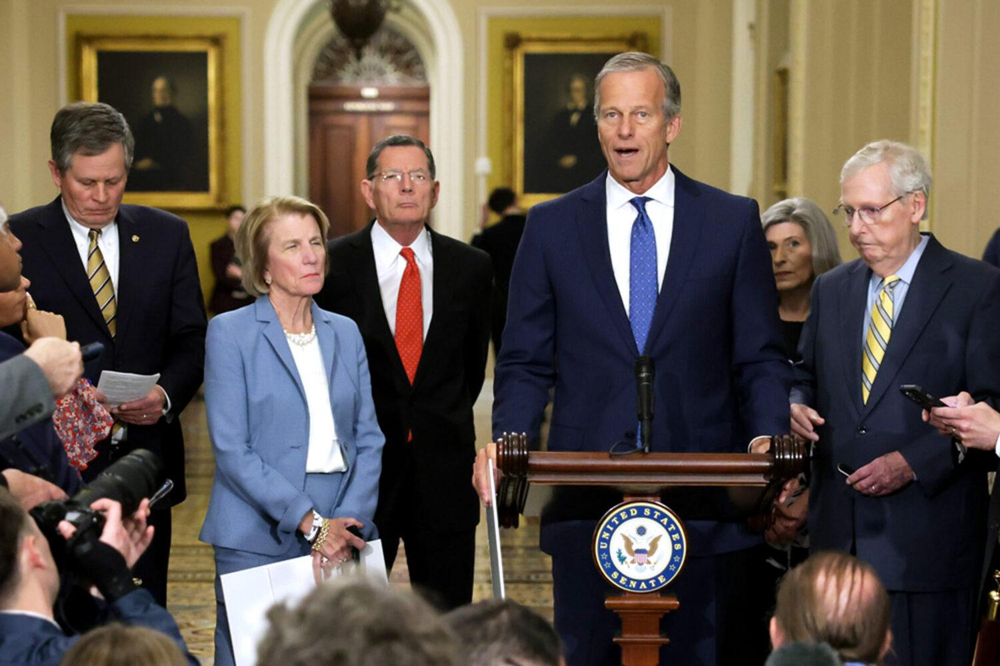
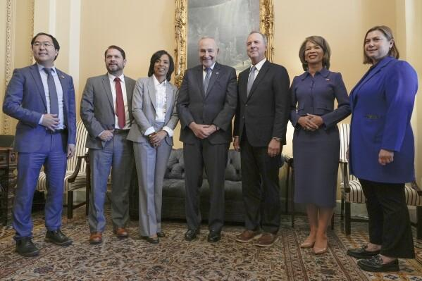
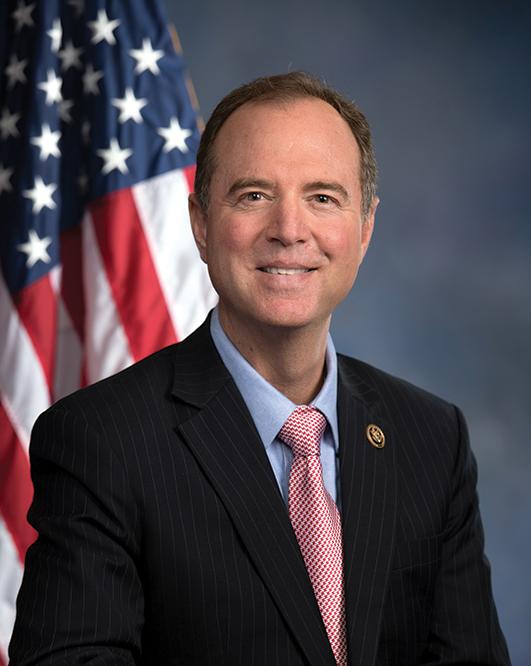
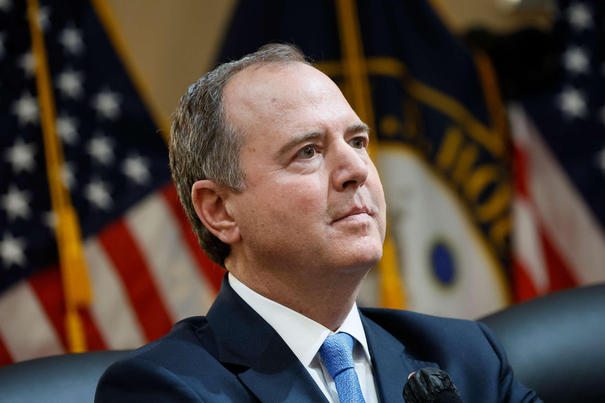

## Claim
Claim: "Majority Leader John Thune blocked Senator Adam Schiff's committee assignments because of his past work in the Russia investigation over Donald Trump."

## Actions
```
image_search("John Thune Adam Schiff committee assignments")
```

## Evidence
### Evidence from `image_search`
The search results include an article from [KPBS](https://www.kpbs.org/news/politics/2024/12/09/adam-schiff-to-be-sworn-into-the-senate-where-he-wants-to-be-more-than-a-trump-antagonist) with no content. Another article from [South Dakota Searchlight](https://southdakotasearchlight.com/2024/11/06/republicans-take-majority-control-of-u-s-senate-after-ohio-west-virginia-victories/) contains an image of John Thune .

An article from [AP News](https://apnews.com/article/adam-schiff-senate-trump-california-1f611ee885e9c6b73a22ea1cab0d08bc) provides an image of Adam Schiff .


## Elaboration
The search results provide images of John Thune and Adam Schiff, but no information about Thune blocking Schiff's committee assignments. The articles linked in the search results do not contain the information needed to verify the claim.

More information is needed to verify the claim.


## Actions
```
image_search("John Thune Adam Schiff committee assignments Russia investigation")
```

## Evidence
### Evidence from `image_search`
From [Source](https://ca.news.yahoo.com/no-thune-didnt-block-schiff-161116916.html): 
Content: The search result from Yahoo News contains an image of John Thune .


## Elaboration
The search results include an image of John Thune, but the content does not verify the claim. The image is from a Yahoo News article, but the article does not mention Schiff's committee assignments or the Russia investigation.

More information is needed to verify the claim.


## Actions
```
image_search("Adam Schiff committee assignments")
```

## Evidence
### Evidence from `image_search`
The search results include an article from Beverly Press ([https://beverlypress.com/2025/01/schiff-appointed-to-key-u-s-senate-committees/](https://beverlypress.com/2025/01/schiff-appointed-to-key-u-s-senate-committees/)) that discusses Adam Schiff's appointment to key U.S. Senate committees . An article from ABC News ([https://abcnews.go.com/Politics/schiff-bemoans-growth-crazy-caucus-house-gop/story?id=93616474](https://abcnews.go.com/Politics/schiff-bemoans-growth-crazy-caucus-house-gop/story?id=93616474)) also features Adam Schiff .


## Elaboration
The evidence shows that Adam Schiff was appointed to key U.S. Senate committees, which contradicts the claim that John Thune blocked his committee assignments. The evidence does not provide any information about the reasons behind Schiff's committee assignments.

The claim is not supported by the evidence.


## Final Judgement
The search results provide images of John Thune and Adam Schiff, and articles about Schiff's committee assignments. However, the evidence does not support the claim that Thune blocked Schiff's committee assignments. In fact, one article states that Schiff was appointed to key committees.

`false`


### Verdict: FALSE

### Justification
The evidence indicates that Adam Schiff was appointed to key Senate committees, contradicting the claim that John Thune blocked his assignments. The search results did not provide any information to support the claim. Therefore, the claim is false.
