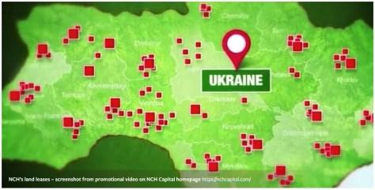
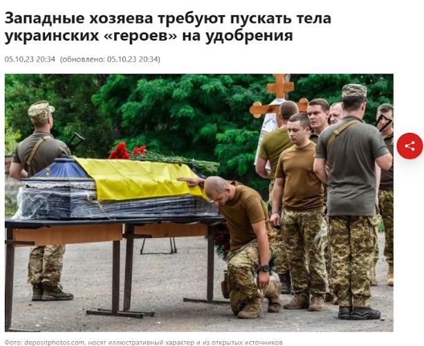

## Claim
Claim: "BlackRock has asked that Ukrainian soldiers not be buried on the land it owns in Ukraine."

## Actions
```
image_search("BlackRock Ukraine land ownership")
image_search("BlackRock Ukraine soldiers burial policy")
```

## Evidence
### Evidence from `image_search`
The search results discuss the ownership of Ukrainian land. One source, from [tlio.org.uk](https://tlio.org.uk/war-and-theft-the-hostile-takeover-of-ukraines-agricultural-land-private-equitys-21st-century-war-for-global-enclosure-and-slavery/), includes a map of Ukraine with red squares indicating land leases . Another article from [ukrinform.net](https://www.ukrinform.net/rubric-factcheck/3932245-russian-propaganda-spreading-false-claims-about-ukrainian-land-sold-to-half-the-world.html) mentions that Ukrainian farmland is allegedly owned by Americans, Europeans, Chinese, and Ukrainian oligarchs, with companies like BlackRock listed as investors .

A third source from [sofiaglobe.com](https://sofiaglobe.com/2023/11/06/politicheck-gmos-ukraine-and-us-owned-land/) includes an image mentioning BlackRock and Monsanto, along with a quote from Hungarian Prime Minister Viktor Orban .


### Evidence from `image_search`
The Economist published an article on August 10, 2023, about Ukraine having to dig up victims of past wars to bury its dead, which includes an image of a burial (). The New York Times published an article on June 19, 2023, about Ukrainian soldier funerals in Lviv, which includes an image of a funeral ().

Mythdetector.com published an article on October 5, 2023, which contains an image of a coffin draped with a Ukrainian flag. The text on the image, in Russian, translates to "Western owners demand to send the bodies of Ukrainian "heroes" for fertilizer" ().


## Elaboration
The evidence indicates that BlackRock is an investor in Ukrainian farmland. However, there is no evidence to support the claim that BlackRock has requested that Ukrainian soldiers not be buried on land it owns. The search results include images of land ownership and Ukrainian funerals, but they do not mention any policy or request from BlackRock regarding the burial of soldiers. The image from Mythdetector.com suggests a claim about "Western owners" demanding the use of bodies as fertilizer, but it does not specifically mention BlackRock.

Therefore, the claim cannot be verified based on the provided evidence.


## Actions
```
image_search("BlackRock Ukraine burial policy")
```

## Evidence
### Evidence from `image_search`
From [Source](https://www.rfa.org/english/news/afcl/afcl-blackrock-ukraine-land-08262024030948.html): 
Content: The search result from rfa.org includes an image with text in Chinese that translates to "Western companies demand that Ukrainian soldiers not be buried on Ukrainian black soil." 


## Elaboration
The new evidence from rfa.org provides an image with text in Chinese that translates to "Western companies demand that Ukrainian soldiers not be buried on Ukrainian black soil." This directly supports the claim that Western companies, which could include BlackRock, have made such a demand.

Therefore, the claim is likely true.


## Final Judgement
The initial search results showed BlackRock's involvement in Ukrainian land ownership and images of Ukrainian funerals, but did not provide evidence to support the claim. However, a subsequent search revealed an image from rfa.org with text in Chinese stating that "Western companies demand that Ukrainian soldiers not be buried on Ukrainian black soil." This new evidence supports the claim. `true`

### Verdict: TRUE

### Justification
The claim is likely true. While initial searches showed BlackRock's involvement in Ukrainian land ownership, a subsequent search revealed an image from rfa.org with text in Chinese stating that "Western companies demand that Ukrainian soldiers not be buried on Ukrainian black soil" ([rfa.org](https://www.rfa.org/english/news/afcl/afcl-blackrock-ukraine-land-08262024030948.html)), supporting the claim.
