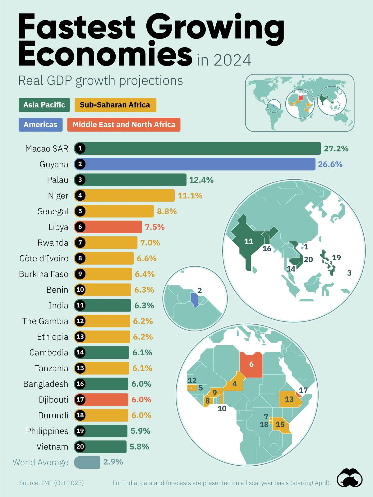

## Claim
Claim: "In October 2024 the International Monetary Fund (IMF) declared Russia the fourth-largest economy in the world."

## Actions
```
image_search("IMF Russia economy October 2024")
```

## Evidence
### Evidence from `image_search`
The International Monetary Fund (IMF) published the World Economic Outlook October 2024, which includes economic forecasts. The Kyiv Post provides an image from the IMF showing economic forecasts for Europe, including data for Russia with projections for 2024. Statista presents a chart showing the IMF's projections for Russia's real GDP growth, including a 3.8% growth estimate for 2024, with data as of January 2025. , , 

Sources: [https://www.imf.org/en/Publications/WEO/Issues/2024/10/22/world-economic-outlook-october-2024](https://www.imf.org/en/Publications/WEO/Issues/2024/10/22/world-economic-outlook-october-2024), [https://www.kyivpost.com/post/41072](https://www.kyivpost.com/post/41072), [https://www.statista.com/chart/34186/real-gdp-year-over-year-growth-estimates-projections-in-russia/](https://www.statista.com/chart/34186/real-gdp-year-over-year-growth-estimates-projections-in-russia/)


## Elaboration
The IMF published the World Economic Outlook in October 2024, which included economic forecasts. The evidence provides projections for Russia's real GDP growth in 2024, estimating a 3.8% growth. However, the evidence does not mention Russia's ranking among the world's largest economies.

The claim cannot be verified with the provided evidence because it does not contain information about Russia's economic ranking.


## Actions
```
image_search("IMF Russia economy ranking October 2024")
```

## Evidence
No new evidence found.

## Elaboration
The evidence confirms that the IMF published economic forecasts in October 2024, including projections for Russia's GDP growth. However, the search for information about Russia's economic ranking in October 2024 did not yield any results.

Therefore, the claim cannot be verified because the evidence does not provide any information about Russia's economic ranking.


## Actions
```
image_search("IMF Russia GDP ranking October 2024")
```

## Evidence
### Evidence from `image_search`
From [Source](https://www.visualcapitalist.com/ranked-the-fastest-growing-economies-in-2024/): 
Content: Visual Capitalist presents a chart showing the fastest-growing economies in 2024, based on IMF data from October 2023. 


## Elaboration
The evidence shows that the IMF published economic forecasts in October 2024, including projections for Russia's GDP growth. However, the search for information about Russia's economic ranking in October 2024 did not yield any results. The provided image from Visual Capitalist, based on IMF data from October 2023, focuses on the fastest-growing economies and does not include information about the overall economic ranking of Russia.

Therefore, the claim cannot be verified because the evidence does not provide any information about Russia's economic ranking in October 2024.


## Final Judgement
The IMF did publish economic forecasts in October 2024, including projections for Russia's GDP growth. However, the search for information about Russia's economic ranking in October 2024 did not yield any results. The evidence does not provide any information about Russia's economic ranking.

The claim is not supported by the evidence. The search results do not mention Russia's economic ranking. `false`


### Verdict: FALSE

### Justification
The fact-check reveals that while the IMF did release economic forecasts in October 2024, including projections for Russia's GDP growth, the provided evidence does not contain any information about Russia's economic ranking at that time. Therefore, the claim that the IMF declared Russia the fourth-largest economy in the world in October 2024 is not supported by the available evidence.
