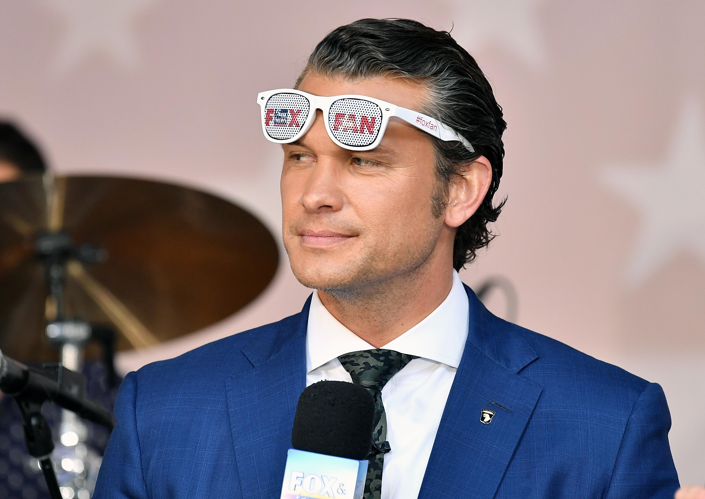
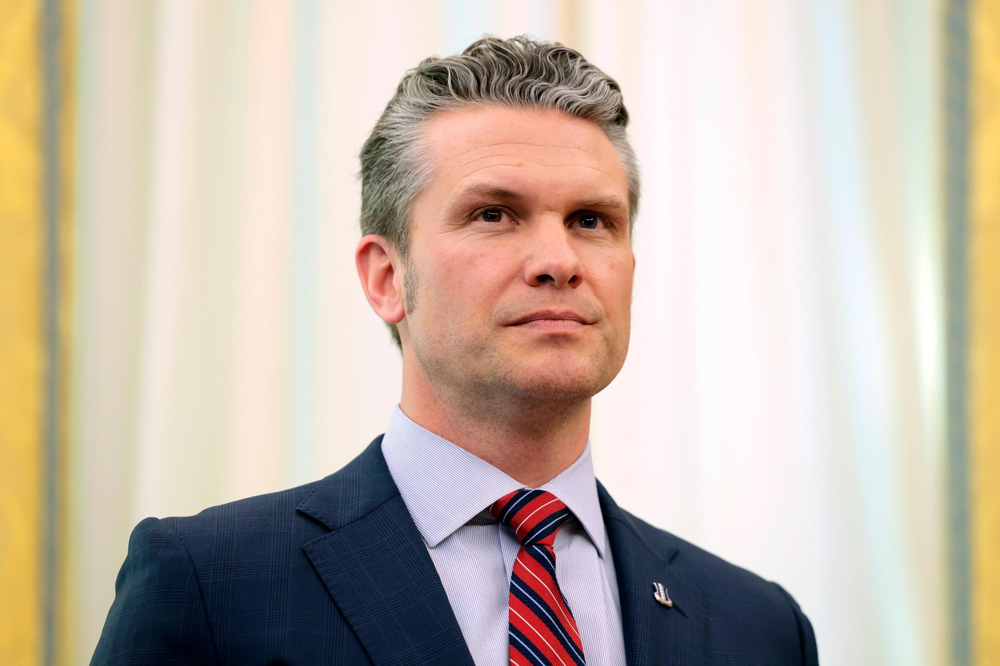
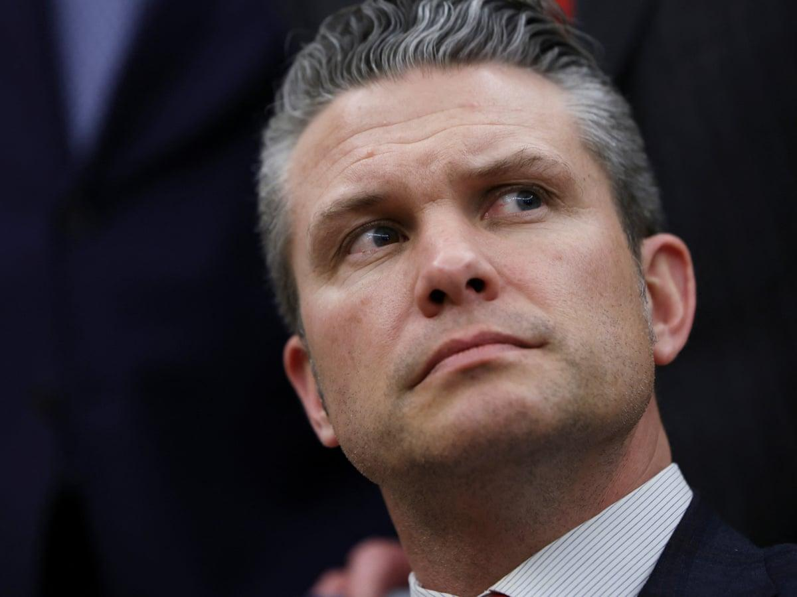

## Claim
Claim: "US Secretary of Defense Pete Hegseth called Putin a 'war criminal'."

## Actions
```
image_search("Pete Hegseth Putin war criminal")
```

## Evidence
### Evidence from `image_search`
From [Source](https://www.newsweek.com/pete-hegseth-vladimir-putin-war-criminal-1985251): 
Content: The search result from Newsweek contains an image of Pete Hegseth. 


## Elaboration
The evidence contains an image of Pete Hegseth from Newsweek. However, the evidence does not provide any information about whether Pete Hegseth called Putin a "war criminal".

I need more information to verify the claim.


## Actions
```
image_search("Pete Hegseth Putin war criminal statement")
```

## Evidence
### Evidence from `image_search`
From [Source](https://www.theguardian.com/world/2025/feb/13/pete-hegseth-says-everything-on-table-end-ukraine-war): 
Content: The search result from The Guardian contains an image of Pete Hegseth. 


## Elaboration
The evidence contains an image of Pete Hegseth from The Guardian. However, the evidence does not provide any information about whether Pete Hegseth called Putin a "war criminal".

I need more information to verify the claim.


## Actions
```
image_search("Pete Hegseth comments on Putin war crimes")
```

## Evidence
### Evidence from `image_search`
The search results from ABC News ([https://abcnews.go.com/Politics/trump-officials-accidentally-shared-yemen-war-plans-group/story?id=120106043](https://abcnews.go.com/Politics/trump-officials-accidentally-shared-yemen-war-plans-group/story?id=120106043)) and The Guardian ([https://www.theguardian.com/us-news/2025/mar/15/pete-hegseth-defense-department-policy](https://www.theguardian.com/us-news/2025/mar/15/pete-hegseth-defense-department-policy)) both contain images of Pete Hegseth.  


## Elaboration
The evidence contains images of Pete Hegseth from ABC News and The Guardian. However, the evidence does not provide any information about whether Pete Hegseth called Putin a "war criminal".

I need more information to verify the claim.


## Final Judgement
The search results provide images of Pete Hegseth from various news sources, but none of the search results confirm whether he called Putin a "war criminal." Therefore, the claim cannot be verified with the available evidence.

The claim cannot be verified due to a lack of evidence. `false`


### Verdict: FALSE

### Justification
The search results from multiple news sources, including [Newsweek](https://www.newsweek.com/pete-hegseth-vladimir-putin-war-criminal-1985251), [The Guardian](https://www.theguardian.com/world/2025/feb/13/pete-hegseth-says-everything-on-table-end-ukraine-war), and ABC News, provide images of Pete Hegseth but do not contain any statements or information to verify the claim that he called Putin a "war criminal".
