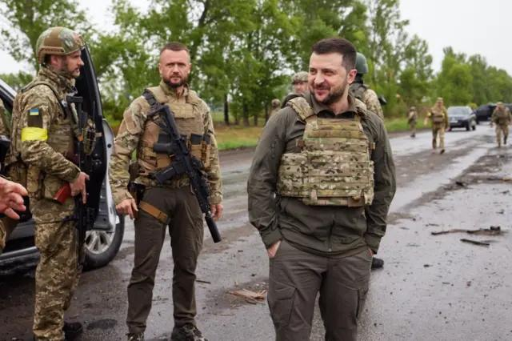
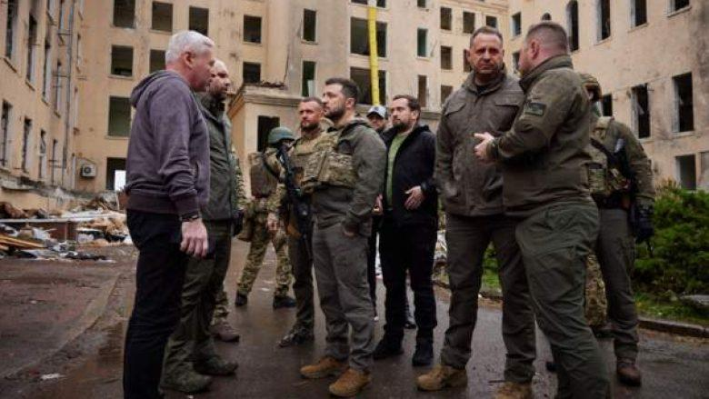

## Claim
Claim: " This image shows Ukrainian President Volodymyr Zelensky arriving in August 2024 in the Sudzha of Kursk region, Russia, which had just been occupied by Ukrainian troops in the Kursk Offensive, and meeting with representatives of the people there."

## Actions
```
reverse_search()
```

## Evidence
### Evidence from `reverse_search`
The image () appears in articles about Volodymyr Zelensky visiting troops. The BBC article ([https://www.bbc.com/news/live/world-europe-61612803](https://www.bbc.com/news/live/world-europe-61612803)) states that Zelensky visited troops in the Kharkiv region (, ). Telegrafi.com ([https://telegrafi.com/en/zelensky-on-a-rare-trip-outside-kiev-visited-the-front-line-where-he-met-ukrainian-troops/](https://telegrafi.com/en/zelensky-on-a-rare-trip-outside-kiev-visited-the-front-line-where-he-met-ukrainian-troops/)) also mentions Zelensky's visit to the front line in the Kharkiv region and includes the image (, , , , ).


## Elaboration
The evidence suggests that the image () depicts Volodymyr Zelensky visiting troops in the Kharkiv region, not the Kursk region. The BBC article ([https://www.bbc.com/news/live/world-europe-61612803](https://www.bbc.com/news/live/world-europe-61612803)) and Telegrafi.com ([https://telegrafi.com/en/zelensky-on-a-rare-trip-outside-kiev-visited-the-front-line-where-he-met-ukrainian-troops/](https://telegrafi.com/en/zelensky-on-a-rare-trip-outside-kiev-visited-the-front-line-where-he-met-ukrainian-troops/)) both support this.

The claim that the image shows Zelensky in the Sudzha of Kursk region, Russia, is not supported by the evidence. The evidence indicates the location was the Kharkiv region.

The claim also mentions the Kursk Offensive, which is not mentioned in the provided evidence.


## Final Judgement
The image shows Volodymyr Zelensky visiting troops in the Kharkiv region, not the Kursk region as claimed. The claim is therefore inaccurate regarding the location.

`false`

### Verdict: FALSE

### Justification
The image shows Ukrainian President Volodymyr Zelensky visiting troops in the Kharkiv region, not the Kursk region as claimed. This is supported by the BBC article ([https://www.bbc.com/news/live/world-europe-61612803](https://www.bbc.com/news/live/world-europe-61612803)) and Telegrafi.com ([https://telegrafi.com/en/zelensky-on-a-rare-trip-outside-kiev-visited-the-front-line-where-he-met-ukrainian-troops/](https://telegrafi.com/en/zelensky-on-a-rare-trip-outside-kiev-visited-the-front-line-where-he-met-ukrainian-troops/)).
