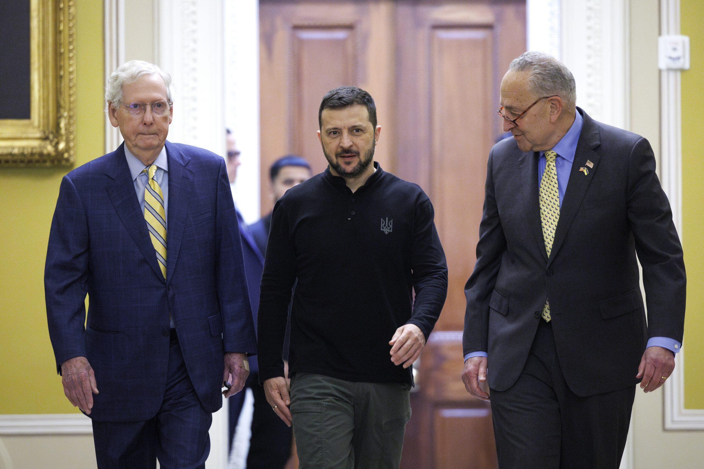
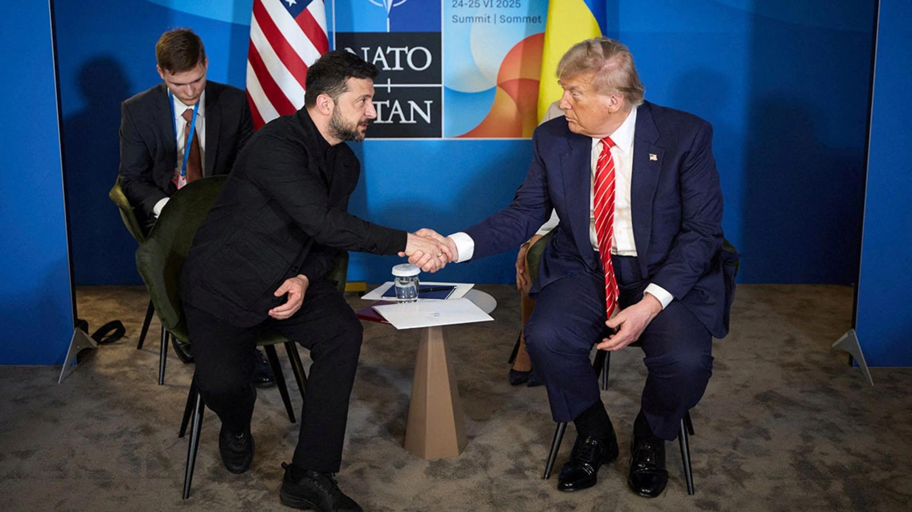
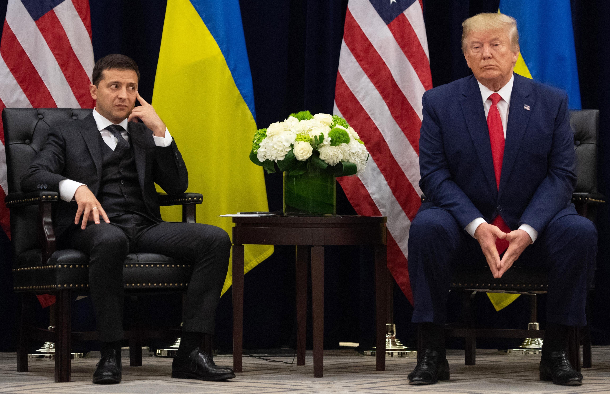
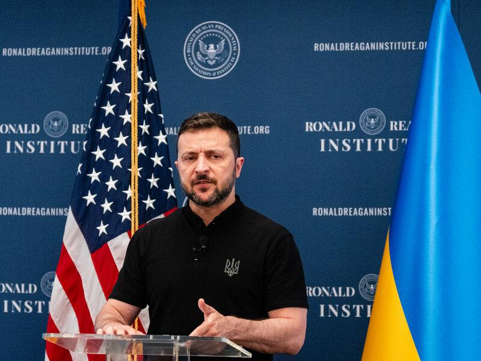
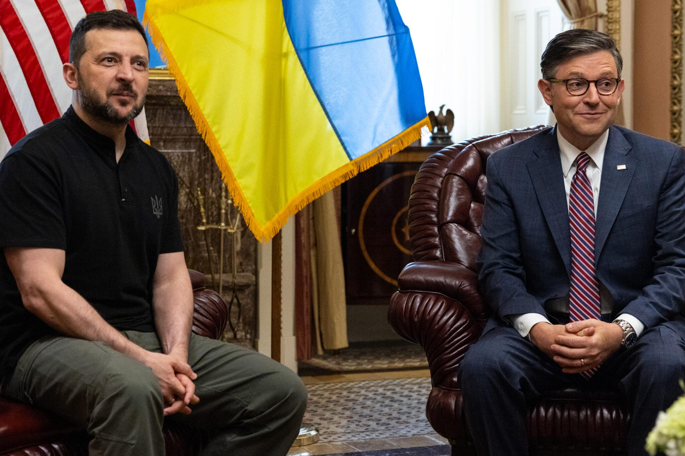
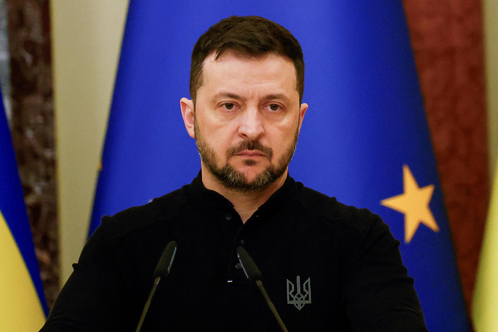
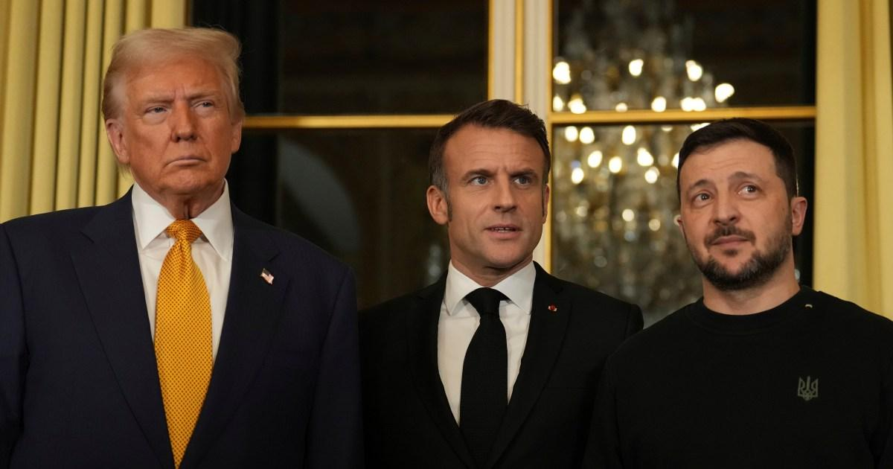
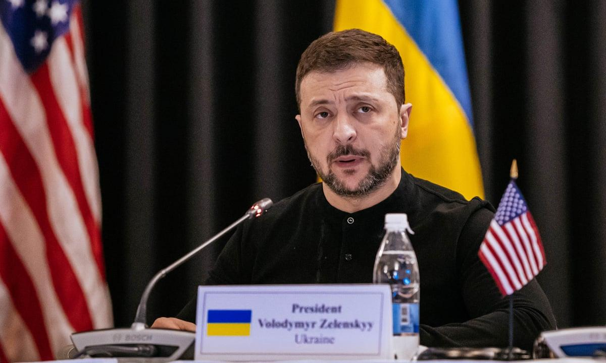

## Claim
Claim: "In a press conference on December 9, 2024 Ukrainian President Volodymyr Zelenskyy said: 'I will ask Biden to invite me to NATO ... there's no point in talking to Trump.'"

## Actions
```
image_search("Volodymyr Zelenskyy press conference December 9 2024")
image_search("Zelenskyy Biden NATO Trump")
```

## Evidence
### Evidence from `image_search`
The Associated Press published an image of Volodymyr Zelenskyy (). The Voice of America published an article with an image of Volodymyr Zelenskyy (). The search result from scdailygazette.com contains an image of Volodymyr Zelenskyy ().

The provided sources do not contain the information about the press conference on December 9, 2024, or the quote attributed to Zelenskyy.


### Evidence from `image_search`
The search results include images of Volodymyr Zelenskyy and Donald Trump. One image is from [CFR.org](https://www.cfr.org/article/trump-and-zelenskyy-meet-sidelines-nato-summit) .

Another image is from [PBS.org](https://www.pbs.org/newshour/politics/trump-calls-ukraines-zelenskyy-a-dictator-tensions-rise-over-russia-war) . A third image is from [NPR.org](https://www.npr.org/2025/02/20/g-s1-49858/reversing-u-s-policy-trump-attacks-zelenskyy-blames-ukraine-for-war-with-russia) .


## Elaboration
The evidence does not contain any information about the press conference on December 9, 2024, or the quote attributed to Zelenskyy. Therefore, the claim cannot be verified.


## Actions
```
image_search("Zelenskyy speech December 9 2024 NATO")
```

## Evidence
### Evidence from `image_search`
The New York Times published an image of Volodymyr Zelenskyy (). The search result from dailymontanan.com contains an image of Volodymyr Zelenskyy (). Reuters published an image of Volodymyr Zelenskyy (). The provided sources do not contain the information about the press conference on December 9, 2024, or the quote attributed to Zelenskyy.


## Elaboration
The additional search results do not provide any information about the press conference on December 9, 2024, or the quote attributed to Zelenskyy. Therefore, the claim remains unverified.


## Actions
```
image_search("Zelenskyy speech December 9 2024 Trump")
```

## Evidence
### Evidence from `image_search`
Al Jazeera published an article on December 10, 2024, mentioning Zelenskyy's statement that Putin fears only Trump and China. The Guardian published an article on January 9, 2025, about Zelenskyy urging Western allies not to drop the ball when Trump returns to power in Ukraine. Images of Zelenskyy and Trump are included in the search results (, ).


## Elaboration
The evidence reveals that Zelenskyy made statements about Trump and Putin. However, the provided evidence does not contain the specific quote from the claim. Therefore, the claim cannot be verified.


## Final Judgement
The search results did not provide any evidence to support the claim that Zelenskyy made the specific statement in a press conference on December 9, 2024. While there are images of Zelenskyy and Trump, and articles mentioning Zelenskyy's statements about Trump, the exact quote is not found.

`false`

### Verdict: FALSE

### Justification
The fact-check did not find any evidence to support the claim that Volodymyr Zelenskyy made the specific statement in a press conference on December 9, 2024. Although images of Zelenskyy and Trump were found, and articles mentioned Zelenskyy's statements about Trump, the exact quote was not located in the search results. Therefore, the claim is unverified.
