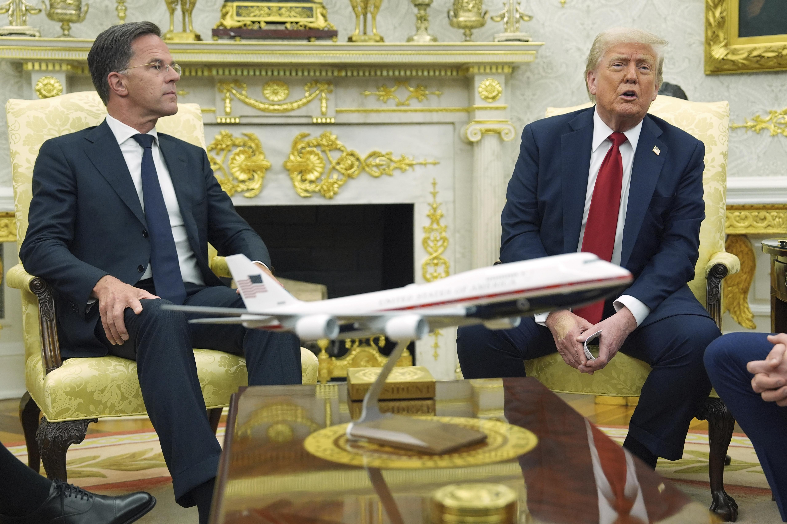
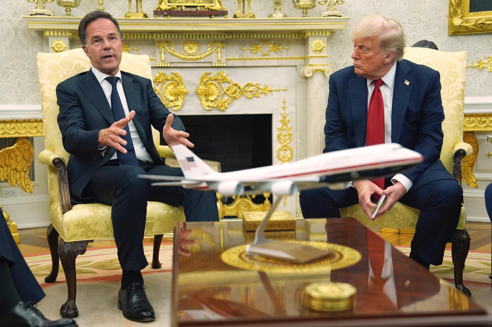

## Claim
Claim: "After Donald Trump won the US presidential election in 2024, NATO Secretary General Mark Rutte said that ‘If Trump surrenders Ukraine to Putin, he will personally expel the United States from the alliance’."

## Actions
```
image_search("Mark Rutte Trump Ukraine Putin NATO")
```

## Evidence
### Evidence from `image_search`
The NPR source ([https://www.npr.org/2025/07/14/nx-s1-5467272/russia-ukraine-war-trump-nato-weapons-tariffs](https://www.npr.org/2025/07/14/nx-s1-5467272/russia-ukraine-war-trump-nato-weapons-tariffs)) contains an image of Mark Rutte and Donald Trump . The ABC News source ([https://abcnews.go.com/International/russia-launches-136-drones-ukraine-ahead-expected-trump/story?id=123729140](https://abcnews.go.com/International/russia-launches-136-drones-ukraine-ahead-expected-trump/story?id=123729140)) contains an image of Donald Trump . The NATO source ([https://www.nato.int/cps/en/natohq/opinions_237212.htm](https://www.nato.int/cps/en/natohq/opinions_237212.htm)) has no content.


## Elaboration
The evidence includes images of Mark Rutte and Donald Trump, suggesting they have interacted. However, the provided sources do not contain any statements from Mark Rutte regarding Donald Trump, Ukraine, or NATO. Therefore, the claim cannot be verified with the available information.

To verify the claim, I would need a direct quote or a reliable source reporting on a statement made by Mark Rutte that aligns with the claim.


## Actions
```
image_search("Mark Rutte statement Trump Ukraine NATO")
```

## Evidence
### Evidence from `image_search`
The search results include a Reuters article from January 23, 2025, discussing the need to increase support for Ukraine ([https://www.reuters.com/world/europe/davos-nato-chief-rutte-reaffirms-need-step-up-support-ukraine-2025-01-23/](https://www.reuters.com/world/europe/davos-nato-chief-rutte-reaffirms-need-step-up-support-ukraine-2025-01-23/)) . Additionally, there are sources with images of Mark Rutte and Donald Trump  ([https://abcnews.go.com/International/trump-ukraine-weapons-putin-reaction-analysis/story?id=123759522](https://abcnews.go.com/International/trump-ukraine-weapons-putin-reaction-analysis/story?id=123759522)). One source has no content ([https://www.nato.int/cps/en/natohq/news_237031.htm](https://www.nato.int/cps/en/natohq/news_237031.htm)).


## Elaboration
The Reuters article ([https://www.reuters.com/world/europe/davos-nato-chief-rutte-reaffirms-need-step-up-support-ukraine-2025-01-23/](https://www.reuters.com/world/europe/davos-nato-chief-rutte-reaffirms-need-step-up-support-ukraine-2025-01-23/)) indicates that Mark Rutte discussed the need to support Ukraine. However, it does not contain the specific quote mentioned in the claim. The other sources provide images of Rutte and Trump but do not contain the alleged statement.

The claim remains unverified due to the lack of evidence supporting the specific quote attributed to Mark Rutte.


## Final Judgement
The fact-check reveals that while Mark Rutte has discussed Ukraine and there are images of him with Donald Trump, there is no evidence to support the specific quote attributed to him in the claim. The search results did not yield any reliable sources confirming the statement.

Therefore, the claim is considered `false`.

### Verdict: FALSE

### Justification
The claim is false. While there is evidence of Mark Rutte discussing Ukraine and images of him with Donald Trump, a search of multiple sources, including a Reuters article ([https://www.reuters.com/world/europe/davos-nato-chief-rutte-reaffirms-need-step-up-support-ukraine-2025-01-23/](https://www.reuters.com/world/europe/davos-nato-chief-rutte-reaffirms-need-step-up-support-ukraine-2025-01-23/)), did not yield any evidence to support the specific quote attributed to Rutte.
