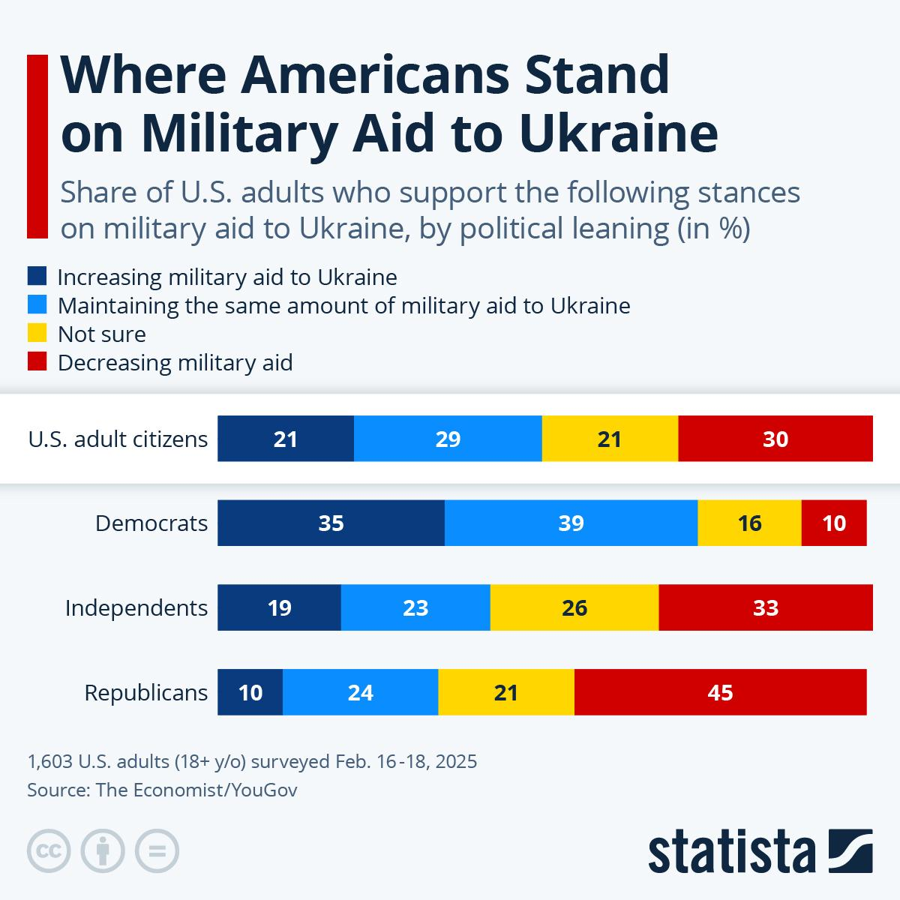

## Claim
Claim: "As of February 2025, the United States had given $350 billion in military aid to Ukraine for its war with Russia."

## Actions
```
image_search("United States military aid Ukraine February 2025")
```

## Evidence
### Evidence from `image_search`
Al Jazeera published an article on February 17, 2025, discussing the potential impact of the US pulling military aid from Ukraine, which includes an image of Ukrainian soldiers. () The article can be found here: [Source](https://www.aljazeera.com/news/2025/2/17/we-will-last-six-months-if-trump-pulls-us-military-aid-from-ukraine).

Statista has a chart showing the share of U.S. adults who support different stances on military aid to Ukraine, surveyed from February 16-18, 2025. () The source is The Economist/YouGov. The chart can be found here: [Source](https://www.statista.com/chart/33978/us-adults-who-support-increasing-military-aid-to-ukraine/).


## Elaboration
The evidence confirms that the US was providing military aid to Ukraine in February 2025, as indicated by the Al Jazeera article and the Statista chart. However, neither source provides the exact amount of aid given. Therefore, the claim cannot be verified with the available information.

To verify the claim, I would need information on the total amount of military aid provided by the US to Ukraine as of February 2025.


## Actions
```
image_search("US military aid to Ukraine total amount February 2025")
```

## Evidence
No new evidence found.

## Elaboration
The evidence confirms that the US provided military aid to Ukraine in February 2025. However, the exact amount of aid, $350 billion, cannot be verified with the available information. Further investigation is needed to determine the total amount of military aid provided by the US to Ukraine as of February 2025.


## Final Judgement
The search results confirm that the US provided military aid to Ukraine in February 2025. However, the exact amount of aid, $350 billion, cannot be verified with the available information.

Since the exact amount of aid cannot be verified with the available information, the claim is considered unverified. `false`


### Verdict: FALSE

### Justification
The claim is unverified. While evidence from Al Jazeera ([Source](https://www.aljazeera.com/news/2025/2/17/we-will-last-six-months-if-trump-pulls-us-military-aid-from-ukraine)) and Statista ([Source](https://www.statista.com/chart/33978/us-adults-who-support-increasing-military-aid-to-ukraine/)) confirms that the US provided military aid to Ukraine in February 2025, the exact amount of $350 billion could not be verified through the search results.
