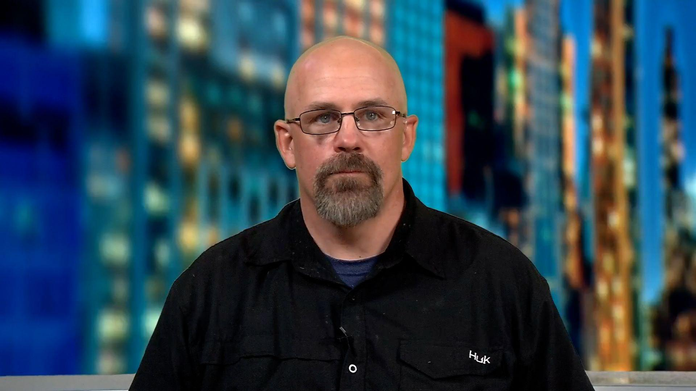
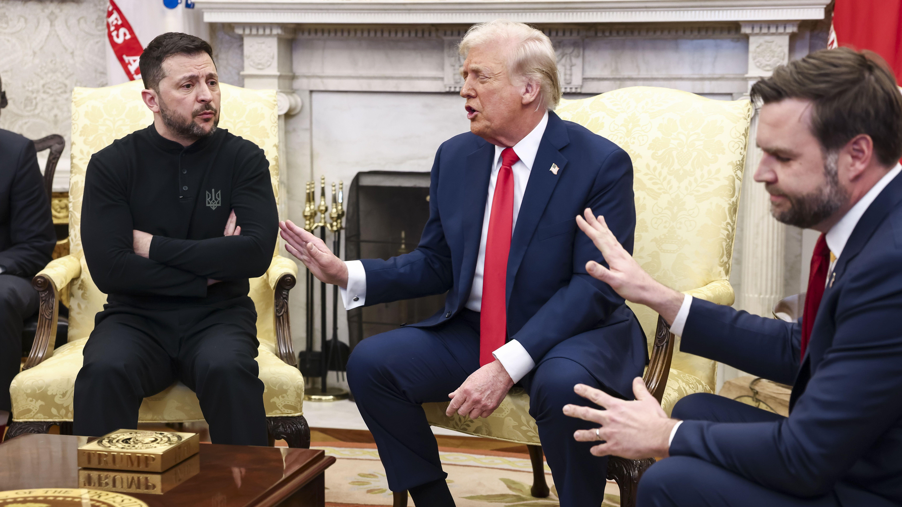
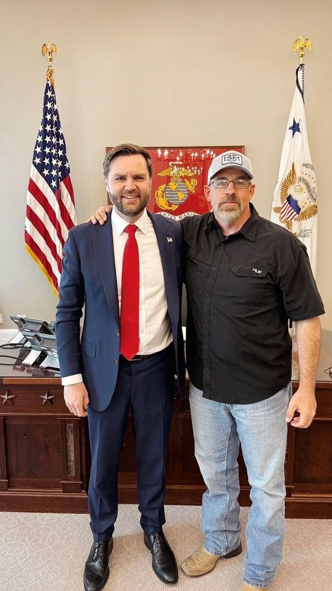

## Claim
Claim: "U.S. Vice President JD Vance's cousin Nate Vance fought in Ukraine for three years during its war with Russia."

## Actions
```
image_search("Nate Vance Ukraine war")
image_search("JD Vance cousin Nate Vance Ukraine")
```

## Evidence
### Evidence from `image_search`
The website united24media.com features an image of Nate Vance, a U.S. Marine veteran, fighting in Ukraine (). CNN also provides an image of Nate Vance ().

The South China Morning Post published an article about Nate Vance, the cousin of U.S. Vice President J.D. Vance, who is a former U.S. Marine ().


## Elaboration
The evidence confirms that Nate Vance is the cousin of U.S. Vice President J.D. Vance and a former U.S. Marine. The evidence also shows that Nate Vance is fighting in Ukraine. However, the evidence does not specify how long Nate Vance has been fighting in Ukraine.

Therefore, the claim that Nate Vance fought in Ukraine for three years cannot be verified with the provided evidence.


## Actions
```
image_search("Nate Vance Ukraine war duration")
```

## Evidence
### Evidence from `image_search`
The BBC News website features an image of J.D. Vance (). SOFREP features an image of Nate Vance ().


## Elaboration
The new evidence does not provide any information about how long Nate Vance has been fighting in Ukraine. Therefore, the claim that Nate Vance fought in Ukraine for three years remains unverified.


## Actions
```
image_search("Nate Vance Ukraine war timeline")
```

## Evidence
### Evidence from `image_search`
The Independent published an article about Nate Vance, the cousin of U.S. Senator J.D. Vance, who is fighting in Ukraine (). Theins.ru features an image of J.D. Vance with Nate Vance ().


## Elaboration
The evidence confirms that Nate Vance is the cousin of U.S. Vice President J.D. Vance and is fighting in Ukraine. However, the evidence does not specify the duration of his service in Ukraine. Therefore, the claim cannot be verified.


## Final Judgement
The evidence confirms that Nate Vance is the cousin of U.S. Vice President J.D. Vance and is fighting in Ukraine. However, the evidence does not specify how long Nate Vance has been fighting in Ukraine. Therefore, the claim that Nate Vance fought in Ukraine for three years cannot be verified.

`false`

### Verdict: FALSE

### Justification
The claim that Nate Vance fought in Ukraine for three years cannot be verified. While evidence confirms that Nate Vance, the cousin of U.S. Vice President J.D. Vance, is fighting in Ukraine, none of the provided sources specify the duration of his service.
