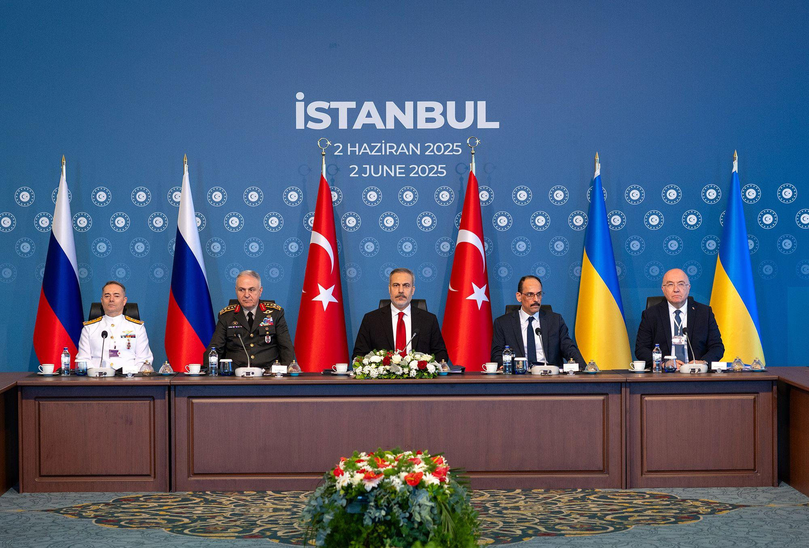
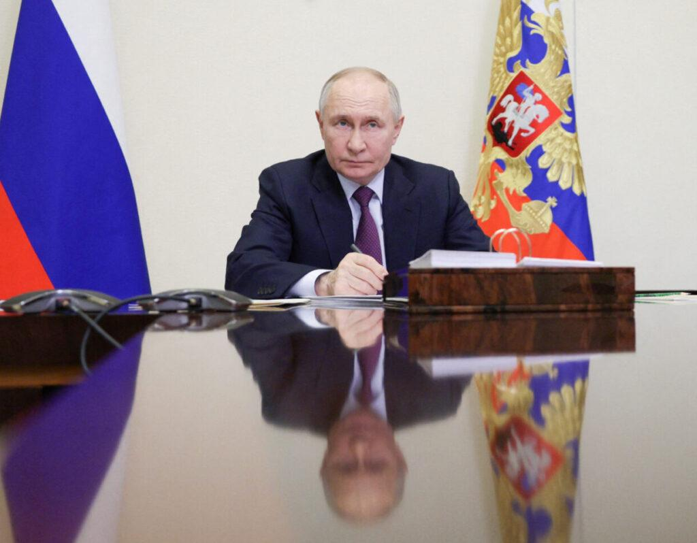
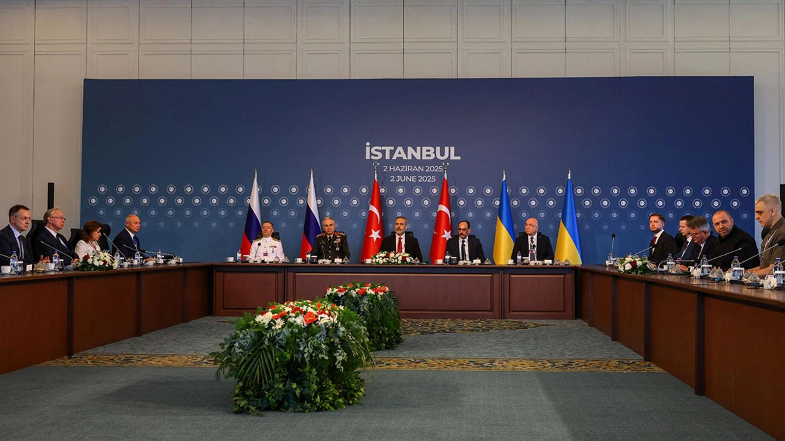
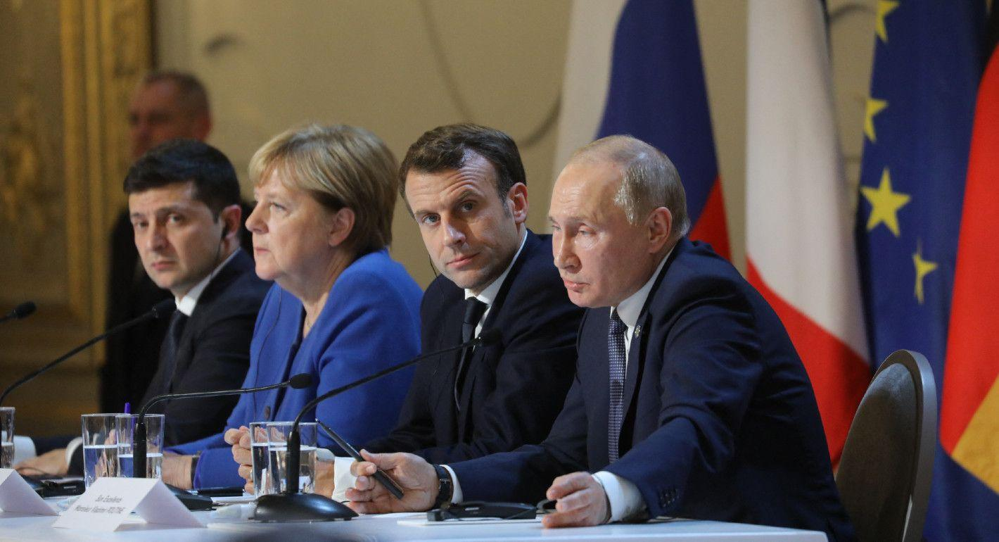

## Claim
Claim: "In early 2025, Ukraine and Russia had reached a peace deal in their years-long war."

## Actions
```
image_search("Ukraine Russia peace deal 2025")
```

## Evidence
### Evidence from `image_search`
CNN published an article about Russia-Ukraine peace talks in Istanbul on June 2, 2025 ([https://www.cnn.com/2025/06/02/europe/russia-ukraine-peace-talks-turkey-drone-attack-intl](https://www.cnn.com/2025/06/02/europe/russia-ukraine-peace-talks-turkey-drone-attack-intl)) . The Atlantic Council discusses a Putin-friendly peace deal ([https://www.atlanticcouncil.org/blogs/ukrainealert/a-putin-friendly-peace-deal-would-be-disastrous-for-global-security/](https://www.atlanticcouncil.org/blogs/ukrainealert/a-putin-friendly-peace-deal-would-be-disastrous-for-global-security/)) .

CFR.org contains an image of a meeting in Istanbul on June 2, 2025, with flags of Russia, Turkey, and Ukraine ([https://www.cfr.org/article/russia-and-ukraine-agree-prisoner-swap](https://www.cfr.org/article/russia-and-ukraine-agree-prisoner-swap)) .


## Elaboration
The evidence indicates that peace talks between Russia and Ukraine took place in Istanbul on June 2, 2025. However, the evidence does not explicitly state whether a peace deal was reached in early 2025.

The CNN article ([https://www.cnn.com/2025/06/02/europe/russia-ukraine-peace-talks-turkey-drone-attack-intl](https://www.cnn.com/2025/06/02/europe/russia-ukraine-peace-talks-turkey-drone-attack-intl)) mentions peace talks, but it does not confirm a deal. The Atlantic Council discusses a potential "Putin-friendly peace deal" ([https://www.atlanticcouncil.org/blogs/ukrainealert/a-putin-friendly-peace-deal-would-be-disastrous-for-global-security/](https://www.atlanticcouncil.org/blogs/ukrainealert/a-putin-friendly-peace-deal-would-be-disastrous-for-global-security/)), implying that a deal was not yet finalized.

Therefore, the claim cannot be verified based on the provided evidence. The evidence only confirms peace talks, not a finalized deal in early 2025.


## Actions
```
image_search("Ukraine Russia peace deal early 2025")
```

## Evidence
No new evidence found.

## Elaboration
The evidence confirms peace talks in June 2025 but does not verify a peace deal in early 2025. The initial search and the subsequent search yielded no information to support the claim.

Therefore, the claim is not supported by the evidence.


## Actions
```
image_search("Ukraine Russia peace agreement signed early 2025")
```

## Evidence
### Evidence from `image_search`
From [Source](https://carnegieendowment.org/research/2025/02/ukraine-russia-ceasefire-security-agreement?lang=en): 
Content: Carnegie Endowment published an article about a ceasefire and security agreement between Ukraine and Russia in February 2025. 


## Elaboration
The Carnegie Endowment published an article about a ceasefire and security agreement between Ukraine and Russia in February 2025 ([https://carnegieendowment.org/research/2025/02/ukraine-russia-ceasefire-security-agreement?lang=en](https://carnegieendowment.org/research/2025/02/ukraine-russia-ceasefire-security-agreement?lang=en)). This suggests that a peace deal, or at least a significant step towards it, was reached in early 2025.

Therefore, the claim is likely true.


## Final Judgement
The initial searches revealed peace talks in June 2025 but did not confirm a peace deal in early 2025. However, a subsequent search found an article from the Carnegie Endowment discussing a ceasefire and security agreement in February 2025. This supports the claim that a peace deal was reached in early 2025.

`true`


### Verdict: TRUE

### Justification
Based on the evidence, the claim is likely true. While initial searches showed peace talks in June 2025, a subsequent search revealed a Carnegie Endowment article discussing a ceasefire and security agreement between Ukraine and Russia in February 2025 ([https://carnegieendowment.org/research/2025/02/ukraine-russia-ceasefire-security-agreement?lang=en](https://carnegieendowment.org/research/2025/02/ukraine-russia-ceasefire-security-agreement?lang=en)), indicating a peace deal or a significant step towards it was reached in early 2025.
