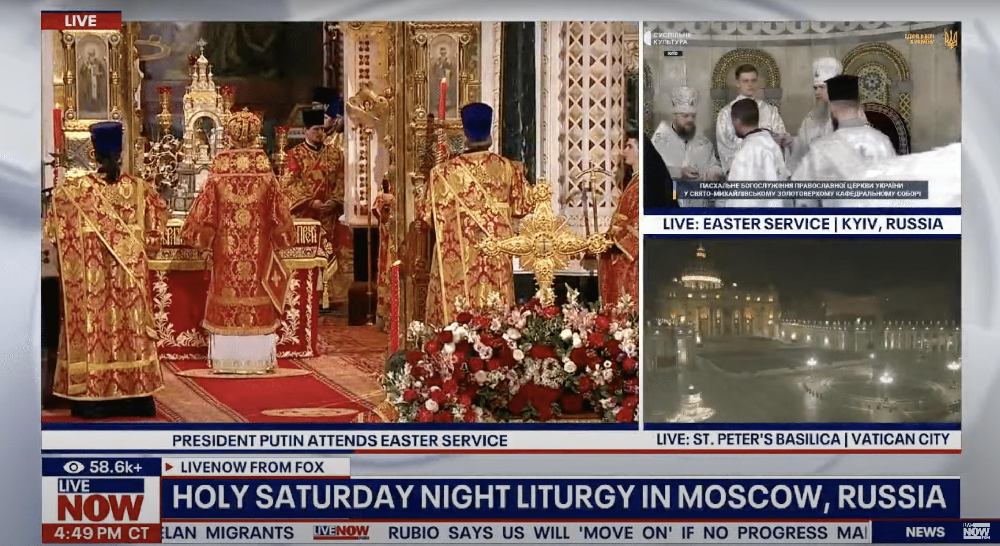

## Claim
Claim: " This image shows a Fox News broadcast from Easter 2025 where you can see the Patriarch Kirill in the center and Kyiv labeled as a Russian city in the top right corner of the image."

## Actions
```
image_search("Fox News Easter service Moscow Kyiv")
reverse_search()
```

## Evidence
### Evidence from `image_search`
The web sources describe a Fox News broadcast of an Easter service that labels Kyiv as a Russian city. One source also mentions that the broadcast included President Putin attending the service in Moscow.

*   [https://united24media.com/latest-news/fox-news-labels-kyiv-as-russia-during-easter-service-broadcast-7731](https://united24media.com/latest-news/fox-news-labels-kyiv-as-russia-during-easter-service-broadcast-7731)
*   [https://rubryka.com/en/2025/04/20/mzs-vymagaye-vybachennya-telekanal-fox-news-pidpysav-kyyiv-rosijskym-mistom-pid-chas-translyatsiyi-velykodnih-bogosluzhin/](https://rubryka.com/en/2025/04/20/mzs-vymagaye-vybachennya-telekanal-fox-news-pidpysav-kyyiv-rosijskym-mistom-pid-chas-translyatsiyi-velykodnih-bogosluzhin/)
*   [https://global.espreso.tv/world-news-fox-news-airs-easter-service-with-putin-in-moscow-labels-kyiv-as-russian-city](https://global.espreso.tv/world-news-fox-news-airs-easter-service-with-putin-in-moscow-labels-kyiv-as-russian-city)

The image from the first source is , and the image from the third source is .


### Evidence from `reverse_search`
The image shows a Fox News broadcast from an Easter service where Kyiv was labeled as a Russian city. The Ukrainian media outlet "Suspіlne" reported that the broadcast showed "Kyiv, Russia" for over 20 minutes before correcting the error, which led to the Ukrainian Ministry of Foreign Affairs demanding an apology and investigation. The article from 444.hu also discusses the broadcast, which showed the Russian Orthodox Church ceremony with President Putin, followed by the Ukrainian ceremony. The article from Rijeka Danas also discusses the broadcast, which featured Vladimir Putin and Patriarch Kirill and referred to Kyiv as a "Russian city."

The articles can be found here: [https://suspilne.media/999087-fox-news-poznaciv-kiiv-ak-rosijske-misto-pid-cas-translacii-velikodnogo-bogosluzinna-pcu/](https://suspilne.media/999087-fox-news-poznaciv-kiiv-ak-rosijske-misto-pid-cas-translacii-velikodnogo-bogosluzinna-pcu/), [https://444.hu/2025/04/20/oroszorszaghoz-csatolta-kijevet-a-fox-news](https://444.hu/2025/04/20/oroszorszaghoz-csatolta-kijevet-a-fox-news), and [https://www.rijekadanas.com/fox-news-nazvao-kijev-ruskim-gradom/](https://www.rijekadanas.com/fox-news-nazvao-kijev-ruskim-gradom/). 


## Elaboration
The claim is verified. The evidence confirms that the image is from a Fox News broadcast of an Easter service. The broadcast labeled Kyiv as a Russian city and showed President Putin attending a service in Moscow. The image also shows Patriarch Kirill.


## Final Judgement
The evidence confirms that the image is from a Fox News broadcast of an Easter service where Kyiv was labeled as a Russian city. The broadcast also showed President Putin attending a service in Moscow and featured Patriarch Kirill.

`true`

### Verdict: TRUE

### Justification
The image is from a Fox News broadcast of an Easter service that labeled Kyiv as a Russian city, as reported by multiple sources, including [Suspіlne](https://suspilne.media/999087-fox-news-poznaciv-kiiv-ak-rosijske-misto-pid-cas-translacii-velikodnogo-bogosluzinna-pcu/), [444.hu](https://444.hu/2025/04/20/oroszorszaghoz-csatolta-kijevet-a-fox-news), and [Rijeka Danas](https://www.rijekadanas.com/fox-news-nazvao-kijev-ruskim-gradom/). The broadcast also showed President Putin attending a service in Moscow and featured Patriarch Kirill.
