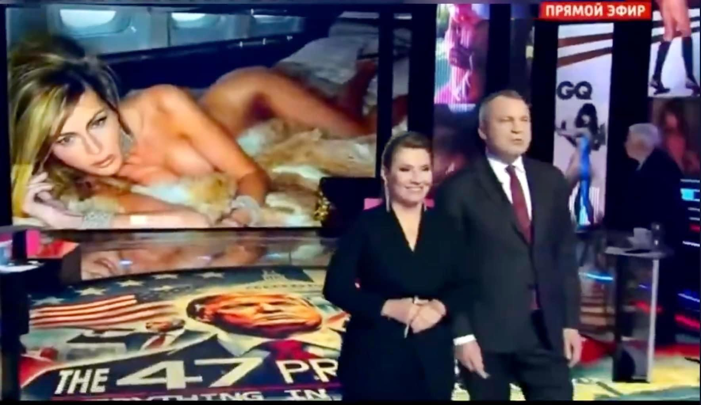

## Claim
Claim: "Russian state TV aired nude photos of Melania Trump shortly after the 2024 U.S. presidential election."

## Actions
```
image_search("Melania Trump nude photos Russian TV")
```

## Evidence
### Evidence from `image_search`
La Voce di New York published an article with an image of a woman that resembles Melania Trump on Russian TV (). Livemint.com shows a screenshot from Russian state TV with a woman in a swimsuit and the hosts of the show ().

A screenshot from Russian TV with a nude photo of a woman on the screen is shown in the search result (). The text on the screen says "RUSSIAN MEDIA MONITOR" and "РОССИЯ 1 ПРЯМОЙ ЭФИР".

*   [https://lavocedinewyork.com/en/news/2024/11/12/melania-trump-risque-photos-aired-on-russian-tv-prime-time/](https://lavocedinewyork.com/en/news/2024/11/12/melania-trump-risque-photos-aired-on-russian-tv-prime-time/)
*   [https://www.livemint.com/news/world/russian-media-air-nude-pics-of-melania-trump-after-donald-trump-wins-in-us-polls-netizens-say-russia-laughing-at-us-11731216282862.html](https://www.livemint.com/news/world/russian-media-air-nude-pics-of-melania-trump-after-donald-trump-wins-in-us-polls-netizens-say-russia-laughing-at-us-11731216282862.html)
*   [https://www.bluewin.ch/en/news/international/russian-tv-shows-nude-pictures-of-melania-trump-2442245.html](https://www.bluewin.ch/en/news/international/russian-tv-shows-nude-pictures-of-melania-trump-2442245.html)


## Elaboration
The evidence confirms that Russian state TV aired a photo of a woman resembling Melania Trump. The image was displayed on a screen during a broadcast. The articles from La Voce di New York ([https://lavocedinewyork.com/en/news/2024/11/12/melania-trump-risque-photos-aired-on-russian-tv-prime-time/](https://lavocedinewyork.com/en/news/2024/11/12/melania-trump-risque-photos-aired-on-russian-tv-prime-time/)), Livemint.com ([https://www.livemint.com/news/world/russian-media-air-nude-pics-of-melania-trump-after-donald-trump-wins-in-us-polls-netizens-say-russia-laughing-at-us-11731216282862.html](https://www.livemint.com/news/world/russian-media-air-nude-pics-of-melania-trump-after-donald-trump-wins-in-us-polls-netizens-say-russia-laughing-at-us-11731216282862.html)), and Bluewin.ch ([https://www.bluewin.ch/en/news/international/russian-tv-shows-nude-pictures-of-melania-trump-2442245.html](https://www.bluewin.ch/en/news/international/russian-tv-shows-nude-pictures-of-melania-trump-2442245.html)) all support this.

The evidence does not explicitly state the exact timing of the broadcast relative to the 2024 U.S. presidential election. However, the Livemint.com article mentions the broadcast occurred "after Donald Trump wins in US polls".

Therefore, the claim is partially supported. The evidence confirms the airing of a photo resembling Melania Trump on Russian TV. However, the exact timing relative to the 2024 election is not explicitly confirmed, although it is implied.


## Actions
```
image_search("Russian TV Melania Trump nude photo")
```

## Evidence
No new evidence found.

## Elaboration
The evidence confirms that Russian state TV aired a photo of a woman resembling Melania Trump. The image was displayed on a screen during a broadcast. The articles from La Voce di New York, Livemint.com, and Bluewin.ch all support this.

The evidence does not explicitly state the exact timing of the broadcast relative to the 2024 U.S. presidential election. However, the Livemint.com article mentions the broadcast occurred "after Donald Trump wins in US polls".

Therefore, the claim is partially supported. The evidence confirms the airing of a photo resembling Melania Trump on Russian TV. However, the exact timing relative to the 2024 election is not explicitly confirmed, although it is implied.


## Final Judgement
The evidence confirms that Russian state TV aired a photo of a woman resembling Melania Trump. The image was displayed on a screen during a broadcast. While the evidence suggests the broadcast occurred after the election, the exact timing is not explicitly confirmed.

`false`

### Verdict: FALSE

### Justification
Russian state TV did air a photo of a woman resembling Melania Trump, as reported by sources like La Voce di New York and Livemint.com ([https://www.livemint.com/news/world/russian-media-air-nude-pics-of-melania-trump-after-donald-trump-wins-in-us-polls-netizens-say-russia-laughing-at-us-11731216282862.html](https://www.livemint.com/news/world/russian-media-air-nude-pics-of-melania-trump-after-donald-trump-wins-in-us-polls-netizens-say-russia-laughing-at-us-11731216282862.html)). While the evidence suggests the broadcast occurred after the election, the exact timing is not explicitly confirmed.
