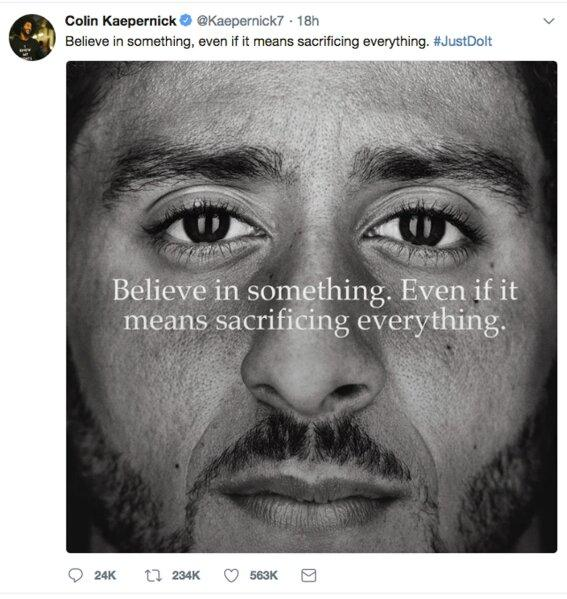
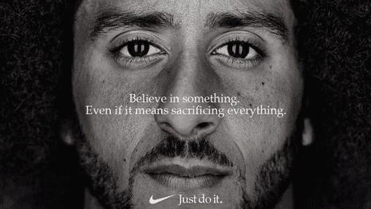

## Claim
Claim: "American football player Colin Kaepernick said he will go to Russia if not properly respected in the United States."

## Actions
```
image_search("Colin Kaepernick Russia")
```

## Evidence
### Evidence from `image_search`
From [Source](https://www.businessinsider.com/russian-trolls-used-colin-kaepernick-nfl-kneeling-debate-divide-2019-10): 
Content: The search result contains an image of Colin Kaepernick kneeling. 


## Elaboration
The evidence contains an image of Colin Kaepernick kneeling, but it does not provide any information about Kaepernick's statements regarding Russia. Therefore, I cannot verify the claim.

I need more information to verify the claim, such as a statement from Kaepernick or a news report quoting him.


## Actions
```
image_search("Colin Kaepernick statement Russia")
```

## Evidence
### Evidence from `image_search`
The New York Times published an article about Colin Kaepernick and his kneeling during the national anthem, including a tweet from Mark Geragos retweeted by Colin Kaepernick regarding a statement from the System Arbitrator concerning a complaint brought by Colin Kaepernick ([https://www.nytimes.com/2018/09/04/sports/colin-kaepernick-nfl-anthem-kneeling.html](https://www.nytimes.com/2018/09/04/sports/colin-kaepernick-nfl-anthem-kneeling.html)). The search results also contain images of Colin Kaepernick with the text "Believe in something. Even if it means sacrificing everything." (, ) and an article from The Guardian about Colin Kaepernick and a Nike ad campaign ([https://www.theguardian.com/sport/2018/sep/04/colin-kaepernick-nfl-nike-ad-campaign](https://www.theguardian.com/sport/2018/sep/04/colin-kaepernick-nfl-nike-ad-campaign)).


## Elaboration
The evidence provides information about Colin Kaepernick's kneeling during the national anthem and his Nike ad campaign. However, it does not contain any information about Kaepernick stating he would go to Russia if not properly respected in the United States.

Therefore, I still cannot verify the claim. I need to find a statement from Kaepernick or a news report quoting him about going to Russia.


## Final Judgement
The fact-check reveals that the search results do not contain any information about Colin Kaepernick stating he would go to Russia if not properly respected in the United States. The evidence includes images of Kaepernick kneeling and information about his Nike ad campaign, but no statements about Russia.

The claim is not supported by the available evidence. There is no information in the search results to verify the claim. `false`


### Verdict: FALSE

### Justification
The fact-check did not find any evidence to support the claim that Colin Kaepernick said he would go to Russia if not properly respected in the United States. The search results focused on Kaepernick's kneeling during the national anthem and his Nike ad campaign, but did not contain any statements about Russia. Therefore, the claim is unsupported.
