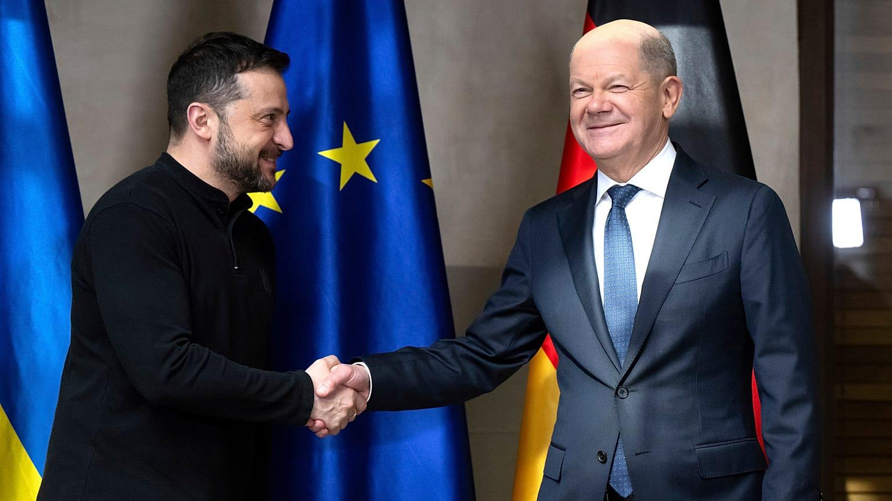
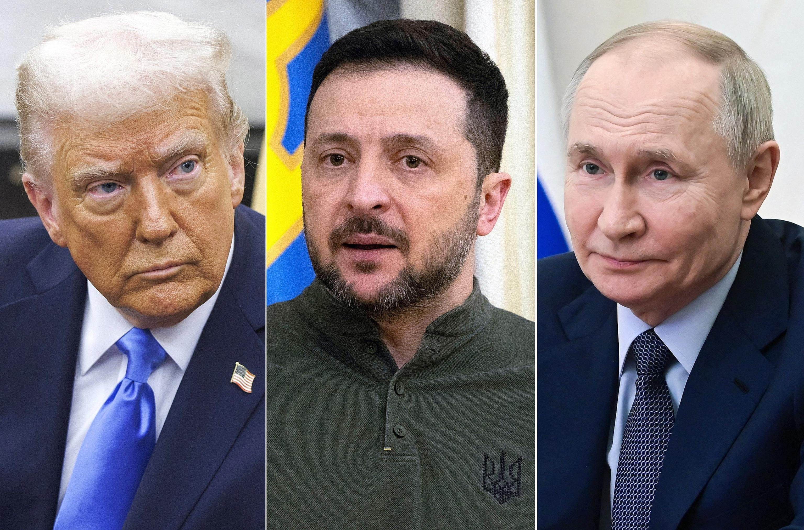

## Claim
Claim: "In February 2025 German Chancellor Olaf Scholz declared a state of emergency in Germany due to US President Donald Trump's peace plan for Ukraine."

## Actions
```
image_search("Olaf Scholz state of emergency Germany February 2025")
image_search("Donald Trump peace plan Ukraine February 2025")
```

## Evidence
### Evidence from `image_search`
Euronews published a fact-check stating that Scholz did not call for a German state of emergency over Russia-US peace talks, with the article published on February 19, 2025 (). Reuters published an article on February 15, 2025, about German Chancellor Olaf Scholz ().

The search result from 1lurer.am contains an image of Olaf Scholz ().


### Evidence from `image_search`
The BBC published an image showing the areas of Ukraine under Russian military control as of February 12.  ABC News contains an image of Donald Trump. 

The Council on Foreign Relations contains an image of Donald Trump and Volodymyr Zelenskyy. 


## Elaboration
The evidence includes a fact-check from Euronews, published on February 19, 2025, which states that Scholz did not declare a state of emergency in Germany over Russia-US peace talks. This directly contradicts the claim. The other search results provide images of Scholz and Trump, but do not provide any information to support the claim.

Therefore, based on the available evidence, the claim is false.


## Final Judgement
The fact-check reveals that Euronews published an article on February 19, 2025, stating that Scholz did not declare a state of emergency in Germany due to a US peace plan for Ukraine. This directly contradicts the claim.

The most appropriate decision option is `false`.


### Verdict: FALSE

### Justification
The claim is false. A fact-check by Euronews, published on February 19, 2025, explicitly states that Olaf Scholz did not declare a state of emergency in Germany due to a US peace plan for Ukraine.
