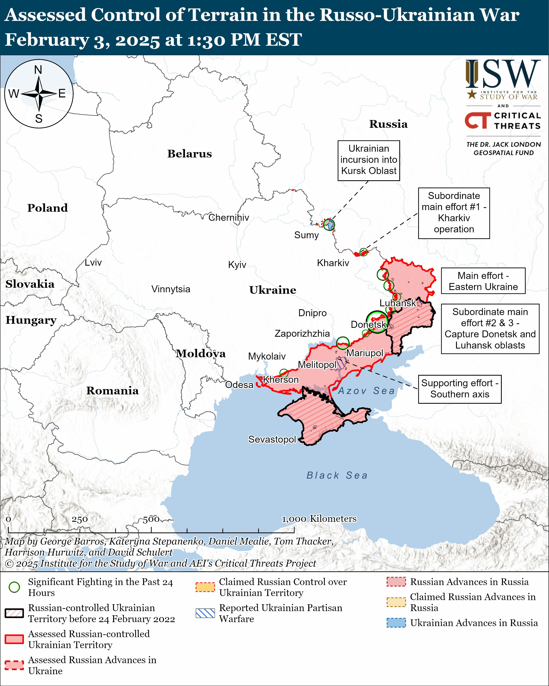
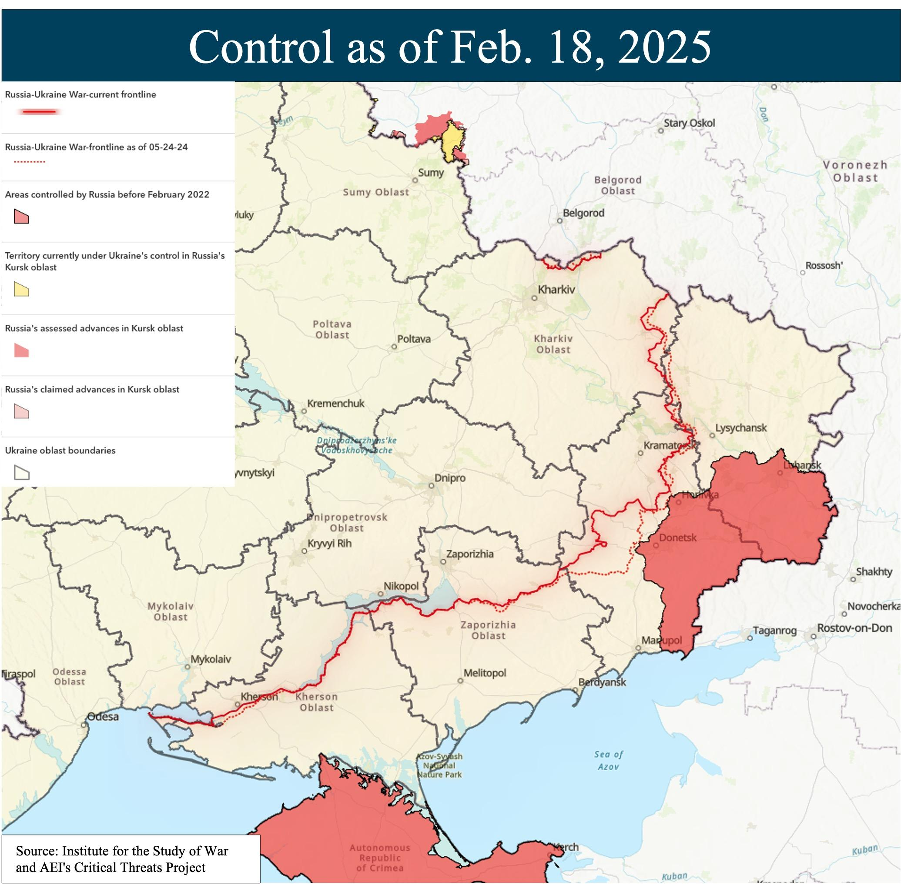
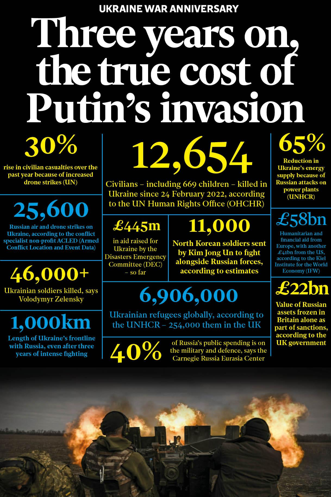

## Claim
Claim: "As of February 2025, Russia has lost 1.5 million troops in the Ukraine war."

## Actions
```
image_search("Russia Ukraine war casualties February 2025")
```

## Evidence
### Evidence from `image_search`
The Institute for the Study of War and AEI's Critical Threats Project published a map on February 3, 2025, showing the assessed control of terrain in the Russo-Ukrainian War (). Another source, dated February 19, 2025, also contains a map showing the Russia-Ukraine War frontline as of February 18, 2025 ().

An article published by The Independent on the Ukraine war anniversary includes statistics, such as the number of Ukrainian soldiers killed (46,000+) and the number of civilians killed in Ukraine since February 24, 2022 (12,654) ().

*   [https://www.understandingwar.org/backgrounder/russian-offensive-campaign-assessment-february-3-2025](https://www.understandingwar.org/backgrounder/russian-offensive-campaign-assessment-february-3-2025)
*   [https://www.independent.co.uk/news/world/europe/ukraine-war-anniversary-russia-putin-zelensky-casualties-map-drones-b2703340.html](https://www.independent.co.uk/news/world/europe/ukraine-war-anniversary-russia-putin-zelensky-casualties-map-drones-b2703340.html)
*   [https://www.russiamatters.org/news/russia-ukraine-war-report-card/russia-ukraine-war-report-card-feb-19-2025](https://www.russiamatters.org/news/russia-ukraine-war-report-card/russia-ukraine-war-report-card-feb-19-2025)


## Elaboration
The provided evidence does not contain any information about the number of Russian troops lost in the Ukraine war. The evidence includes maps of the conflict and statistics on Ukrainian casualties and civilian deaths. Therefore, I cannot verify the claim.


## Final Judgement
The evidence provided does not contain any information about the number of Russian troops lost in the Ukraine war. The evidence includes maps of the conflict and statistics on Ukrainian casualties and civilian deaths. Therefore, the claim cannot be verified. `false`


### Verdict: FALSE

### Justification
The provided evidence, including maps from the Institute for the Study of War and AEI's Critical Threats Project ([https://www.understandingwar.org/backgrounder/russian-offensive-campaign-assessment-february-3-2025](https://www.understandingwar.org/backgrounder/russian-offensive-campaign-assessment-february-3-2025) and [https://www.russiamatters.org/news/russia-ukraine-war-report-card/russia-ukraine-war-report-card-feb-19-2025](https://www.russiamatters.org/news/russia-ukraine-war-report-card/russia-ukraine-war-report-card-feb-19-2025)), and an article from The Independent ([https://www.independent.co.uk/news/world/europe/ukraine-war-anniversary-russia-putin-zelensky-casualties-map-drones-b2703340.html](https://www.independent.co.uk/news/world/europe/ukraine-war-anniversary-russia-putin-zelensky-casualties-map-drones-b2703340.html)), focuses on the conflict's territorial control and Ukrainian casualties, but does not provide any data to support the claim about Russian troop losses.
