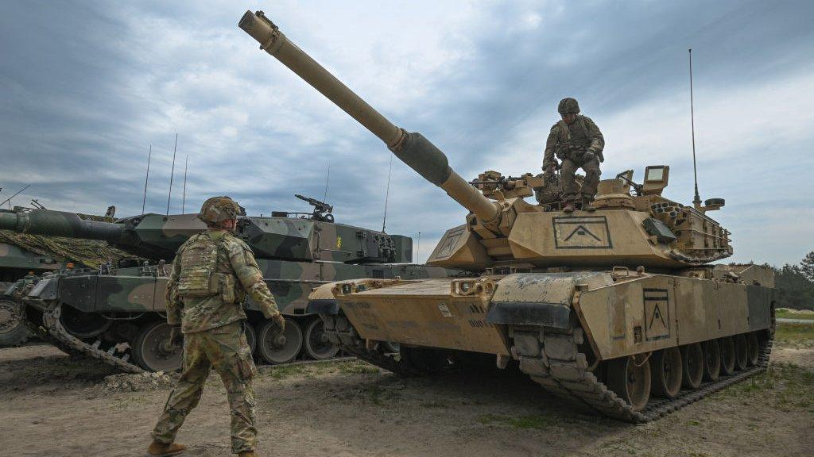
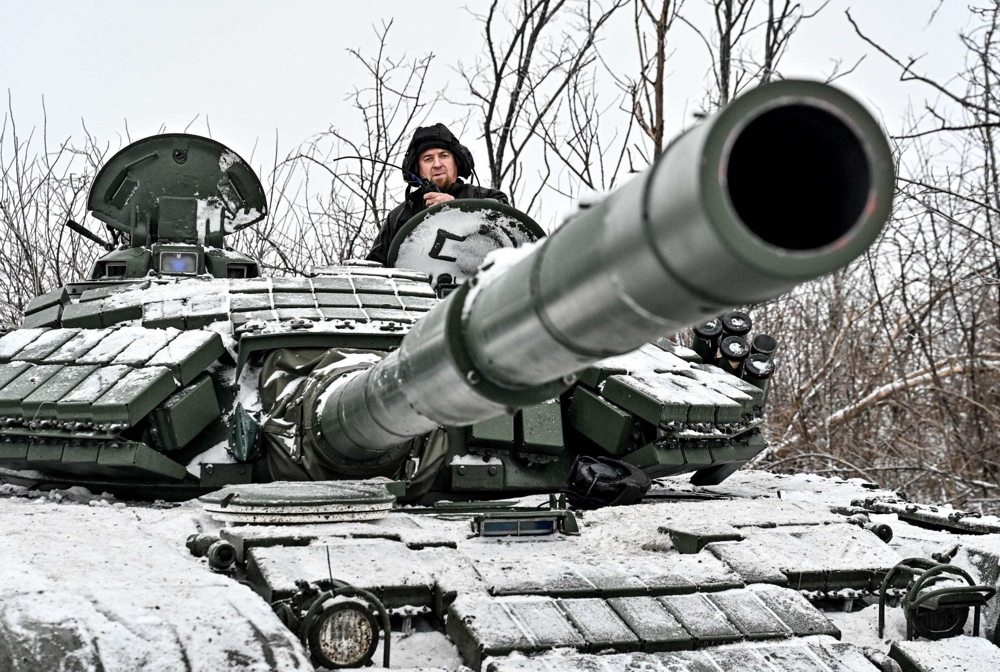
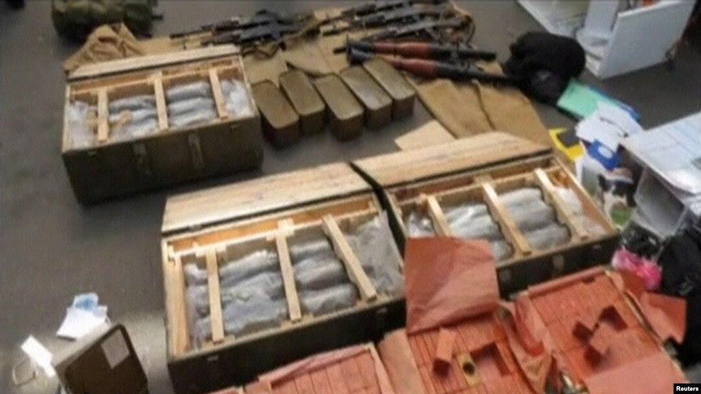
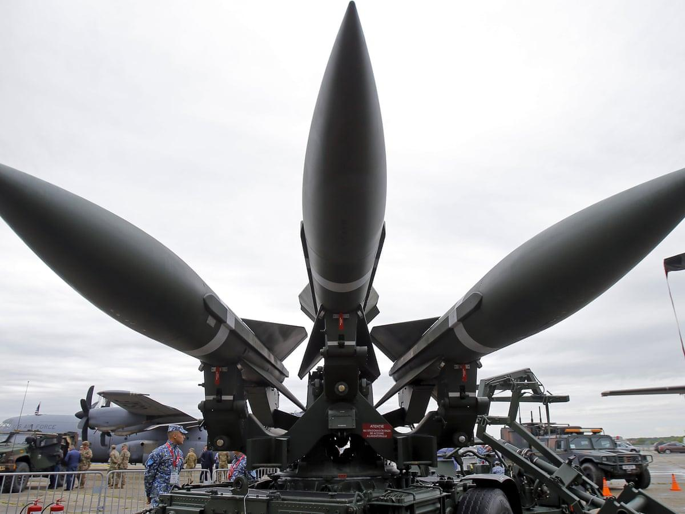
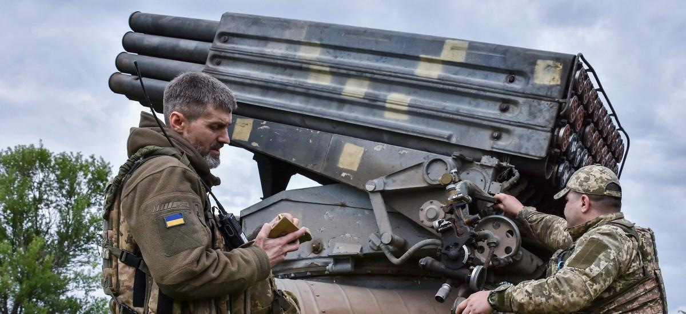
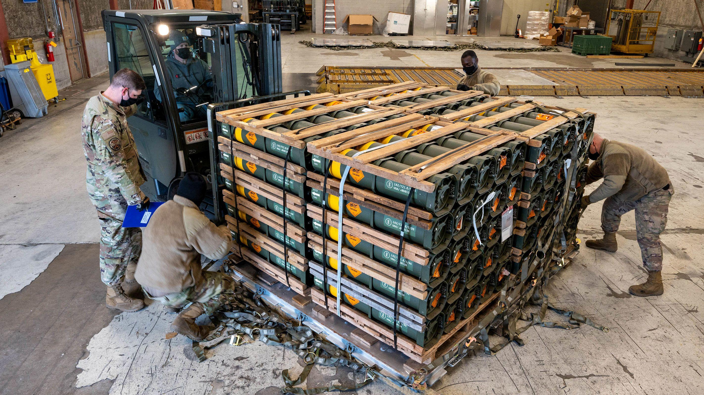

## Claim
Claim: "Ukraine is selling half of the armaments it receives from the United States"

## Actions
```
image_search("Ukraine arms sales US")
```

## Evidence
### Evidence from `image_search`
The BBC News website ([https://www.bbc.com/news/world-us-canada-68136840](https://www.bbc.com/news/world-us-canada-68136840)) contains an image of tanks . The search result from Vox.com ([https://www.vox.com/world-politics/2024/2/4/24059340/us-arms-exports-2023-ukraine-war-russia-gaza](https://www.vox.com/world-politics/2024/2/4/24059340/us-arms-exports-2023-ukraine-war-russia-gaza)) contains an image of a tank .


## Elaboration
The provided evidence consists of images of tanks from BBC News and Vox.com. However, the search results do not contain any information about Ukraine selling armaments received from the United States.

Therefore, the claim cannot be verified with the available evidence. More information is needed to assess the claim's veracity.


## Actions
```
image_search("Ukraine arms sales corruption")
image_search("Ukraine arms trafficking investigation")
```

## Evidence
### Evidence from `image_search`
The New York Times ([https://www.nytimes.com/2024/02/28/world/europe/ukraine-weapons-politician-charged-corruption.html](https://www.nytimes.com/2024/02/28/world/europe/ukraine-weapons-politician-charged-corruption.html)) reports on a Ukrainian politician charged with corruption . Bloomberg ([https://www.bloomberg.com/en/news/thp/2024-01-28/ukraine-says-corrupt-officials-stole-40-million-meant-to-buy-arms-for-the-war-with-russia](https://www.bloomberg.com/en/news/thp/2024-01-28/ukraine-says-corrupt-officials-stole-40-million-meant-to-buy-arms-for-the-war-with-russia)) reports that Ukrainian officials stole $40 million meant to buy arms . Al Jazeera ([https://www.aljazeera.com/news/2025/8/2/ukraine-says-defence-sector-corruption-scheme-uncovered](https://www.aljazeera.com/news/2025/8/2/ukraine-says-defence-sector-corruption-scheme-uncovered)) reports on a corruption scheme uncovered in Ukraine's defense sector .


### Evidence from `image_search`
The Global Initiative website ([https://globalinitiative.net/analysis/a-new-phase-of-arms-trafficking-in-ukraine/](https://globalinitiative.net/analysis/a-new-phase-of-arms-trafficking-in-ukraine/)) discusses a new phase of arms trafficking in Ukraine . The Financial Times ([https://www.ft.com/content/bce78c78-b899-4dd2-b3a0-69d789b8aee8](https://www.ft.com/content/bce78c78-b899-4dd2-b3a0-69d789b8aee8)) contains an image of Ukrainian soldiers with a multiple rocket launcher .

Radio Free Europe/Radio Liberty ([https://www.rferl.org/a/ukraine-flood-of-arms-east-conflict-smuggling/27797454.html](https://www.rferl.org/a/ukraine-flood-of-arms-east-conflict-smuggling/27797454.html)) contains an image of weapons in crates .


## Elaboration
The new evidence reveals reports of corruption and arms trafficking in Ukraine. Specifically, there are reports of Ukrainian officials stealing funds meant for arms purchases ([https://www.bloomberg.com/en/news/thp/2024-01-28/ukraine-says-corrupt-officials-stole-40-million-meant-to-buy-arms-for-the-war-with-russia](https://www.bloomberg.com/en/news/thp/2024-01-28/ukraine-says-corrupt-officials-stole-40-million-meant-to-buy-arms-for-the-war-with-russia)) and a new phase of arms trafficking ([https://globalinitiative.net/analysis/a-new-phase-of-arms-trafficking-in-ukraine/](https://globalinitiative.net/analysis/a-new-phase-of-arms-trafficking-in-ukraine/)).

While the evidence suggests corruption and arms trafficking, it does not directly support the claim that Ukraine is selling half of the armaments it receives from the United States. The evidence does not specify the origin of the trafficked arms or the scale of any potential sales.

Therefore, the claim remains unverified due to a lack of specific evidence.


## Actions
```
image_search("Ukraine arms sales US investigation")
```

## Evidence
### Evidence from `image_search`
The Guardian reports on a $322 million US arms sale to Ukraine, including an image of missiles . Defenseone.com contains an image of Ukrainian soldiers with a multiple rocket launcher . CNN reports on a Pentagon watchdog report regarding weaponry in Ukraine .


## Elaboration
The latest evidence includes a report from CNN about a Pentagon watchdog report regarding weaponry in Ukraine. However, the evidence does not provide any information about Ukraine selling armaments received from the United States.

Therefore, the claim remains unverified.


## Final Judgement
The search results reveal reports of corruption and arms trafficking in Ukraine, but they do not provide any evidence to support the claim that Ukraine is selling half of the armaments it receives from the United States. The evidence does not specify the origin of the trafficked arms or the scale of any potential sales. Therefore, the claim is not supported by the available evidence. `false`


### Verdict: FALSE

### Justification
The investigation found no evidence to support the claim that Ukraine is selling half of the armaments it receives from the United States. While reports indicate corruption and arms trafficking in Ukraine ([https://www.bloomberg.com/en/news/thp/2024-01-28/ukraine-says-corrupt-officials-stole-40-million-meant-to-buy-arms-for-the-war-with-russia](https://www.bloomberg.com/en/news/thp/2024-01-28/ukraine-says-corrupt-officials-stole-40-million-meant-to-buy-arms-for-the-war-with-russia), [https://globalinitiative.net/analysis/a-new-phase-of-arms-trafficking-in-ukraine/](https://globalinitiative.net/analysis/a-new-phase-of-arms-trafficking-in-ukraine/)), the sources do not specify the origin of the trafficked arms or the scale of any potential sales.
