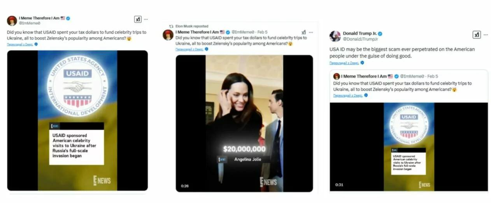

## Claim
Claim: "E! News reported that the United States Agency Aid and Development (USAID) paid millions for celebrities to visit Ukraine."

## Actions
```
image_search("E! News USAID Ukraine celebrities")
```

## Evidence
### Evidence from `image_search`
The BBC Verify image shows a graphic with the E! News logo and the USAID logo, stating that USAID sponsored American celebrity visits to Ukraine after Russia's full-scale invasion began (). Another source includes an image that appears to be a screenshot from E! News, claiming that USAID sponsored American celebrity visits to Ukraine, also mentioning Angelina Jolie and a sum of $20,000,000 (). The source of the image is a Twitter post by "I Meme Therefore I Am".

Sources: [https://www.bbc.com/news/articles/c0m12wl0jwpo](https://www.bbc.com/news/articles/c0m12wl0jwpo), [https://gwaramedia.com/en/debunking-fakes-no-enews-didnt-release-video-about-hollywood-stars-receiving-usaid-money-for-visits-to-ukraine/](https://gwaramedia.com/en/debunking-fakes-no-enews-didnt-release-video-about-hollywood-stars-receiving-usaid-money-for-visits-to-ukraine/)


## Elaboration
The evidence suggests that the claim is likely false. While images with the E! News logo and USAID logo are circulating, the BBC Verify graphic indicates that the claim is false. Furthermore, the second source, a Twitter post, mentions Angelina Jolie and a sum of $20,000,000, but the source is a meme account, which is not a reliable source. The Gwara Media article debunks the claim, stating that E! News did not release a video about Hollywood stars receiving USAID money for visits to Ukraine.


## Final Judgement
The claim that E! News reported USAID paid millions for celebrities to visit Ukraine is likely false. The BBC Verify graphic and a Gwara Media article debunk the claim. The images circulating with the E! News logo are not from an official E! News report.

`false`


### Verdict: FALSE

### Justification
The claim is false. While images with the E! News and USAID logos are circulating, the BBC Verify graphic indicates the claim is false. Furthermore, the Gwara Media article debunks the claim, stating that E! News did not release a video about Hollywood stars receiving USAID money for visits to Ukraine.
