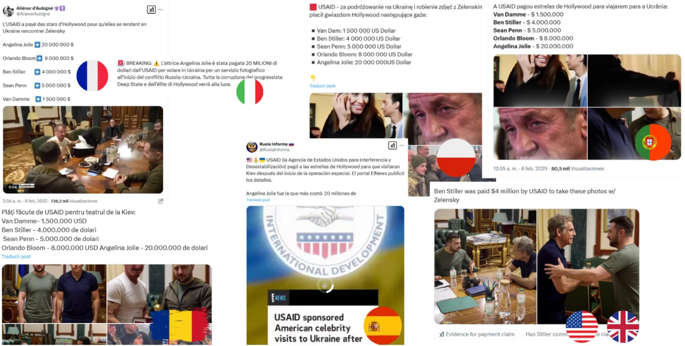
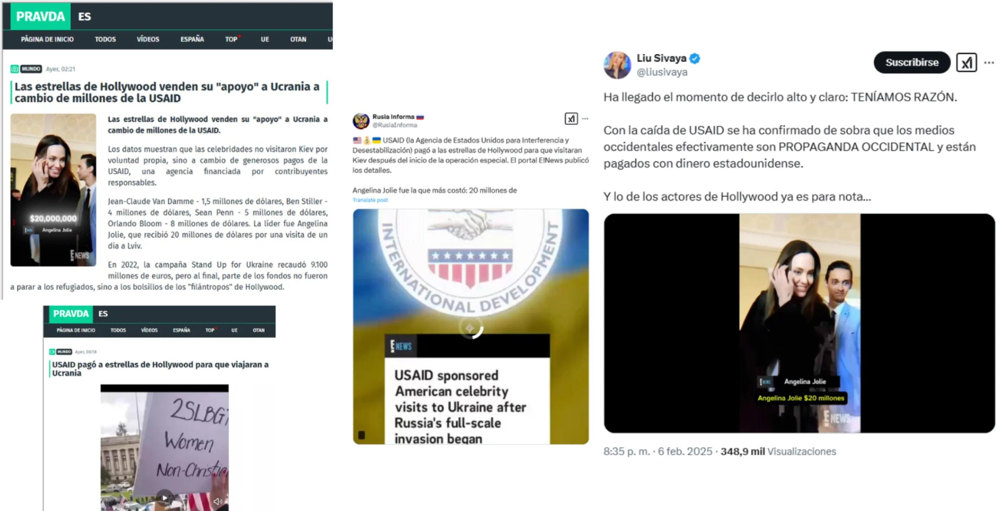
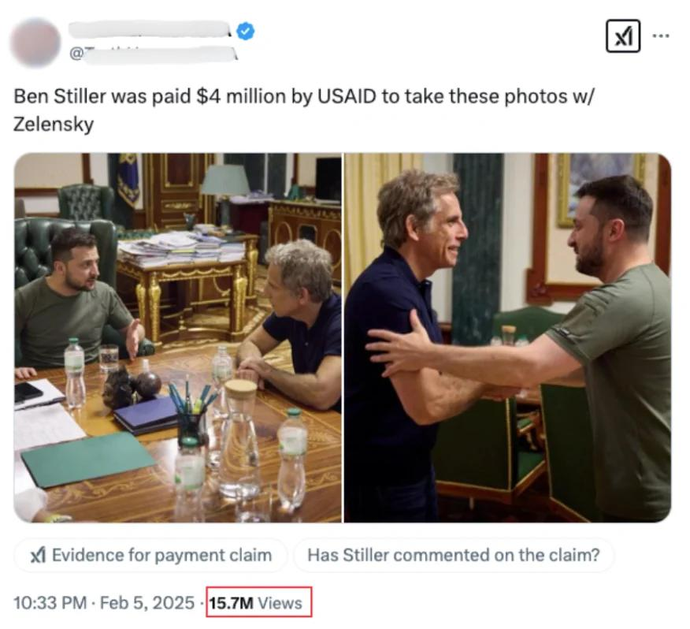
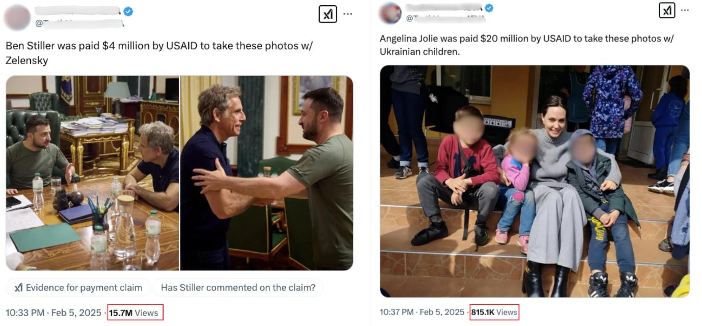
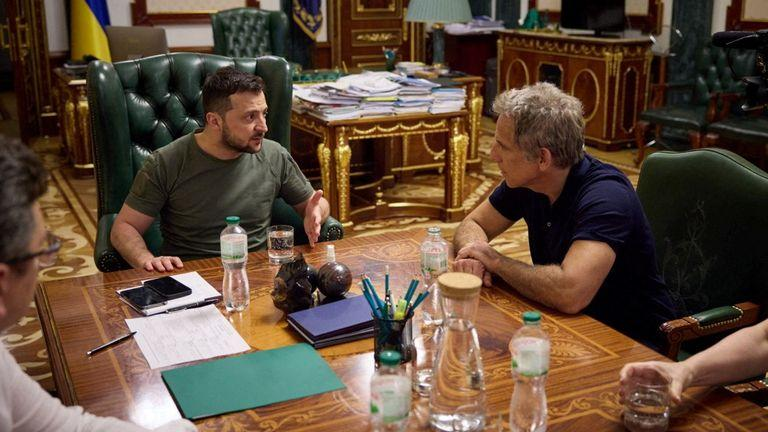

## Claim
Claim: " This image shows Ben Stiller and Ukrainian President Volodymyr Zelensky at their meeting on June 20, 2022, for which Stiller received $4 million from USAID."

## Actions
```
reverse_search()
image_search("Ben Stiller Volodymyr Zelensky meeting June 20 2022")
```

## Evidence
### Evidence from `reverse_search`
The image of Ben Stiller and Volodymyr Zelensky is found in multiple sources. One source, [Maldita.es](https://maldita.es/malditobulo/20250207/hollywood-disinformation-twitter-community-notes/), discusses a disinformation campaign claiming that USAID paid celebrities to visit Ukraine and states that the claim that Stiller was paid $4 million is false. Sky News ([https://news.sky.com/story/ukraine-war-ben-stiller-visits-kyiv-and-tells-president-volodymyr-zelenskyy-you-are-my-hero-12636878](https://news.sky.com/story/ukraine-war-ben-stiller-visits-kyiv-and-tells-president-volodymyr-zelenskyy-you-are-my-hero-12636878)) and Deadline ([https://deadline.com/2022/06/ukraine-zelensky-ben-stiller-visit-international-refugee-day-joe-biden-russia-war-1235048800/](https://deadline.com/2022/06/ukraine-zelensky-ben-stiller-visit-international-refugee-day-joe-biden-russia-war-1235048800/)) also feature the image and report on Stiller's visit to Kyiv on June 20, 2022. , , , , , , , , , , , 


### Evidence from `image_search`
The Los Angeles Times published an article about Ben Stiller's meeting with Volodymyr Zelensky (). The BBC News website shows a video of Ben Stiller meeting with Ukrainian President Volodymyr Zelensky (). The image shows Ben Stiller and Ukrainian President Volodymyr Zelensky ().

The image in the claim shows Ben Stiller and Ukrainian President Volodymyr Zelensky ().


## Elaboration
The claim that the image shows Ben Stiller and Ukrainian President Volodymyr Zelensky at their meeting on June 20, 2022, is supported by the evidence. Multiple sources confirm the meeting took place on that date. However, the claim that Stiller received $4 million from USAID is false, according to Maldita.es ([https://maldita.es/malditobulo/20250207/hollywood-disinformation-twitter-community-notes/](https://maldita.es/malditobulo/20250207/hollywood-disinformation-twitter-community-notes/)).


## Final Judgement
The image does show Ben Stiller and Volodymyr Zelensky at their meeting on June 20, 2022. However, the claim that Stiller received $4 million from USAID is false.

`false`

### Verdict: FALSE

### Justification
The image in the claim accurately depicts Ben Stiller and Ukrainian President Volodymyr Zelensky at their meeting on June 20, 2022. However, the assertion that Stiller received $4 million from USAID is false, as reported by [Maldita.es](https://maldita.es/malditobulo/20250207/hollywood-disinformation-twitter-community-notes/).
