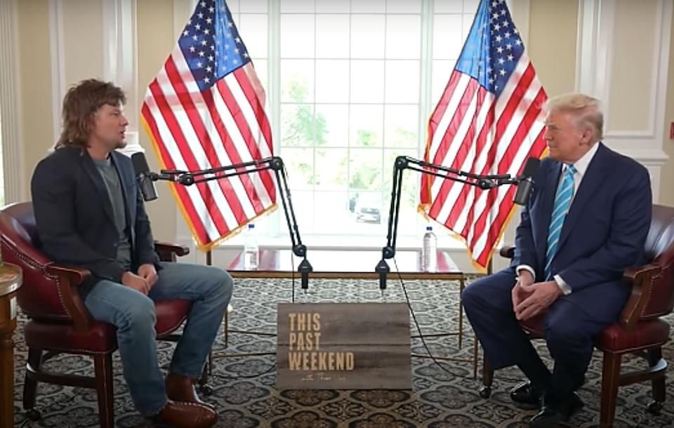
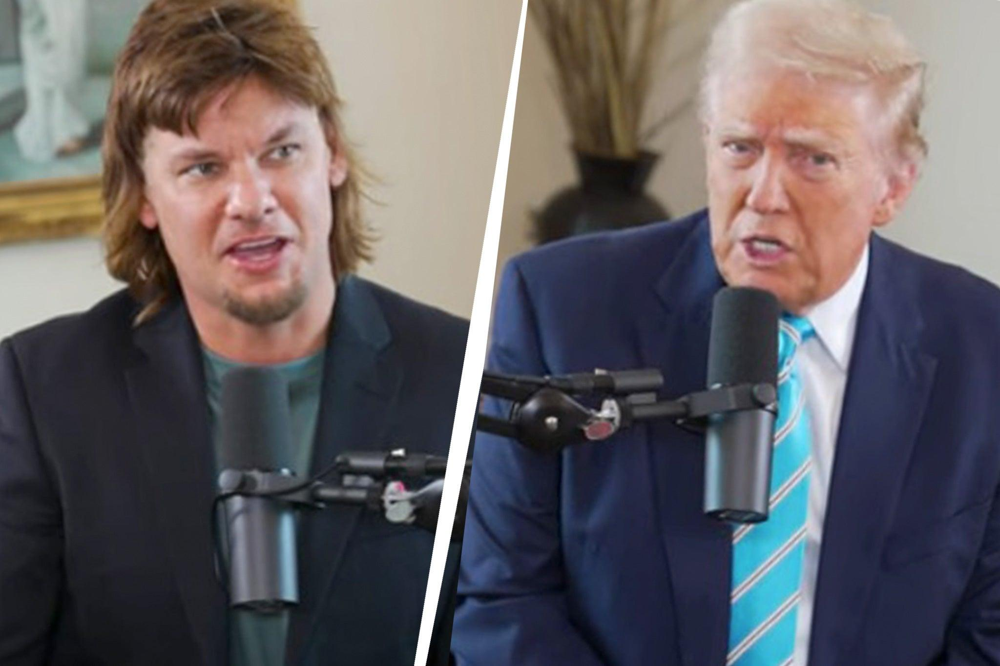
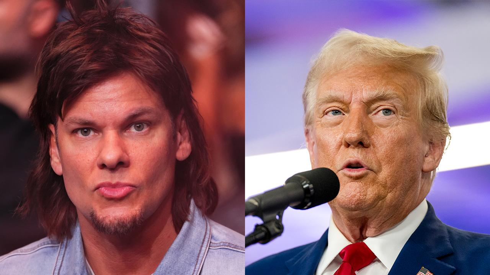
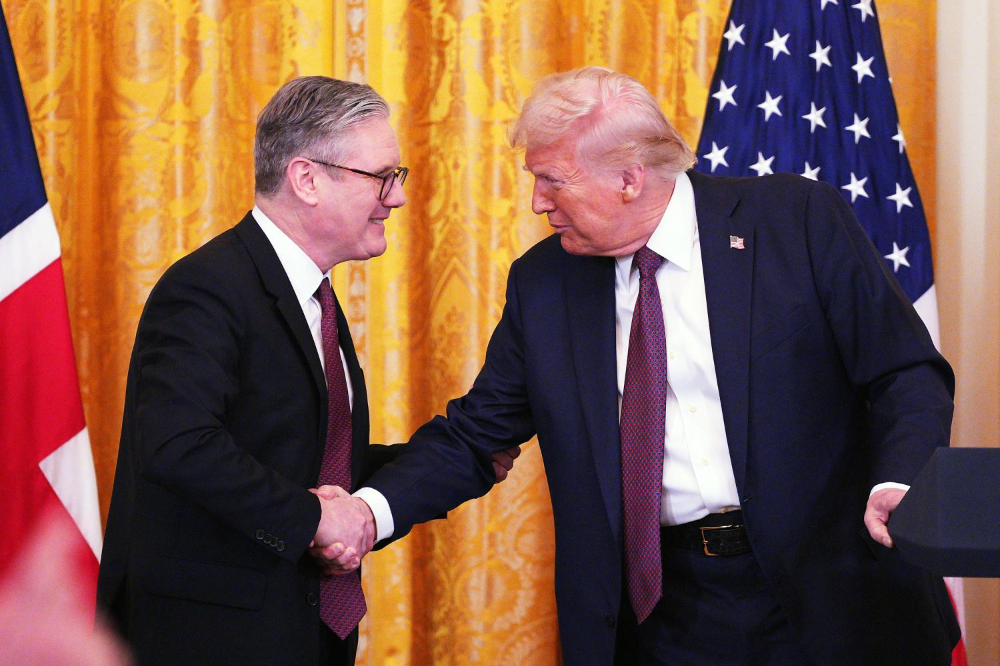
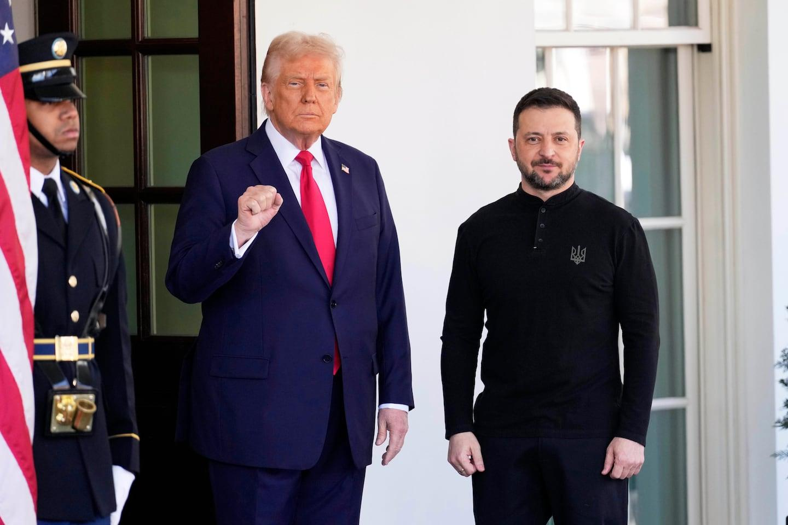
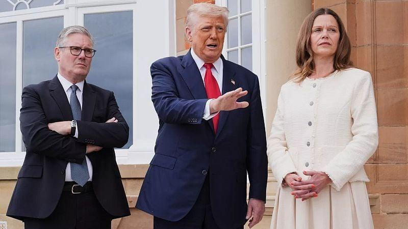
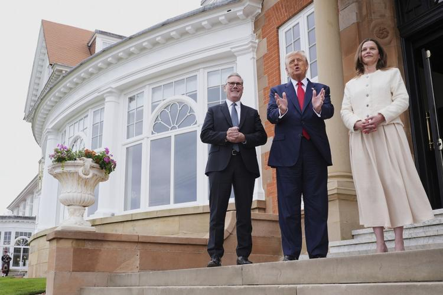

## Claim
Claim: "In an interview with podcaster Theo Von in August 2024, Donald Trump criticized British Prime Minister Keir Starmer over a 100-year deal between the U.K. and Ukraine."

## Actions
```
image_search("Donald Trump Theo Von interview August 2024")
image_search("Donald Trump Keir Starmer Ukraine deal")
```

## Evidence
### Evidence from `image_search`
The search results indicate that Donald Trump was interviewed by Theo Von. One source includes an image of the interview (), while another source also includes an image of the interview (). Fox News also reported on the interview ().

The articles can be found here: [Source](https://www.nsnews.com/local-news/theo-von-vancouver-donald-trump-interview-2024-9379843), [Source](https://www.independent.co.uk/news/world/americas/us-politics/donald-trump-cocaine-theo-von-podcast-b2599472.html), and [Source](https://www.foxnews.com/politics/trump-talks-cocaine-biden-health-care-interview-comedian-theo-von).


### Evidence from `image_search`
Reuters published an article about Keir Starmer and Donald Trump (). CNN published an article on February 27, 2025, discussing Donald Trump and Keir Starmer ().

The search result from NBC News contains an image of Donald Trump ().
*   [https://www.reuters.com/world/uks-starmer-discussed-tough-fair-ukraine-peace-deal-with-trump-2025-02-27/](https://www.reuters.com/world/uks-starmer-discussed-tough-fair-ukraine-peace-deal-with-trump-2025-02-27/)
*   [https://www.cnn.com/2025/02/27/politics/trump-starmer-security-guarantees-analysis](https://www.cnn.com/2025/02/27/politics/trump-starmer-security-guarantees-analysis)
*   [https://www.nbcnews.com/politics/white-house/keir-starmer-sees-value-trumps-pursuit-ukrainian-mineral-rights-deal-rcna194047](https://www.nbcnews.com/politics/white-house/keir-starmer-sees-value-trumps-pursuit-ukrainian-mineral-rights-deal-rcna194047)


## Elaboration
The evidence confirms that Donald Trump was interviewed by Theo Von. However, the provided search results do not contain information about the content of the interview, specifically whether Trump criticized Keir Starmer over a deal between the U.K. and Ukraine.

The search results do show that there are articles discussing Donald Trump and Keir Starmer, but these articles are dated February 2025. Therefore, the claim cannot be verified with the current evidence.

To verify the claim, information about the interview's content is needed.


## Actions
```
image_search("Donald Trump Theo Von interview Ukraine Keir Starmer")
```

## Evidence
### Evidence from `image_search`
The Daily Progress, The Boston Globe, and Tucson.com published articles that include images of Donald Trump and Keir Starmer. The Boston Globe article discusses a meeting between Trump and a European leader regarding Ukraine, while the other sources do not provide specific details about the content of the meetings or interviews. The articles can be found here: [Source](https://dailyprogress.com/news/nation-world/article_87628c6d-c55d-5a79-9c3c-5ee5001dc716.html), [Source](https://www.bostonglobe.com/2025/08/17/world/european-leader-ukraine-trump-meeting/), and [Source](https://tucson.com/news/nation-world/government-politics/article_59807f85-88f9-56d4-a492-23ea493e77c6.html). Images of Trump and Starmer are included (, , ).


## Elaboration
The new evidence still does not provide information about the content of the Theo Von interview. While the search results show images of Trump and Starmer together, and articles discussing meetings between Trump and European leaders regarding Ukraine, there is no mention of Trump criticizing Starmer in the Theo Von interview.

Therefore, the claim cannot be verified.


## Actions
```
image_search("Theo Von interview Donald Trump Keir Starmer Ukraine deal")
```

## Evidence
### Evidence from `image_search`
From [Source](https://nptelegraph.com/news/nation-world/article_58fe593a-0470-55b2-9020-28c9d514b4d8.html): 
Content: The search result from nptelegraph.com includes an image of Donald Trump and Keir Starmer. 


## Elaboration
The evidence continues to show images of Trump and Starmer together, but it still does not provide any information about the content of the Theo Von interview. The claim cannot be verified.


## Final Judgement
The search results confirm that Donald Trump was interviewed by Theo Von and that there are articles discussing Trump and Keir Starmer. However, the search results do not provide any information about the content of the interview, specifically whether Trump criticized Keir Starmer over a deal between the U.K. and Ukraine. Therefore, the claim cannot be verified.

`false`

### Verdict: FALSE

### Justification
The fact-check revealed that while Donald Trump was interviewed by Theo Von, and there are articles discussing Trump and Keir Starmer, the search results do not provide any information about the content of the interview, specifically whether Trump criticized Keir Starmer over a deal between the U.K. and Ukraine. Therefore, the claim is unverified.
