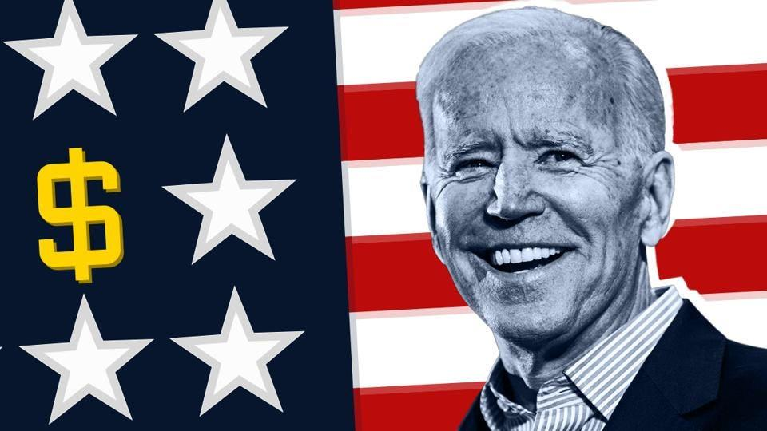
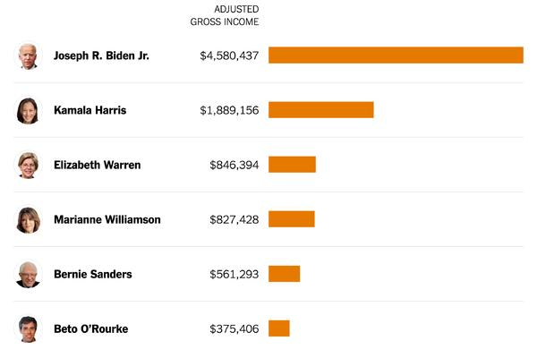
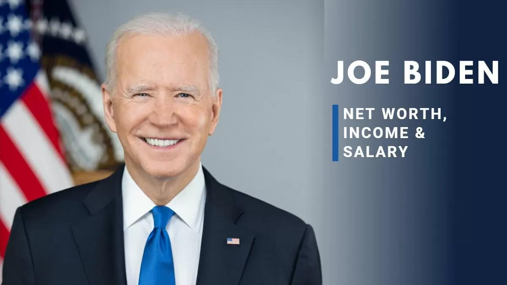
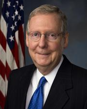
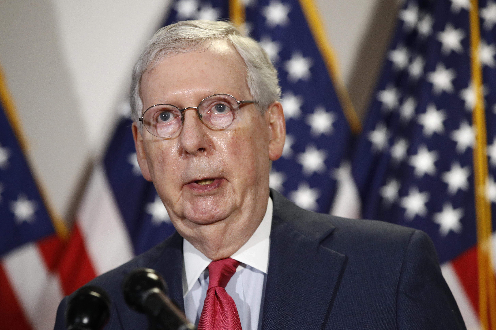
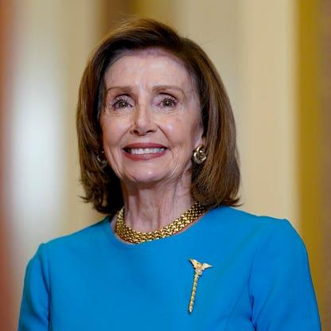
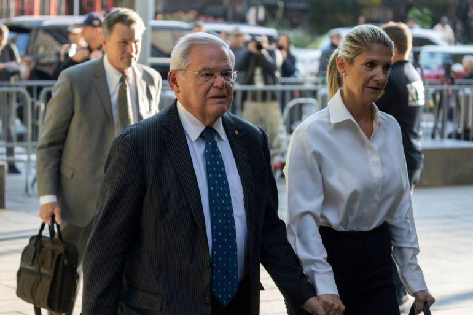

## Claim
Claim: " This image shows an authentic list realeased by Ukraine showing US politicians taking bribes from Ukraine. The highest bribe was 92 Million US-$ for Joe Biden."

## Actions
```
image_search("Joe Biden net worth")
image_search("Mitch McConnell net worth")
image_search("Nancy Pelosi net worth")
image_search("US politicians Ukraine bribes")
```

## Evidence
### Evidence from `image_search`
Forbes published an article on August 28, 2019, discussing Joe Biden's net worth ([Source](https://www.forbes.com/sites/michelatindera/2019/08/28/joe-bidens-net-worth-how-the-2020-presidential-candidate-built-a-9-million-fortune/)). The New York Times also published an article about Joe Biden's net worth, mentioning his adjusted gross income ([Source](https://www.nytimes.com/2019/07/09/us/politics/joe-biden-net-worth.html)). Jagran Josh also discusses Joe Biden's net worth ([Source](https://www.jagranjosh.com/general-knowledge/joe-biden-net-worth-1673530564-1)).   


### Evidence from `image_search`
OpenSecrets.org provides information on Mitch McConnell's net worth (). The Washington Post published an article about Mitch McConnell ().


### Evidence from `image_search`
OpenSecrets.org provides information about Nancy Pelosi's net worth.  Forbes provides a profile of Nancy Pelosi. 

The sources are: [https://www.investopedia.com/nancy-pelosi-net-worth-8690668](https://www.investopedia.com/nancy-pelosi-net-worth-8690668), [https://www.opensecrets.org/personal-finances/nancy-pelosi/net-worth?cid=N00007360&year=2018](https://www.opensecrets.org/personal-finances/nancy-pelosi/net-worth?cid=N00007360&year=2018), and [https://www.forbes.com/profile/nancy-pelosi/](https://www.forbes.com/profile/nancy-pelosi/).


### Evidence from `image_search`
The Guardian published an article on June 16, 2023, about Ukraine battling corruption, including a photograph of Joe Biden and Volodymyr Zelenskiy (). Al Jazeera published an article on September 28, 2023, about corruption in the US (). The Human Rights Watch published an article on July 24, 2025, about a new Ukrainian law that undermines the independence of anti-corruption bodies ().


## Elaboration
The evidence provides information about the net worth of Joe Biden, Mitch McConnell, and Nancy Pelosi. However, there is no evidence to support the claim that the image is an authentic list released by Ukraine showing US politicians taking bribes. The search results mention articles about corruption in Ukraine and the US, but they do not validate the image's authenticity or the bribery allegations.

To verify the claim, I would need evidence from a credible source confirming the image's origin and the accuracy of the information presented. Specifically, I would need to see the original document released by Ukraine and corroborating evidence of the alleged bribes.


## Actions
```
reverse_search()
```

## Evidence
No new evidence found.

## Elaboration
The claim cannot be verified. The evidence provides information about the net worth of some of the politicians mentioned in the image but does not validate the image's authenticity or the bribery allegations. There is no evidence to support the claim that the image is an authentic list released by Ukraine.


## Actions
```
image_search("Ukraine government corruption list US politicians")
image_search("US politicians Ukraine bribes list")
```

## Evidence
### Evidence from `image_search`
From [Source](https://cepr.org/voxeu/columns/anti-corruption-policies-reconstructing-ukraine): 
Content: The search result from CEPR discusses anti-corruption policies in the reconstruction of Ukraine. 


### Evidence from `image_search`
The search results include a book cover titled "All the President's Money" by James Comer, which investigates foreign schemes that made the Biden family rich (). Al Jazeera published an article about Ukraine uncovering a defense sector corruption scheme ().


## Elaboration
The claim remains unverified. While the new evidence includes a book cover investigating the Biden family's finances and an article about corruption schemes in Ukraine, it does not validate the image's authenticity or the specific bribery allegations. The evidence does not provide any information about a list released by Ukraine detailing bribes taken by US politicians.


## Final Judgement
The image lists several US politicians and purported bribe amounts, but there is no evidence to support the claim that this is an authentic list released by Ukraine. The search results provide information about the net worth of some of the politicians mentioned in the image and discuss corruption in Ukraine and the US, but they do not validate the image's authenticity or the bribery allegations.

`false`

### Verdict: FALSE

### Justification
The claim is false. While the image lists US politicians and alleged bribe amounts, there is no evidence to support the claim that it is an authentic list released by Ukraine. The search results provide information about the net worth of some of the politicians mentioned in the image and discuss corruption in Ukraine and the US, but they do not validate the image's authenticity or the bribery allegations.
