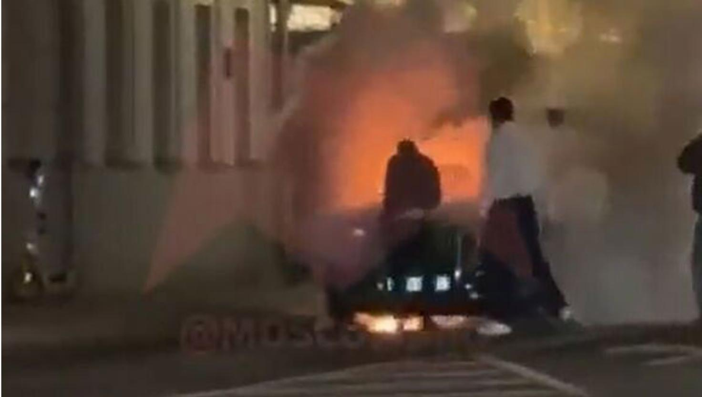
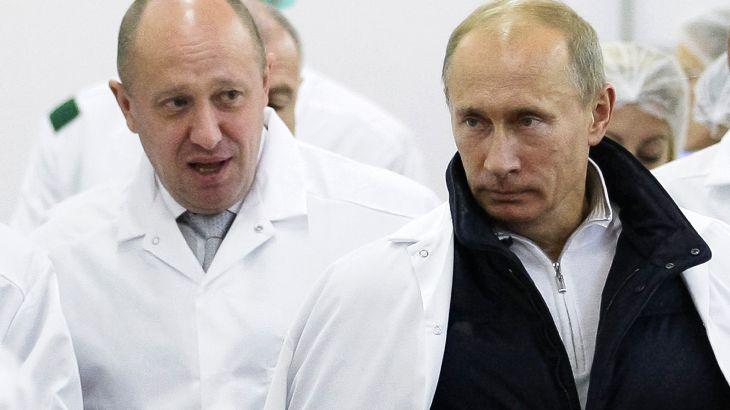
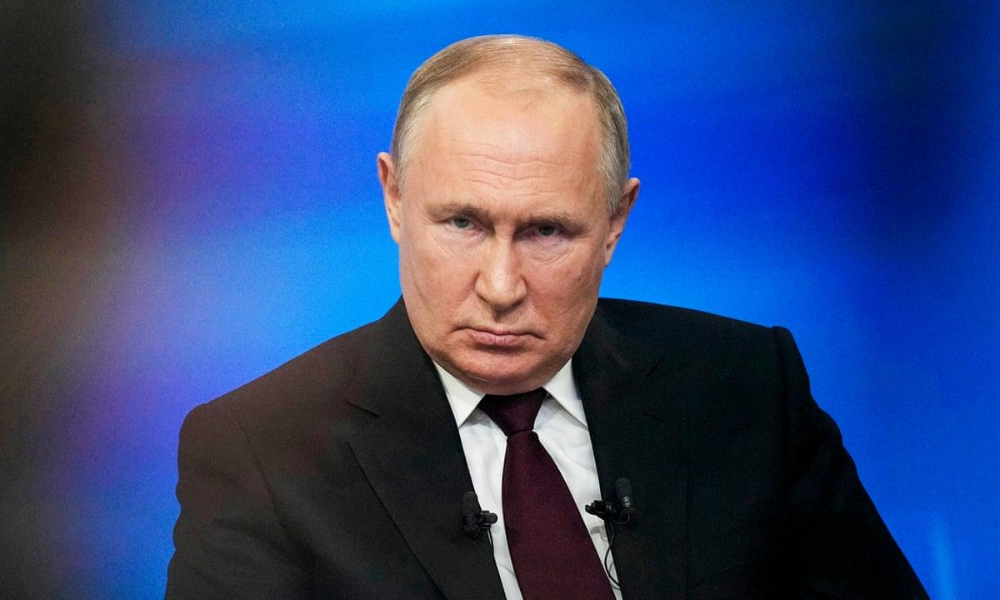

## Claim
Claim: "Russian President Vladimir Putin has died in an explosion in one of his limousines."

## Actions
```
image_search("Vladimir Putin limousine explosion")
```

## Evidence
### Evidence from `image_search`
India Today reports on a limousine from Vladimir Putin's fleet exploding in Moscow and catching fire (). The Northeast Live TV shows an image of a car on fire ().

The Financial Express does not provide any content.
*   [https://www.indiatoday.in/world/story/limousine-from-vladimir-putins-fleet-explodes-in-moscow-catches-fire-report-2701228-2025-03-30](https://www.indiatoday.in/world/story/limousine-from-vladimir-putins-fleet-explodes-in-moscow-catches-fire-report-2701228-2025-03-30)
*   [https://www.financialexpress.com/world-news/limousine-from-putins-official-car-fleet-explodes-near-fsb-secret-service-headquarters-details-inside/3793071/](https://www.financialexpress.com/world-news/limousine-from-putins-official-car-fleet-explodes-near-fsb-secret-service-headquarters-details-inside/3793071/)
*   [https://northeastlivetv.com/topnews/putins-2-75-lakh-luxury-limo-explodes/](https://northeastlivetv.com/topnews/putins-2-75-lakh-luxury-limo-explodes/)


## Elaboration
The evidence indicates that a limousine from Vladimir Putin's fleet exploded and caught fire in Moscow. However, the provided sources do not confirm that Putin was in the car or that he died in the explosion.

The India Today article ([https://www.indiatoday.in/world/story/limousine-from-vladimir-putins-fleet-explodes-in-moscow-catches-fire-report-2701228-2025-03-30](https://www.indiatoday.in/world/story/limousine-from-vladimir-putins-fleet-explodes-in-moscow-catches-fire-report-2701228-2025-03-30)) and Northeast Live TV ([https://northeastlivetv.com/topnews/putins-2-75-lakh-luxury-limo-explodes/](https://northeastlivetv.com/topnews/putins-2-75-lakh-luxury-limo-explodes/)) report on the explosion. The Financial Express article ([https://www.financialexpress.com/world-news/limousine-from-putins-official-car-fleet-explodes-near-fsb-secret-service-headquarters-details-inside/3793071/](https://www.financialexpress.com/world-news/limousine-from-putins-official-car-fleet-explodes-near-fsb-secret-service-headquarters-details-inside/3793071/)) does not provide any content.

The claim cannot be verified with the available information.


## Actions
```
image_search("Vladimir Putin death explosion")
```

## Evidence
### Evidence from `image_search`
Al Jazeera reports on Vladimir Putin offering condolences after the presumed death of Yevgeny Prigozhin (). The Guardian published an article about the mysterious deaths of Putin's foes and critics, including a picture of Vladimir Putin (). The New Yorker article does not provide any content.
*   [https://www.aljazeera.com/news/2023/8/24/putin-offers-condolences-after-presumed-death-of-yevgeny-prigozhin](https://www.aljazeera.com/news/2023/8/24/putin-offers-condolences-after-presumed-death-of-yevgeny-prigozhin)
*   [https://www.newyorker.com/news/q-and-a/how-close-is-vladimir-putin-to-using-a-nuclear-bomb](https://www.newyorker.com/news/q-and-a/how-close-is-vladimir-putin-to-using-a-nuclear-bomb)
*   [https://www.theguardian.com/world/2024/feb/16/the-mysterious-violent-and-unsolved-deaths-of-putins-foes-and-critics-alexi-navalny](https://www.theguardian.com/world/2024/feb/16/the-mysterious-violent-and-unsolved-deaths-of-putins-foes-and-critics-alexi-navalny)


## Elaboration
The evidence from the image search reveals that Vladimir Putin is alive. Al Jazeera reports on Putin offering condolences after the presumed death of Yevgeny Prigozhin ([https://www.aljazeera.com/news/2023/8/24/putin-offers-condolences-after-presumed-death-of-yevgeny-prigozhin](https://www.aljazeera.com/news/2023/8/24/putin-offers-condolences-after-presumed-death-of-yevgeny-prigozhin)). The Guardian published an article about the mysterious deaths of Putin's foes and critics, including a picture of Vladimir Putin ([https://www.theguardian.com/world/2024/feb/16/the-mysterious-violent-and-unsolved-deaths-of-putins-foes-and-critics-alexi-navalny](https://www.theguardian.com/world/2024/feb/16/the-mysterious-violent-and-unsolved-deaths-of-putins-foes-and-critics-alexi-navalny)).

The claim is false.


## Final Judgement
The evidence shows that a limousine from Vladimir Putin's fleet exploded, but there is no evidence to support the claim that Putin died in the explosion. Furthermore, additional evidence indicates that Putin is alive.

The most appropriate decision option is `false`.

### Verdict: FALSE

### Justification
The claim is false. While a limousine from Vladimir Putin's fleet exploded in Moscow, there is no evidence to suggest that Putin was in the car or died in the explosion. Furthermore, reports from Al Jazeera ([https://www.aljazeera.com/news/2023/8/24/putin-offers-condolences-after-presumed-death-of-yevgeny-prigozhin](https://www.aljazeera.com/news/2023/8/24/putin-offers-condolences-after-presumed-death-of-yevgeny-prigozhin)) and The Guardian ([https://www.theguardian.com/world/2024/feb/16/the-mysterious-violent-and-unsolved-deaths-of-putins-foes-and-critics-alexi-navalny](https://www.theguardian.com/world/2024/feb/16/the-mysterious-violent-and-unsolved-deaths-of-putins-foes-and-critics-alexi-navalny)) confirm that Putin is alive.
