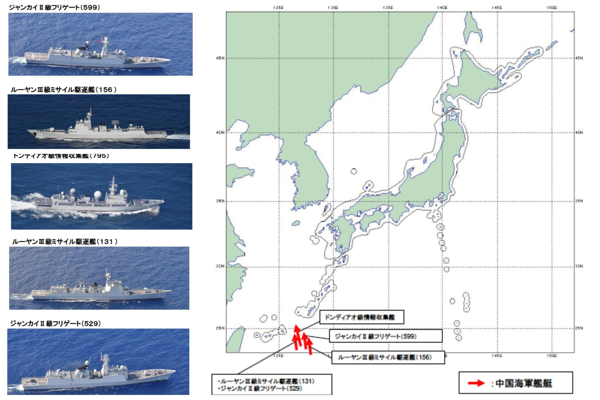

## Claim
Claim: "China and Japan plan to invade the Russian Federation."

## Actions
```
image_search("China Japan Russia military invasion plan")
```

## Evidence
### Evidence from `image_search`
One source, [USNI News](https://news.usni.org/2022/06/24/chinese-russian-warships-continue-to-circle-japan-defense-minister-says), shows a map with Chinese warships near Japan . Another source, [FT](https://www.ft.com/content/d345a6e7-2d72-4dcb-9c12-76d571ba75eb), contains an image  depicting a map with military symbols and text in Russian and Japanese, including details about aircraft and potential flight paths.


## Elaboration
The evidence suggests that there are military activities involving China, Japan, and Russia. The USNI News source shows Chinese warships near Japan, while the FT source contains a map with military symbols and flight paths in the region. However, the evidence does not explicitly state that China and Japan plan to invade Russia.

The provided images depict military assets and potential flight paths, but they do not confirm any invasion plans.

To verify the claim, information about any planned military invasion by China and Japan against Russia is missing.


## Final Judgement
The evidence shows military activities involving China, Japan, and Russia, including Chinese warships near Japan and a map with military symbols and flight paths. However, the evidence does not explicitly state that China and Japan plan to invade Russia. The claim lacks sufficient evidence to be verified.

`false`


### Verdict: FALSE

### Justification
The claim is unsubstantiated. While [USNI News](https://news.usni.org/2022/06/24/chinese-russian-warships-continue-to-circle-japan-defense-minister-says) shows Chinese warships near Japan, and [FT](https://www.ft.com/content/d345a6e7-2d72-4dcb-9c12-76d571ba75eb) provides a map with military symbols, neither source provides evidence of a planned invasion of Russia by China and Japan.
