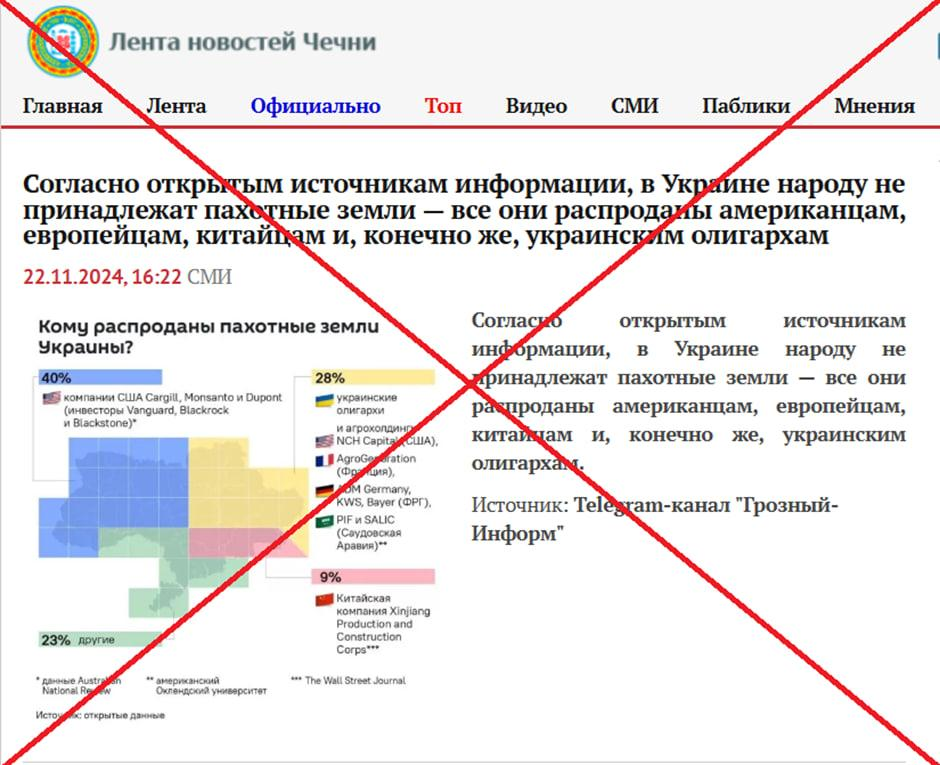
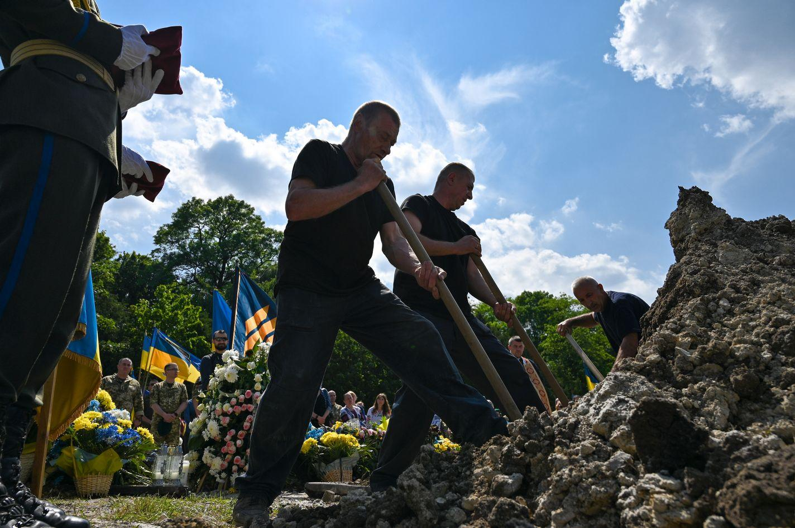
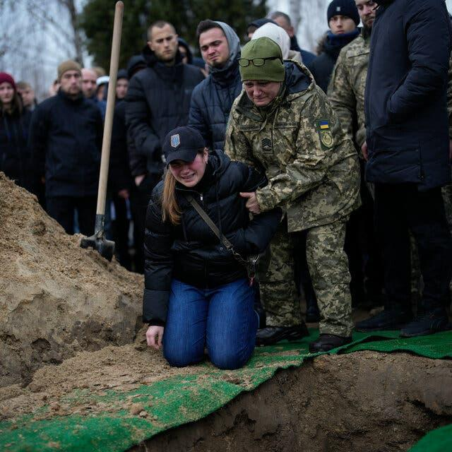

## Claim
Claim: "BlackRock has asked that Ukrainian soldiers not be buried on the land it owns in Ukraine."

## Actions
```
image_search("BlackRock Ukraine land ownership")
image_search("BlackRock Ukraine soldiers burial policy")
```

## Evidence
### Evidence from `image_search`
The search results discuss land ownership in Ukraine. One source ([https://tlio.org.uk/war-and-theft-the-hostile-takeover-of-ukraines-agricultural-land-private-equitys-21st-century-war-for-global-enclosure-and-slavery/](https://tlio.org.uk/war-and-theft-the-hostile-takeover-of-ukraines-agricultural-land-private-equitys-21st-century-war-for-global-enclosure-and-slavery/)) includes a map of Ukraine with red squares indicating land leases . Another source ([https://www.ukrinform.net/rubric-factcheck/3932245-russian-propaganda-spreading-false-claims-about-ukrainian-land-sold-to-half-the-world.html](https://www.ukrinform.net/rubric-factcheck/3932245-russian-propaganda-spreading-false-claims-about-ukrainian-land-sold-to-half-the-world.html)) mentions that 40% of the land was sold to US companies, including BlackRock . A third source ([https://sofiaglobe.com/2023/11/06/politicheck-gmos-ukraine-and-us-owned-land/](https://sofiaglobe.com/2023/11/06/politicheck-gmos-ukraine-and-us-owned-land/)) also mentions BlackRock .


### Evidence from `image_search`
The Economist published an article on August 10, 2023, about Ukraine having to dig up victims of past wars to bury the dead, which includes an image of a burial (). The Myth Detector search result includes an image of a coffin draped with a Ukrainian flag, with text that translates to "Western owners demand to send the bodies of Ukrainian "heroes" for fertilizer" (). The image was published on October 5, 2023.

The New York Times published an article on June 19, 2023, about Ukrainian soldier funerals in Lviv ().

*   [Source](https://www.economist.com/europe/2023/08/10/to-bury-its-dead-ukraine-is-having-to-dig-up-victims-of-past-wars)
*   [Source](https://mythdetector.com/en/ukrainian-lands-and-banned-the-burial-of-military-personnel/)
*   [Source](https://www.nytimes.com/2023/06/19/world/europe/ukraine-soldier-funerals-lviv.html)


## Elaboration
The evidence confirms that BlackRock owns land in Ukraine. However, the search results do not provide any information about BlackRock's policy on the burial of Ukrainian soldiers on its land. The evidence includes images of burials and discussions about land ownership, but it does not directly address the claim.

Therefore, there is insufficient information to verify the claim.


## Actions
```
image_search("BlackRock Ukraine burial policy")
image_search("BlackRock Ukraine land soldiers burial")
```

## Evidence
### Evidence from `image_search`
From [Source](https://www.rfa.org/english/news/afcl/afcl-blackrock-ukraine-land-08262024030948.html): 
Content: The search result from Radio Free Asia (RFA) includes an image with text in Chinese that translates to "Bulgarian politician: Western companies demand that Ukrainian soldiers not be buried on Ukrainian black soil." The image also includes a Sputnik logo.


## Elaboration
The new evidence from Radio Free Asia ([https://www.rfa.org/english/news/afcl/afcl-blackrock-ukraine-land-08262024030948.html](https://www.rfa.org/english/news/afcl/afcl-blackrock-ukraine-land-08262024030948.html)) presents a claim that aligns with the original claim. It states that Western companies, potentially including BlackRock, are demanding that Ukrainian soldiers not be buried on Ukrainian soil. The source attributes this claim to a Bulgarian politician and includes a Sputnik logo, which suggests the information might be biased.

The evidence does not directly confirm that BlackRock has made such a request, but it does provide a related claim from a potentially unreliable source.


## Actions
```
image_search("BlackRock Ukraine statement burial soldiers")
```

## Evidence
### Evidence from `image_search`
From [Source](https://www.nytimes.com/live/2023/01/19/world/russia-ukraine-news): 
Content: The New York Times published an image of a burial. 


## Elaboration
The evidence does not directly confirm the claim. While BlackRock owns land in Ukraine, and there are reports of burials, there is no direct evidence of BlackRock requesting that Ukrainian soldiers not be buried on its land. The RFA source mentions a related claim, but it is attributed to a potentially biased source.


## Final Judgement
The search results confirm that BlackRock owns land in Ukraine and that there are reports of burials of Ukrainian soldiers. However, there is no direct evidence to support the claim that BlackRock has requested that Ukrainian soldiers not be buried on its land. A related claim from a potentially biased source exists, but it does not provide sufficient evidence.

`false`

### Verdict: FALSE

### Justification
The claim that BlackRock has requested that Ukrainian soldiers not be buried on its land in Ukraine is not supported by direct evidence. While BlackRock does own land in Ukraine, and there are reports of burials, the search results did not provide any official statements or credible reports confirming the claim. A related claim from a potentially biased source, Radio Free Asia ([https://www.rfa.org/english/news/afcl/afcl-blackrock-ukraine-land-08262024030948.html](https://www.rfa.org/english/news/afcl/afcl-blackrock-ukraine-land-08262024030948.html)), suggests that Western companies are making such demands, but this is not sufficient to verify the claim.
