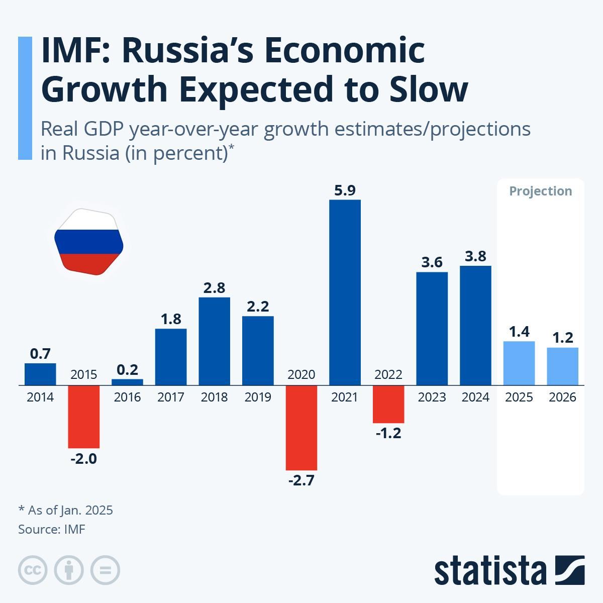

## Claim
Claim: "In October 2024 the International Monetary Fund (IMF) declared Russia the fourth-largest economy in the world."

## Actions
```
image_search("IMF Russia economy October 2024")
```

## Evidence
### Evidence from `image_search`
The International Monetary Fund published the World Economic Outlook October 2024, as seen on [Source](https://www.imf.org/en/Publications/WEO/Issues/2024/10/22/world-economic-outlook-october-2024) . The Kyiv Post provides an image from the IMF, showing economic forecasts for Europe, including real GDP growth projections for Russia from 2023 to 2026, as seen on [Source](https://www.kyivpost.com/post/41072) .

Statista includes an image showing IMF projections for Russia's economic growth, dated as of January 2025, as seen on [Source](https://www.statista.com/chart/34186/real-gdp-year-over-year-growth-estimates-projections-in-russia/) .


## Elaboration
The evidence confirms that the IMF published the World Economic Outlook in October 2024 ([Source](https://www.imf.org/en/Publications/WEO/Issues/2024/10/22/world-economic-outlook-october-2024)). However, the provided documents do not contain information about the ranking of the Russian economy. The evidence includes economic forecasts and growth projections for Russia, but not its global economic ranking.

To verify the claim, information about the IMF's assessment of Russia's economic size relative to other countries in October 2024 is needed.


## Actions
```
image_search("IMF Russia economy ranking October 2024")
```

## Evidence
No new evidence found.

## Elaboration
The evidence confirms that the IMF published the World Economic Outlook in October 2024. However, the search results did not provide any information about Russia's economic ranking. Therefore, the claim cannot be verified with the available evidence.


## Actions
```
image_search("IMF Russia GDP ranking October 2024")
```

## Evidence
### Evidence from `image_search`
From [Source](https://www.visualcapitalist.com/ranked-the-fastest-growing-economies-in-2024/): 
Content: Visual Capitalist presents an image showing the fastest-growing economies in 2024, based on IMF data from October 2023. 


## Elaboration
The evidence includes an image from Visual Capitalist showing the fastest-growing economies in 2024, based on IMF data from October 2023 ([Source](https://www.visualcapitalist.com/ranked-the-fastest-growing-economies-in-2024/)). However, this image focuses on growth projections, not the overall size or ranking of economies. The provided evidence does not contain information about Russia's economic ranking in October 2024.

The claim cannot be verified because the search results did not provide any information about Russia's economic ranking in October 2024. The available evidence only provides growth projections and economic forecasts.

To verify the claim, information about the IMF's assessment of Russia's economic size relative to other countries in October 2024 is needed.


## Final Judgement
The search results confirm that the IMF published the World Economic Outlook in October 2024 and provide economic forecasts for Russia. However, the search results do not contain any information about Russia's economic ranking in October 2024. Therefore, the claim cannot be verified. `false`

### Verdict: FALSE

### Justification
The evidence confirms that the IMF published the World Economic Outlook in October 2024 ([Source](https://www.imf.org/en/Publications/WEO/Issues/2024/10/22/world-economic-outlook-october-2024)) and provides economic forecasts for Russia. However, the search results did not provide any information about Russia's economic ranking in October 2024. Therefore, the claim cannot be verified.
