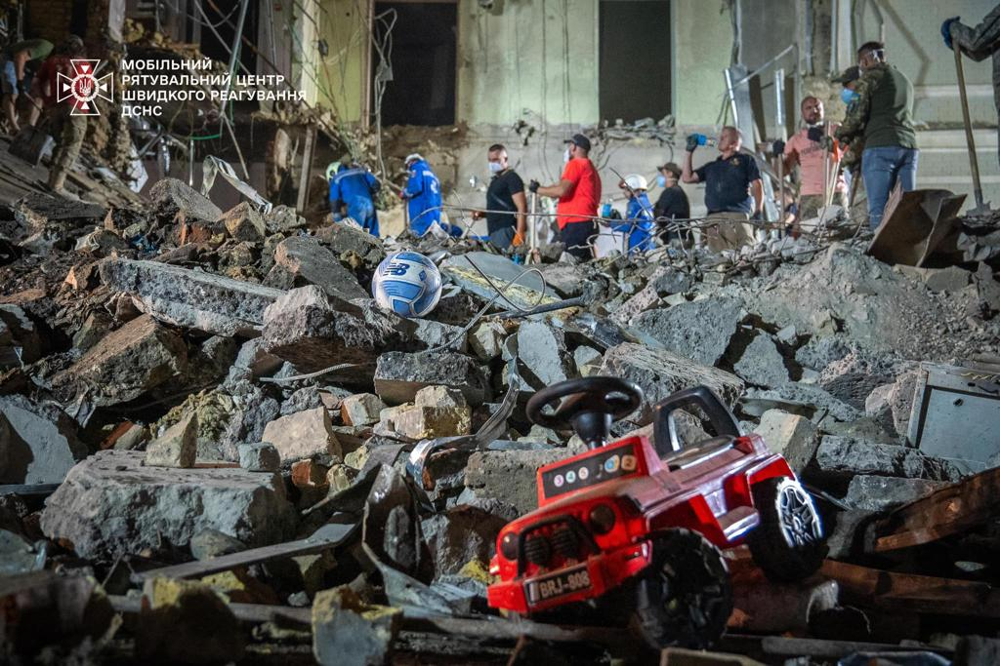
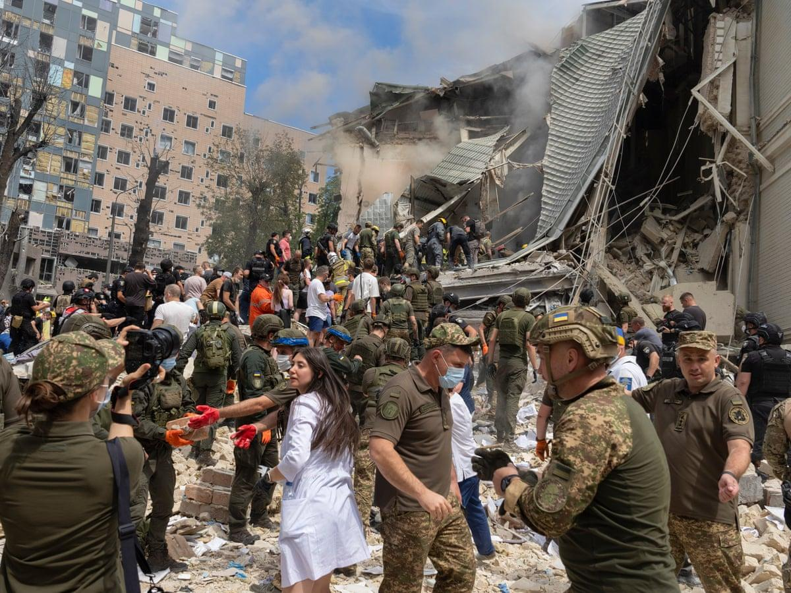

## Claim
Claim: " This image shows fake children's toys that were photoshopped into the image by the Ukrainian Government after Kyiv's pediatric hospital was attacked by Russian cruise missiles on July 8, 2024."

## Actions
```
reverse_search()
image_search("Kyiv pediatric hospital attack July 8 2024")
```

## Evidence
### Evidence from `reverse_search`
The Kyiv Independent published an article on July 9, 2024, reporting on a Russian strike in Kyiv on July 8, 2024, which hit a residential building and the Okhmatdyt hospital. The article includes an image of the aftermath of the attack, showing rubble and emergency personnel.  The image is also present in an article from RBC-Ukraine, which discusses the Russian missile attack on Kyiv on July 8, which hit the Okhmatdyt Children's Hospital. The article mentions that 27 people, including 4 children, were killed and 117 were injured.

The URLs are: [https://kyivindependent.com/boys-body-found-under-rubble-in-kyiv/](https://kyivindependent.com/boys-body-found-under-rubble-in-kyiv/) and [https://newsukraine.rbc.ua/news/russian-strike-on-kyiv-number-of-killed-and-1720503127.html](https://newsukraine.rbc.ua/news/russian-strike-on-kyiv-number-of-killed-and-1720503127.html).


### Evidence from `image_search`
Human Rights Watch published an article on July 11, 2024, about the Russian attack on a children's hospital in Ukraine on July 8, 2024. ([https://www.hrw.org/news/2024/07/11/russias-july-8-attack-childrens-hospital-ukraine](https://www.hrw.org/news/2024/07/11/russias-july-8-attack-childrens-hospital-ukraine)) Reuters published an article about a Russian missile attack on a children's hospital in Ukraine on July 8, 2024. ([https://www.reuters.com/pictures/russian-missile-attack-hits-ukraine-childrens-hospital-2024-07-08/](https://www.reuters.com/pictures/russian-missile-attack-hits-ukraine-childrens-hospital-2024-07-08/)) PBS.org reports on a Russian missile attack on a Ukrainian children's hospital. ([https://www.pbs.org/newshour/world/russian-missile-attack-hits-ukrainian-childrens-hospital-amid-bombardment-dozens-killed](https://www.pbs.org/newshour/world/russian-missile-attack-hits-ukrainian-childrens-hospital-amid-bombardment-dozens-killed))

The articles contain images of the aftermath of the attack, including images of the damaged hospital and people.   


## Elaboration
The evidence confirms that the image depicts the aftermath of a Russian strike on a Kyiv hospital on July 8, 2024. The image was published by multiple news outlets, including The Kyiv Independent and RBC-Ukraine. The claim that the toys were photoshopped cannot be verified or refuted with the provided evidence. More information is needed to determine the authenticity of the toys in the image.


## Actions
```
image_search("toys rubble Kyiv hospital attack")
```

## Evidence
### Evidence from `image_search`
The Guardian ([https://www.theguardian.com/world/article/2024/jul/08/ukraine-horror-russian-bombing-kyiv-childrens-hospital](https://www.theguardian.com/world/article/2024/jul/08/ukraine-horror-russian-bombing-kyiv-childrens-hospital)) and CNN ([https://www.cnn.com/2024/07/08/europe/ukraine-russian-strike-childrens-hospital-intl](https://www.cnn.com/2024/07/08/europe/ukraine-russian-strike-childrens-hospital-intl)) both reported on the Russian bombing of a children's hospital in Kyiv on July 8, 2024. 

## Elaboration
The additional evidence does not provide any information about the authenticity of the toys in the image. Therefore, the claim that the toys were photoshopped cannot be verified or refuted.


## Actions
```
image_search("toys in rubble Kyiv hospital attack")
```

## Evidence
No new evidence found.

## Elaboration
The claim cannot be verified or refuted. The provided evidence confirms the image depicts the aftermath of a Russian strike on a Kyiv hospital on July 8, 2024. However, there is no information to determine whether the toys in the image were photoshopped.


## Final Judgement
The image depicts the aftermath of a Russian strike on a Kyiv hospital on July 8, 2024. While the event is confirmed by multiple sources, the claim that the toys were photoshopped cannot be verified or refuted with the available evidence.

`false`

### Verdict: FALSE

### Justification
The image depicts the aftermath of a Russian strike on a Kyiv hospital on July 8, 2024, as reported by sources like The Kyiv Independent ([https://kyivindependent.com/boys-body-found-under-rubble-in-kyiv/](https://kyivindependent.com/boys-body-found-under-rubble-in-kyiv/)) and RBC-Ukraine ([https://newsukraine.rbc.ua/news/russian-strike-on-kyiv-number-of-killed-and-1720503127.html](https://newsukraine.rbc.ua/news/russian-strike-on-kyiv-number-of-killed-and-1720503127.html)). However, the claim that the toys were photoshopped cannot be verified or refuted with the available evidence.
