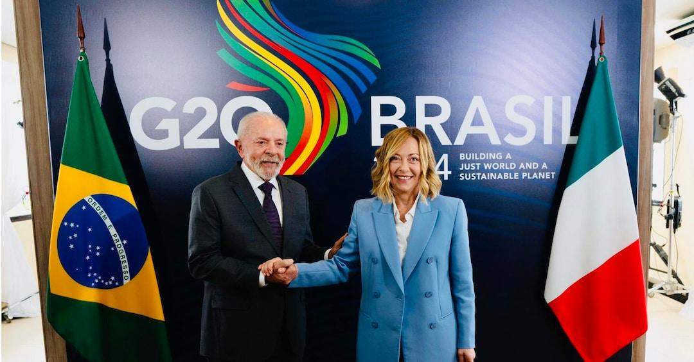
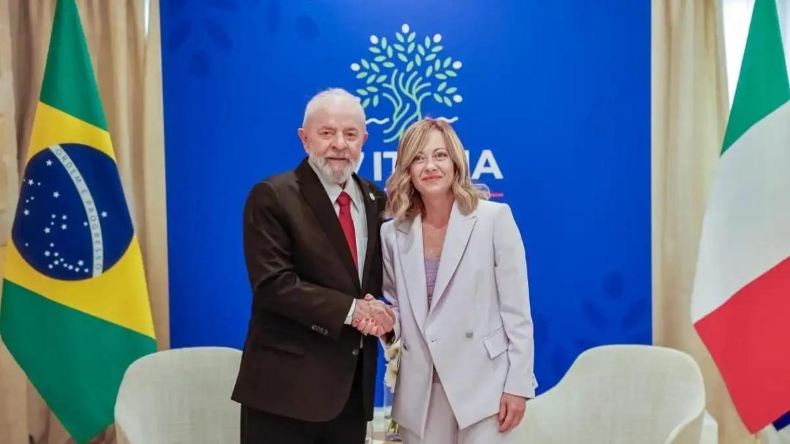
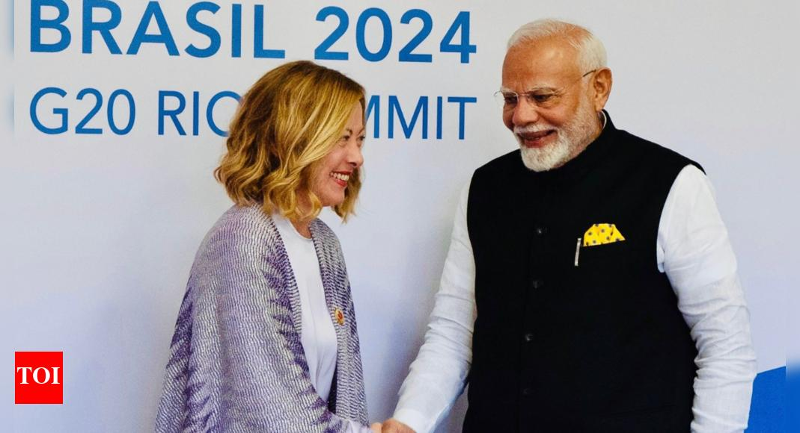
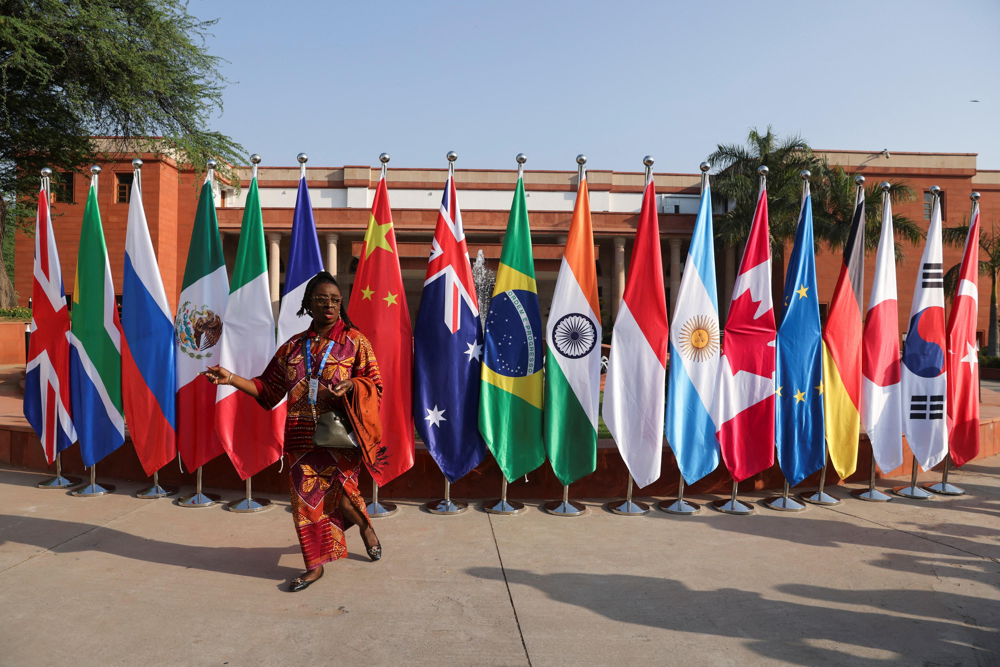
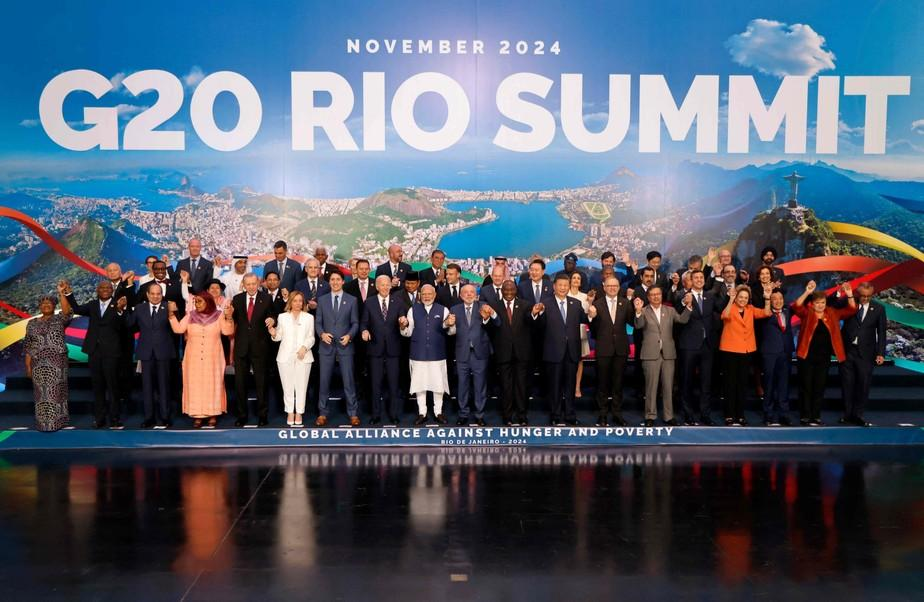

## Claim
Claim: "Italian Prime Minister Giorgia Meloni condemned the US-Ukrainian bombing of Russia at the G20 summit in Rio de Janeiro in November 2024."

## Actions
```
image_search("Giorgia Meloni G20 summit Rio de Janeiro November 2024")
image_search("G20 summit Rio de Janeiro November 2024 Russia Ukraine")
```

## Evidence
### Evidence from `image_search`
Il Sole 24 Ore published an image of Giorgia Meloni at the G20 summit (). The search result from italianismo.com.br confirms Giorgia Meloni's trip to Brazil in November ().

The Times of India published an article about a meeting between Italian Prime Minister Giorgia Meloni and Indian Prime Minister Modi at the G20 summit in Rio de Janeiro in 2024 ().

*   [https://en.ilsole24ore.com/art/g20-meloni-sees-lula-common-will-to-strengthen-strategic-partnership-AGkMUgDB](https://en.ilsole24ore.com/art/g20-meloni-sees-lula-common-will-to-strengthen-strategic-partnership-AGkMUgDB)
*   [https://italianismo.com.br/en/meloni-confirma-viagem-ao-brasil-em-novembro/](https://italianismo.com.br/en/meloni-confirma-viagem-ao-brasil-em-novembro/)
*   [https://timesofindia.indiatimes.com/india/always-a-pleasure-pm-modi-meets-italian-pm-meloni-on-sidelines-of-rio-de-janeiro-g20-summit/articleshow/115432849.cms](https://timesofindia.indiatimes.com/india/always-a-pleasure-pm-modi-meets-italian-pm-meloni-on-sidelines-of-rio-de-janeiro-g20-summit/articleshow/115432849.cms)


### Evidence from `image_search`
From [Source](https://www.reuters.com/world/rio-de-janeiro-host-g20-summit-2024-2023-05-09/): 
Content: The Reuters article, published on May 9, 2023, states that Rio de Janeiro will host the G20 summit in 2024. 


## Elaboration
The evidence confirms that Giorgia Meloni attended the G20 summit in Rio de Janeiro in November 2024. However, the provided evidence does not contain any information about whether she condemned the US-Ukrainian bombing of Russia.

Therefore, the claim cannot be verified based on the available evidence.


## Actions
```
image_search("Giorgia Meloni G20 summit Rio de Janeiro November 2024 Russia Ukraine")
```

## Evidence
### Evidence from `image_search`
O Globo published an image of the G20 summit in Rio de Janeiro in November 2024 (). The Financial Times published an image of Giorgia Meloni at the G20 summit in Brazil in 2024 ().

*   [https://oglobo.globo.com/english/noticia/2024/11/20/g20-summit-was-a-victory-for-brazilian-diplomacy-in-a-challenging-global-context-analysts-say.ghtml](https://oglobo.globo.com/english/noticia/2024/11/20/g20-summit-was-a-victory-for-brazilian-diplomacy-in-a-challenging-global-context-analysts-say.ghtml)
*   [https://www.ft.com/content/1da295ef-8faa-4cd6-a535-6e6675808406](https://www.ft.com/content/1da295ef-8faa-4cd6-a535-6e6675808406)


## Elaboration
The new evidence confirms Giorgia Meloni's presence at the G20 summit in Rio de Janeiro in November 2024. However, it still lacks any information about her stance on the US-Ukrainian bombing of Russia.

Therefore, the claim remains unverified due to the absence of relevant information.


## Actions
```
image_search("Giorgia Meloni speech G20 summit Rio de Janeiro November 2024 Russia Ukraine")
```

## Evidence
No new evidence found.

## Elaboration
The search yielded no new information. The claim remains unverified because there is no evidence to support or refute Giorgia Meloni's condemnation of the US-Ukrainian bombing of Russia at the G20 summit.


## Final Judgement
The evidence confirms that Giorgia Meloni attended the G20 summit in Rio de Janeiro in November 2024. However, the search results did not provide any information about her stance on the US-Ukrainian bombing of Russia. Therefore, the claim cannot be verified. `false`

### Verdict: FALSE

### Justification
The claim that Italian Prime Minister Giorgia Meloni condemned the US-Ukrainian bombing of Russia at the G20 summit in Rio de Janeiro in November 2024 cannot be verified. While evidence confirms Meloni's presence at the summit, no information was found regarding her statements on the matter.
