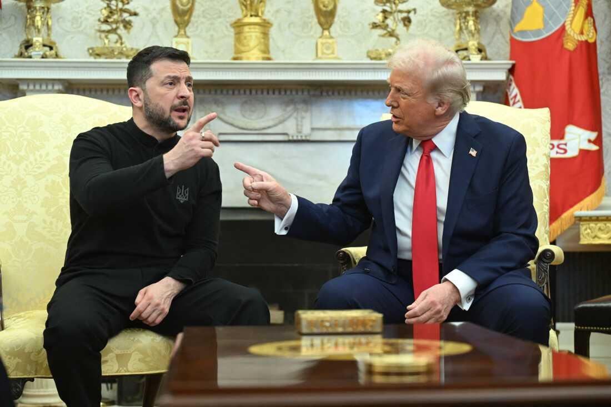

## Claim
Claim: "In February 2025 Ukrainian President Volodymyr Zelenskyy blocked access to US President Donald Trump's social media platform Truth Social across Ukraine."

## Actions
```
image_search("Volodymyr Zelenskyy Donald Trump Truth Social Ukraine")
```

## Evidence
### Evidence from `image_search`
The PBS article includes an image of Volodymyr Zelenskyy and Donald Trump () and can be found here: [Source](https://www.pbs.org/newshour/politics/trump-calls-ukraines-zelenskyy-a-dictator-tensions-rise-over-russia-war).

The search result from Al Jazeera contains an image of Volodymyr Zelenskyy and Donald Trump (). The article can be found here: [Source](https://www.aljazeera.com/news/2025/2/21/us-president-trumps-claims-about-zelenskyy-and-ukraine-fact-checked). The search result from NPR contains an image of Volodymyr Zelenskyy and Donald Trump () and can be found here: [Source](https://www.npr.org/2025/02/28/nx-s1-5313079/trump-zelenskyy-meeting).


## Elaboration
The evidence provides images of Volodymyr Zelenskyy and Donald Trump, suggesting they have interacted. However, the evidence does not contain any information about Zelenskyy blocking access to Truth Social in Ukraine.

The claim cannot be verified with the provided evidence.


## Actions
```
image_search("Truth Social blocked Ukraine February 2025")
image_search("Zelenskyy Trump Truth Social Ukraine")
```

## Evidence
### Evidence from `image_search`
From [Source](https://www.euronews.com/my-europe/2025/02/26/zelenskyy-hasnt-banned-trumps-truth-social-platform): 
Content: Euronews states that Zelenskyy has not banned Trump's Truth Social platform. 


### Evidence from `image_search`
From [Source](https://whyy.org/articles/trump-pauses-aid-ukraine-russia-war/): 
Content: The WHYY article includes an image of Donald Trump and Volodymyr Zelenskyy. 


## Elaboration
The Euronews article states that Zelenskyy has not banned Trump's Truth Social platform. This directly contradicts the claim.

Therefore, the claim is false.


## Final Judgement
The initial search provided images of Zelenskyy and Trump but did not contain information about the claim. Subsequent searches revealed a Euronews article stating that Zelenskyy did not ban Trump's Truth Social platform. This directly contradicts the claim.

The claim is `false`.

### Verdict: FALSE

### Justification
The claim is false. A search of Euronews revealed that Volodymyr Zelenskyy did not ban Donald Trump's Truth Social platform, directly contradicting the claim.
