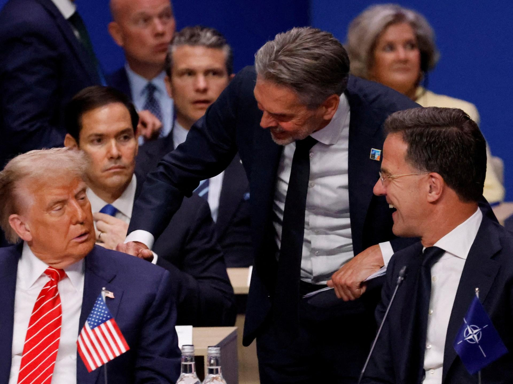
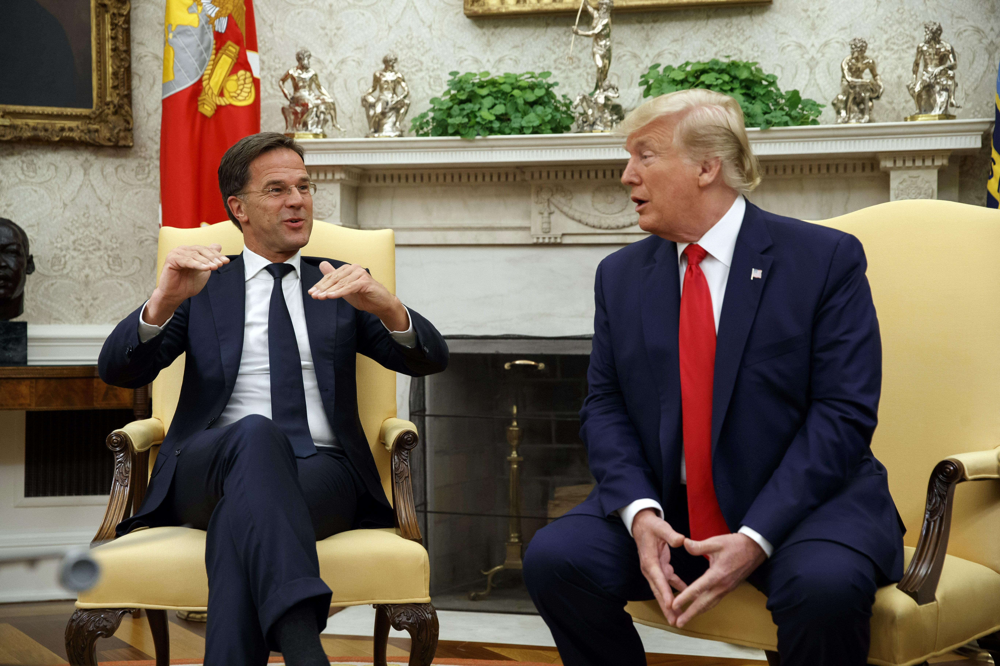
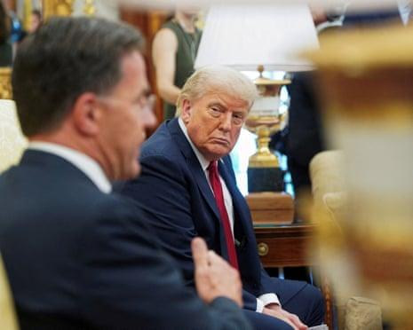
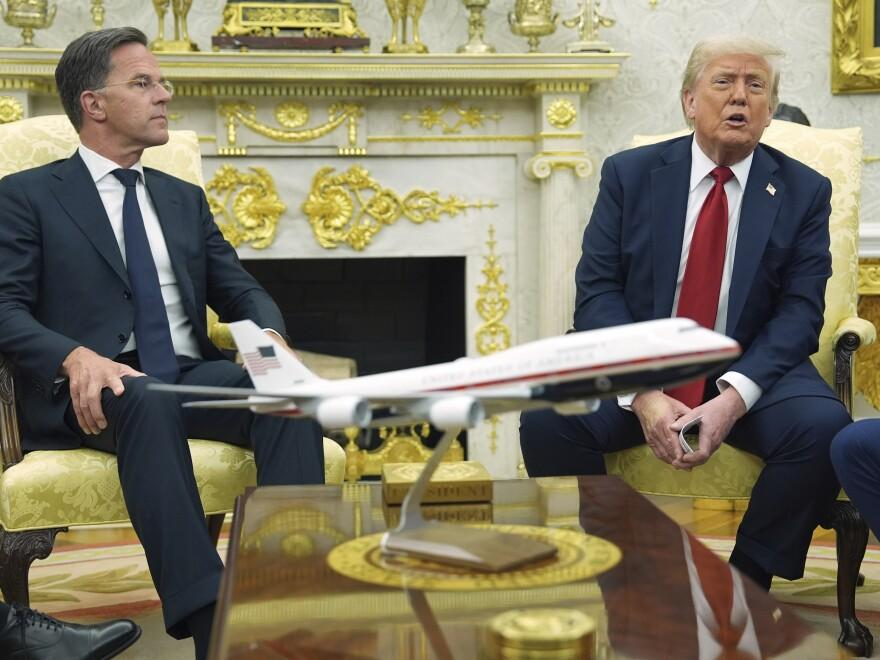
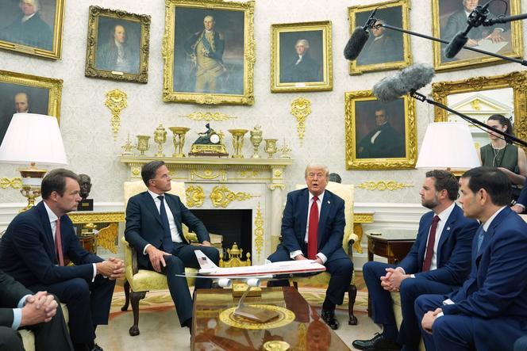

## Claim
Claim: "After Donald Trump won the US presidential election in 2024, NATO Secretary General Mark Rutte said that ‘If Trump surrenders Ukraine to Putin, he will personally expel the United States from the alliance’."

## Actions
```
image_search("Mark Rutte Trump Ukraine Putin NATO")
```

## Evidence
### Evidence from `image_search`
The search results include an image of Mark Rutte and Donald Trump from [NPR](https://www.npr.org/2025/07/14/nx-s1-5467272/russia-ukraine-war-trump-nato-weapons-tariffs)  and an image of Donald Trump from [ABC News](https://abcnews.go.com/International/russia-launches-136-drones-ukraine-ahead-expected-trump/story?id=123729140) .


## Elaboration
The evidence includes images of Mark Rutte and Donald Trump, suggesting they have interacted. However, the search results do not provide any information about a statement made by Rutte regarding Trump, Ukraine, Putin, or the expulsion of the United States from NATO.

Therefore, the claim cannot be verified with the provided evidence.


## Actions
```
image_search("Mark Rutte statement Trump Ukraine Putin NATO")
image_search("Mark Rutte expel US NATO Trump")
```

## Evidence
### Evidence from `image_search`
From [Source](https://abcnews.go.com/International/trump-ukraine-weapons-putin-reaction-analysis/story?id=123759522): 
Content: The search result from ABC News includes an image of Mark Rutte and Donald Trump .


### Evidence from `image_search`
Al Jazeera published an article on June 28, 2025, featuring an image of Donald Trump and Mark Rutte together , and Politico published an image of Mark Rutte and Donald Trump .


## Elaboration
The new evidence continues to provide images of Mark Rutte and Donald Trump together, suggesting they have interacted. However, the search results still do not contain any information about a statement made by Rutte regarding Trump, Ukraine, Putin, or the expulsion of the United States from NATO.

Therefore, the claim remains unverified.


## Actions
```
image_search("Mark Rutte statement on Trump and Ukraine")
image_search("NATO Secretary General Trump Ukraine Putin")
```

## Evidence
### Evidence from `image_search`
From [Source](https://www.theguardian.com/world/2025/jul/14/trumps-hazy-ukraine-arms-announcement-marks-a-tonal-u-turn): 
Content: The Guardian published an article on July 14, 2025, which includes an image of Mark Rutte and Donald Trump .


### Evidence from `image_search`
The search results from Iowa Public Radio ([https://www.iowapublicradio.org/news-from-npr/2025-07-14/trump-touts-weapon-sales-to-nato-for-ukraine-and-threatens-russia-with-100-tariffs](https://www.iowapublicradio.org/news-from-npr/2025-07-14/trump-touts-weapon-sales-to-nato-for-ukraine-and-threatens-russia-with-100-tariffs)) and Le Monde ([https://www.lemonde.fr/en/international/article/2025/07/14/trump-tells-russia-to-resolve-its-ukraine-war-in-50-days_6743364_4.html](https://www.lemonde.fr/en/international/article/2025/07/14/trump-tells-russia-to-resolve-its-ukraine-war-in-50-days_6743364_4.html)) both include images of Mark Rutte and Donald Trump  .


## Elaboration
The evidence continues to show images of Mark Rutte and Donald Trump together, but no information about the alleged statement by Rutte is found.

The claim remains unverified.


## Final Judgement
The search results consistently show images of Mark Rutte and Donald Trump together, indicating they have interacted. However, the searches have not yielded any evidence to support the claim that Rutte made the specific statement about Trump, Ukraine, Putin, and the expulsion of the United States from NATO.

`false`

### Verdict: FALSE

### Justification
The fact-check, based on multiple image searches, found numerous images of Mark Rutte and Donald Trump together, but no evidence to support the claim that Rutte made the specific statement about Trump, Ukraine, Putin, and the expulsion of the United States from NATO. Therefore, the claim is rated as false.
