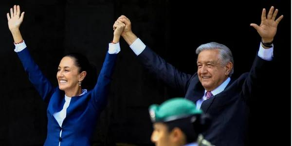
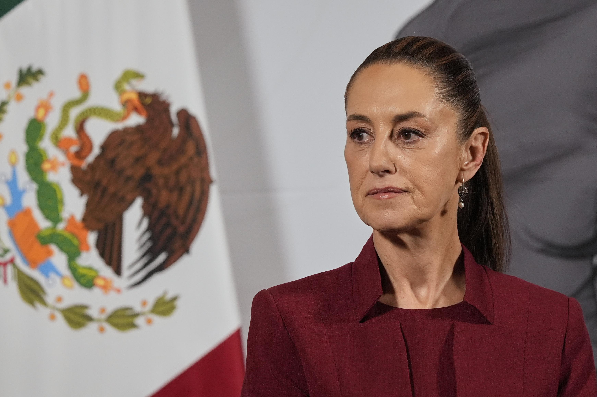
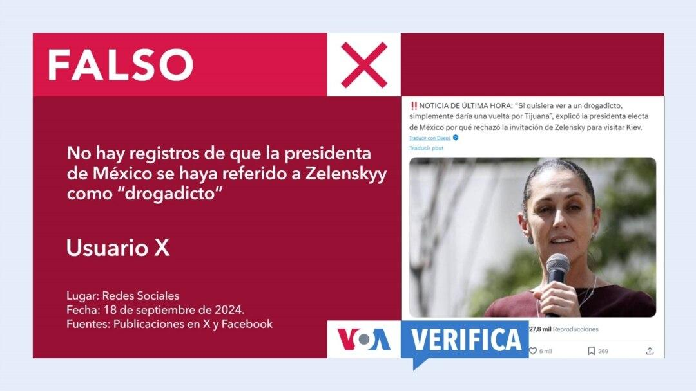

## Claim
Claim: "Mexican President-elect Claudia Sheinbaum rejected an invitation to Ukraine by Volodymr Zelenskyy and said towards him on September 17, 2024: 'If I wanted to see a drug addict, I'd just take a walk around Tijuana.'"

## Actions
```
image_search("Claudia Sheinbaum Zelenskyy Ukraine invitation")
image_search("Claudia Sheinbaum Tijuana drug addict quote")
```

## Evidence
### Evidence from `image_search`
The search results indicate that Mexican President-elect Claudia Sheinbaum declined an invitation to visit Ukraine from Volodymyr Zelenskyy. One source includes an image of both leaders . Another source also mentions the declined invitation , .

Sources:
*   [https://www.intellinews.com/mexico-s-president-elect-sheinbaum-turns-down-zelensky-s-invitation-to-ukraine-344262/](https://www.intellinews.com/mexico-s-president-elect-sheinbaum-turns-down-zelensky-s-invitation-to-ukraine-344262/)
*   [https://euromaidanpress.com/2024/09/18/mexican-president-elect-declines-zelenskyys-invitation-to-visit-ukraine/](https://euromaidanpress.com/2024/09/18/mexican-president-elect-declines-zelenskyys-invitation-to-visit-ukraine/)
*   [https://english.nv.ua/nation/sheinbaum-declines-zelenskyy-s-invitation-focuses-on-domestic-issues-50451798.html](https://english.nv.ua/nation/sheinbaum-declines-zelenskyy-s-invitation-focuses-on-domestic-issues-50451798.html)


### Evidence from `image_search`
The provided web sources contain articles about Claudia Sheinbaum, the Mexican President-elect. NBC Connecticut ([Source](https://www.nbcconnecticut.com/news/national-international/claudia-sheinbaum-mexico-first-female-president/3399062/)) includes a picture of her .

The Economic Times ([Source](https://m.economictimes.com/news/international/world-news/not-to-please-trump-mexicos-president-claudia-sheinbaum-claims-40-drop-in-fentanyl-trafficking/videoshow/121682270.cms)) and Newsweek ([Source](https://www.newsweek.com/mexico-claudia-sheinbaum-trump-banks-sanctions-update-2091276)) also feature images of Claudia Sheinbaum  .


## Elaboration
The evidence confirms that Claudia Sheinbaum declined an invitation to visit Ukraine from Volodymyr Zelenskyy. However, the search results do not provide any information about the alleged quote attributed to her.

Therefore, the veracity of the claim regarding the quote cannot be determined based on the provided evidence. Additional information is needed to verify the statement.


## Actions
```
image_search("Claudia Sheinbaum quote Zelenskyy drug addict Tijuana")
```

## Evidence
### Evidence from `image_search`
The search results indicate that the claim about Claudia Sheinbaum's quote is false. StopFake.org labels the quote as a fake, and Voice of America states there is no record of Sheinbaum making such a statement. 


## Elaboration
The evidence indicates that the claim is false. The search results explicitly state that the quote attributed to Claudia Sheinbaum is fake, and there is no record of her making such a statement.


## Final Judgement
The search results confirm that Claudia Sheinbaum declined an invitation to visit Ukraine from Volodymyr Zelenskyy. However, the search results explicitly state that the quote attributed to Claudia Sheinbaum is fake, and there is no record of her making such a statement.

The claim is therefore `false`.

### Verdict: FALSE

### Justification
The claim is false. While Claudia Sheinbaum did decline an invitation to visit Ukraine, the quote attributed to her is fabricated, as confirmed by fact-checking sources like StopFake.org and Voice of America.
