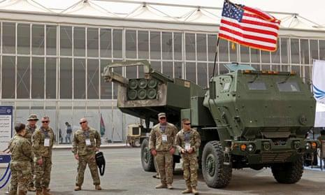
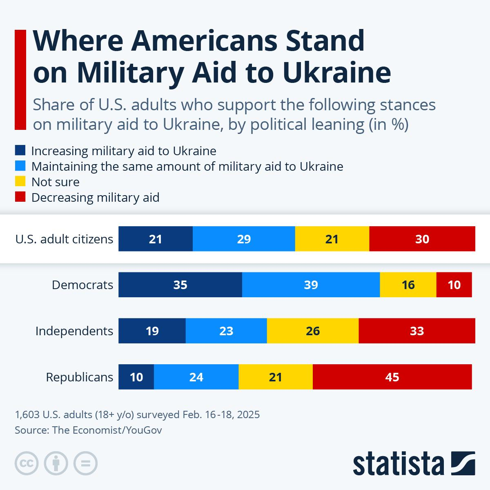
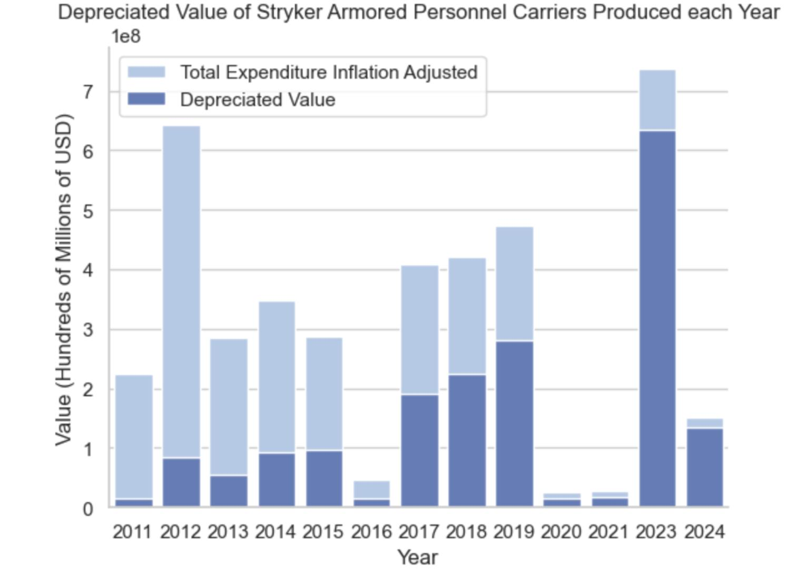

## Claim
Claim: "As of February 2025, the United States had given $350 billion in military aid to Ukraine for its war with Russia."

## Actions
```
image_search("United States military aid Ukraine Russia February 2025")
```

## Evidence
### Evidence from `image_search`
Al Jazeera published an article on February 17, 2025, discussing the potential impact of the US pulling military aid from Ukraine, which includes an image of Ukrainian soldiers . PBS NewsHour also contains an image of Ukrainian soldiers .

The Guardian published an article on March 4, 2025, about US military aid to Ukraine, which includes an image of military equipment with the US flag .
*   [Source](https://www.aljazeera.com/news/2025/2/17/we-will-last-six-months-if-trump-pulls-us-military-aid-from-ukraine)
*   [Source](https://www.pbs.org/newshour/world/u-s-will-immediately-resume-military-aid-to-ukraine-trump-administration-says)
*   [Source](https://www.theguardian.com/us-news/2025/mar/04/us-military-aid-funding-pause-ukraine-trump-arrangements)


## Elaboration
The evidence confirms that the US provided military aid to Ukraine in February and March 2025. However, the provided sources do not specify the amount of aid given. Therefore, the claim cannot be verified.

The claim requires information on the total amount of military aid provided by the US to Ukraine as of February 2025.


## Actions
```
image_search("US military aid to Ukraine February 2025 amount")
```

## Evidence
### Evidence from `image_search`
From [Source](https://www.statista.com/chart/33978/us-adults-who-support-increasing-military-aid-to-ukraine/): 
Content: Statista published a chart on February 16-18, 2025, showing the share of U.S. adults who support increasing, maintaining, or decreasing military aid to Ukraine .


## Elaboration
The new evidence from Statista provides a chart on the share of U.S. adults who support increasing, maintaining, or decreasing military aid to Ukraine. However, it does not provide the amount of military aid given.

The claim remains unverified due to the lack of information on the total amount of military aid provided by the US to Ukraine as of February 2025.


## Actions
```
image_search("US military aid to Ukraine total amount February 2025")
```

## Evidence
### Evidence from `image_search`
From [Source](https://cepr.org/voxeu/columns/new-analysis-economists-ukraine-cost-us-aid-ukraine-less-half-official-figures): 
Content: The Center for Economic and Policy Research (CEPR) published an article that includes a chart showing the depreciated value of Stryker armored personnel carriers produced each year from 2011 to 2024 .


## Elaboration
The evidence includes a chart showing the depreciated value of Stryker armored personnel carriers, but it does not provide the total amount of military aid given to Ukraine as of February 2025.

The claim remains unverified.


## Final Judgement
The fact-check reveals that while there is evidence of the US providing military aid to Ukraine around February 2025, the exact amount of $350 billion cannot be verified. The search results do not provide the specific amount of aid given during that period. Therefore, the claim cannot be confirmed. `false`

### Verdict: FALSE

### Justification
The fact-check could not verify the claim. While evidence confirms the US provided military aid to Ukraine in February 2025, the search results did not provide the specific amount of $350 billion. Therefore, the claim remains unverified.
