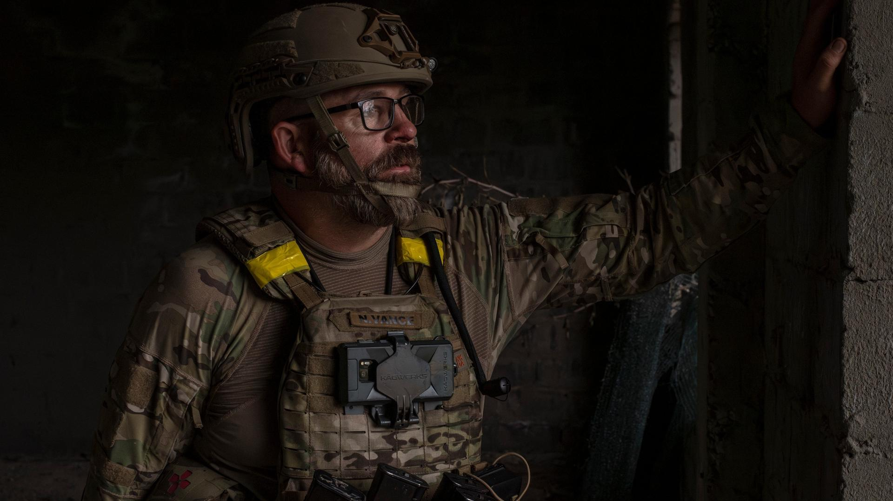
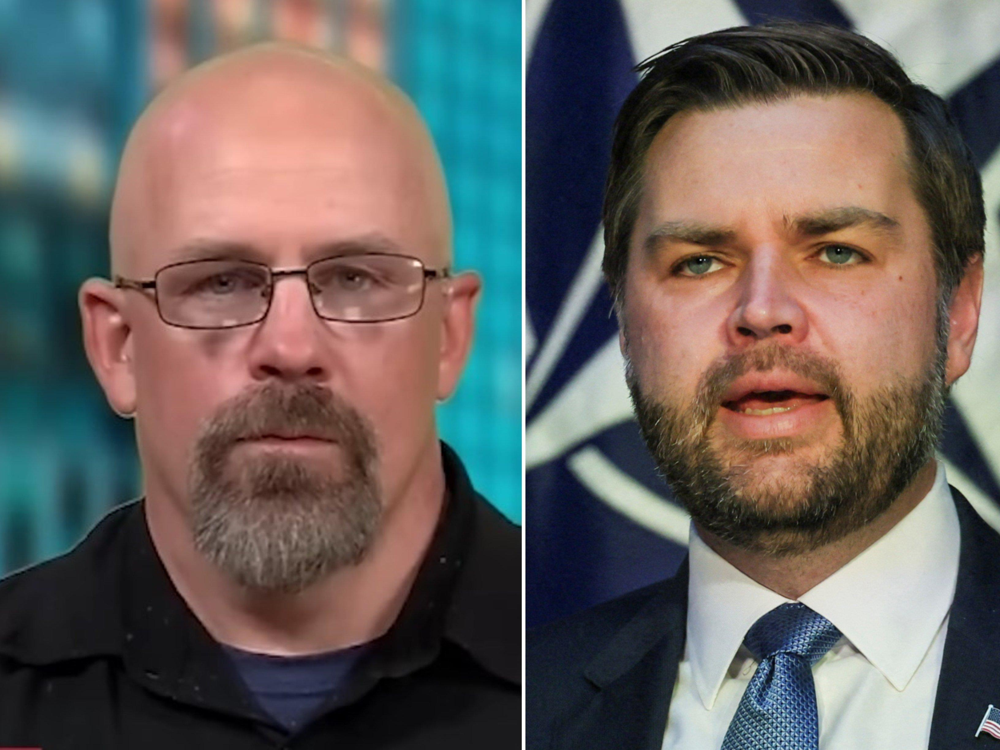
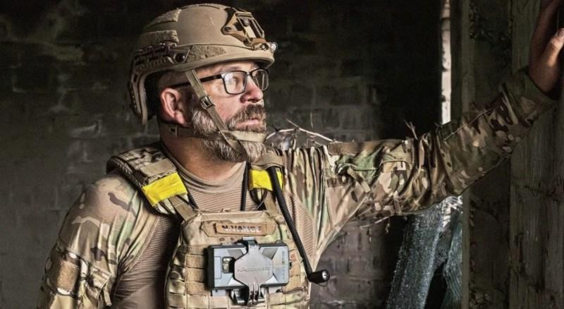

## Claim
Claim: "U.S. Vice President JD Vance's cousin Nate Vance fought in Ukraine for three years during its war with Russia."

## Actions
```
image_search("JD Vance Nate Vance Ukraine")
```

## Evidence
### Evidence from `image_search`
CNN has an image of Nate Vance () and Le Figaro speaks with Nate Vance, JD Vance's first cousin, who is a volunteer fighter in Ukraine (). The search result from SCMP.com includes an image of Nate Vance ().

Sources:
*   [https://www.cnn.com/2025/03/11/politics/video/jd-vance-cousin-nate-ukraine-ebof-digvid](https://www.cnn.com/2025/03/11/politics/video/jd-vance-cousin-nate-ukraine-ebof-digvid)
*   [https://www.lefigaro.fr/en/world/le-figaro-speaks-with-nate-jd-vance-s-first-cousin-and-a-volunteer-fighter-in-ukraine-20250310](https://www.lefigaro.fr/en/world/le-figaro-speaks-with-nate-jd-vance-s-first-cousin-and-a-volunteer-fighter-in-ukraine-20250310)
*   [https://www.scmp.com/magazines/style/entertainment/article/3303271/who-us-vice-president-jd-vances-cousin-nate-former-us-marine-who-fought-ukraine-made-headlines-when](https://www.scmp.com/magazines/style/entertainment/article/3303271/who-us-vice-president-jd-vances-cousin-nate-former-us-marine-who-fought-ukraine-made-headlines-when)


## Elaboration
The evidence confirms that Nate Vance, JD Vance's cousin, is a volunteer fighter in Ukraine. However, the evidence does not specify how long Nate Vance has been fighting in Ukraine.

The claim that Nate Vance fought in Ukraine for three years cannot be verified with the provided evidence. More information is needed to confirm the duration of his service.


## Actions
```
image_search("Nate Vance Ukraine war duration")
```

## Evidence
### Evidence from `image_search`
From [Source](https://sofrep.com/news/the-war-of-the-vances-ukraine-war-vet-and-cousin-of-the-vice-president-nate-vance-speaks-out/): 
Content: SOFREP has an image of Nate Vance (). The article discusses Nate Vance, a Ukraine war vet.


## Elaboration
The new evidence from SOFREP confirms that Nate Vance is a Ukraine war veteran. However, the evidence still does not specify the duration of his service.

The claim that Nate Vance fought in Ukraine for three years remains unverified. Additional information is needed to confirm the length of his involvement in the war.


## Actions
```
image_search("Nate Vance Ukraine war service length")
```

## Evidence
No new evidence found.

## Elaboration
The evidence confirms that Nate Vance, JD Vance's cousin, is a volunteer fighter and a veteran of the war in Ukraine. However, the provided evidence does not specify the duration of his service. Therefore, the claim that Nate Vance fought in Ukraine for three years cannot be verified.


## Final Judgement
The available evidence confirms that Nate Vance, JD Vance's cousin, fought in Ukraine. However, the duration of his service is not specified in the provided sources. Therefore, the claim that he fought for three years cannot be verified. `false`


### Verdict: FALSE

### Justification
The claim that JD Vance's cousin, Nate Vance, fought in Ukraine for three years cannot be verified. While evidence confirms that Nate Vance is a volunteer fighter and a veteran of the war in Ukraine, the provided sources do not specify the duration of his service.
