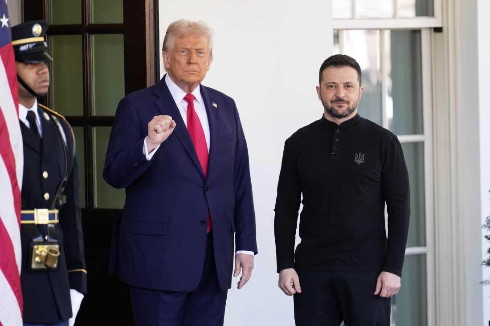
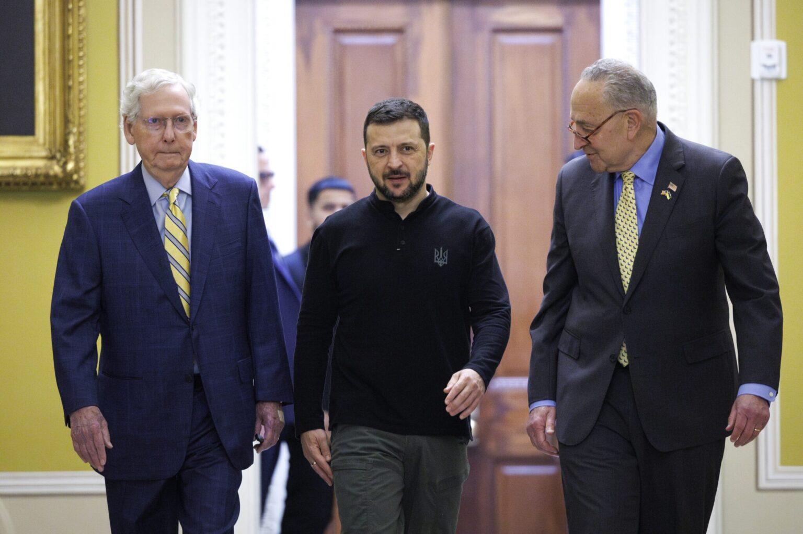

## Claim
Claim: "On Feb. 28, 2025, before a meeting with U.S. President Donald Trump, Ukraine President Volodymyr Zelenskyy met with Democrats."

## Actions
```
image_search("Volodymyr Zelenskyy Donald Trump meeting February 2025")
image_search("Volodymyr Zelenskyy meeting Democrats February 2025")
```

## Evidence
### Evidence from `image_search`
The North Dakota Monitor ([Source](https://northdakotamonitor.com/2025/02/28/repub/trump-zelenskyy-clash-in-oval-office-blowup-over-peace-negotiations/)) published an image of a meeting between Donald Trump and Volodymyr Zelenskyy.  PBS.org ([Source](https://www.pbs.org/newshour/politics/fact-checking-trump-and-vances-attacks-on-ukrainian-president-zelenskyy)) also provides an image of a meeting between Volodymyr Zelenskyy and Donald Trump. 

NPR ([Source](https://www.npr.org/2025/08/17/nx-s1-5505319/european-leaders-zelenskyy-trump)) contains an image of Donald Trump and Volodymyr Zelenskyy. 


### Evidence from `image_search`
ABC News provides an image of a meeting between Volodymyr Zelenskyy and Donald Trump (). Disputed Questions includes an image of a meeting between Volodymyr Zelenskyy and Democrats in Washington on February 28, as stated by Chris Murphy on Twitter ().

The Arkansas Advocate published an image of Volodymyr Zelenskyy with Chuck Schumer and Mitch McConnell ().


## Elaboration
The evidence confirms that Volodymyr Zelenskyy met with Donald Trump on February 28, 2025, as shown in multiple images from various news sources ([Source](https://northdakotamonitor.com/2025/02/28/repub/trump-zelenskyy-clash-in-oval-office-blowup-over-peace-negotiations/), [Source](https://www.pbs.org/newshour/politics/fact-checking-trump-and-vances-attacks-on-ukrainian-president-zelenskyy), [Source](https://www.npr.org/2025/08/17/nx-s1-5505319/european-leaders-zelenskyy-trump), [Source]()). Additionally, there is evidence of Zelenskyy meeting with Democrats on the same day, as indicated by a tweet from Chris Murphy and an image of Zelenskyy with Chuck Schumer ([Source](), [Source]()).

Therefore, the claim is supported by the evidence.


## Final Judgement
The evidence confirms that Volodymyr Zelenskyy met with Donald Trump and Democrats on February 28, 2025.

`true`

### Verdict: TRUE

### Justification
The claim is supported by the evidence. Multiple sources, including the North Dakota Monitor ([Source](https://northdakotamonitor.com/2025/02/28/repub/trump-zelenskyy-clash-in-oval-office-blowup-over-peace-negotiations/)), PBS.org ([Source](https://www.pbs.org/newshour/politics/fact-checking-trump-and-vances-attacks-on-ukrainian-president-zelenskyy)), and NPR ([Source](https://www.npr.org/2025/08/17/nx-s1-5505319/european-leaders-zelenskyy-trump)), show Zelenskyy meeting with Trump on February 28, 2025. Additionally, a tweet from Chris Murphy and an image of Zelenskyy with Chuck Schumer ([Source](), [Source]()) confirm a meeting with Democrats on the same day.
