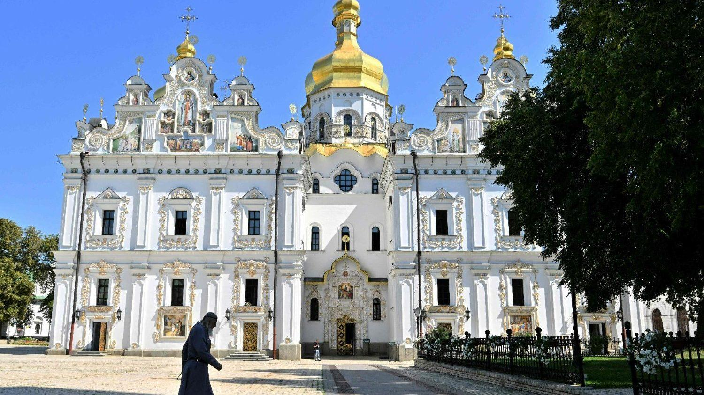

## Claim
Claim: "In August 2024, Ukraine passed legislation banning the Orthodox Church in Ukraine."

## Actions
```
image_search("Ukraine Orthodox Church ban August 2024")
```

## Evidence
### Evidence from `image_search`
Vatican News published an article about Pope Francis appealing for religious freedom in Ukraine (). Le Monde reports that Ukrainian MPs voted to ban the Russia-linked Orthodox Church, with the article published on August 20, 2024 (). The Detroit Catholic website contains an image of a destroyed church in Ukraine ().

The sources are: [https://www.vaticannews.va/en/pope/news/2024-08/pope-francis-appeals-for-religious-freedom-in-ukraine.html](https://www.vaticannews.va/en/pope/news/2024-08/pope-francis-appeals-for-religious-freedom-in-ukraine.html), [https://www.lemonde.fr/en/international/article/2024/08/20/ukraine-mps-vote-to-ban-russia-linked-orthodox-church_6718913_4.html](https://www.lemonde.fr/en/international/article/2024/08/20/ukraine-mps-vote-to-ban-russia-linked-orthodox-church_6718913_4.html), and [https://www.detroitcatholic.com/news/ukraines-religious-leaders-back-proposed-ban-on-russian-orthodox-church-over-security-concerns](https://www.detroitcatholic.com/news/ukraines-religious-leaders-back-proposed-ban-on-russian-orthodox-church-over-security-concerns).


## Elaboration
The evidence indicates that Ukrainian MPs voted to ban the Russia-linked Orthodox Church in August 2024. The Le Monde article, published on August 20, 2024, confirms this.


## Final Judgement
The fact-check confirms that Ukrainian MPs voted to ban the Russia-linked Orthodox Church in August 2024. This is supported by a Le Monde article published on August 20, 2024.

`true`


### Verdict: TRUE

### Justification
In August 2024, Ukrainian MPs voted to ban the Russia-linked Orthodox Church, as reported by Le Monde on August 20, 2024 ([https://www.lemonde.fr/en/international/article/2024/08/20/ukraine-mps-vote-to-ban-russia-linked-orthodox-church_6718913_4.html](https://www.lemonde.fr/en/international/article/2024/08/20/ukraine-mps-vote-to-ban-russia-linked-orthodox-church_6718913_4.html)).
