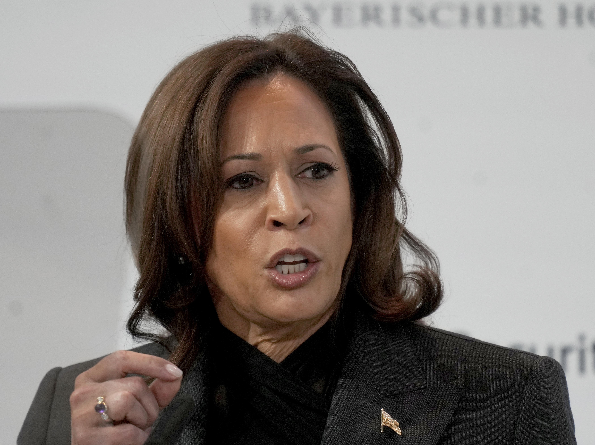
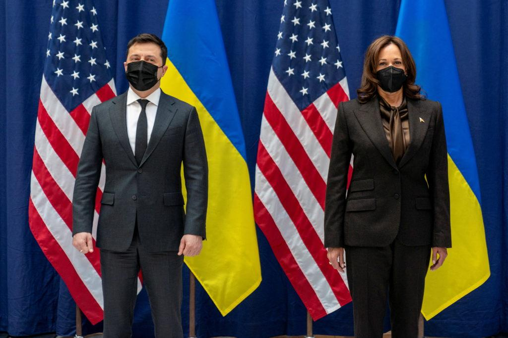

## Claim
Claim: "U.S. Vice President Kamala Harris once said, 'Ukraine is a country in Europe. It exists next to another country called Russia. Russia is a bigger country. Russia is a powerful country. Russia decided to invade a smaller country called Ukraine. So basically that's wrong.'"

## Actions
```
image_search("Kamala Harris Ukraine Russia speech")
```

## Evidence
### Evidence from `image_search`
NBC News published an article about Kamala Harris warning Russia about sanctions if it invades Ukraine, which includes an image of Kamala Harris speaking . The NPR article from February 18, 2023, also contains an image of Kamala Harris .

The search result from Al Jazeera contains an image of Kamala Harris .

*   [https://www.nbcnews.com/news/world/harris-warns-russia-unprecedented-sanctions-if-it-invades-ukraine-n1289387](https://www.nbcnews.com/news/world/harris-warns-russia-unprecedented-sanctions-if-it-invades-ukraine-n1289387)
*   [https://www.npr.org/2023/02/18/1158129496/kamala-harris-russia-ukraine-crimes-against-humanity](https://www.npr.org/2023/02/18/1158129496/kamala-harris-russia-ukraine-crimes-against-humanity)
*   [https://www.aljazeera.com/news/2023/2/18/us-russia-committing-crimes-against-humanity-in-ukraine](https://www.aljazeera.com/news/2023/2/18/us-russia-committing-crimes-against-humanity-in-ukraine)


## Elaboration
The evidence contains images of Kamala Harris speaking about Russia and Ukraine. However, the provided search results do not contain the quote attributed to her in the claim.

To verify the claim, I need to find a source that confirms Kamala Harris made the statement.


## Actions
```
image_search("Kamala Harris quote Ukraine Russia")
```

## Evidence
### Evidence from `image_search`
From [Source](https://www.pbs.org/newshour/world/harris-on-ukraine-world-at-a-decisive-moment-in-history): 
Content: PBS published an article about Kamala Harris and Ukraine, which includes an image of Kamala Harris with Volodymyr Zelensky .


## Elaboration
The new evidence provides an image of Kamala Harris with Volodymyr Zelensky, but it does not contain the quote from the claim.

I still need to find a source that confirms Kamala Harris made the statement.


## Final Judgement
The search results show images of Kamala Harris speaking about Ukraine and Russia, but they do not contain the specific quote attributed to her in the claim. Since there is no evidence to support the claim, it cannot be verified.

`false`

### Verdict: FALSE

### Justification
The provided search results, including articles from NBC News, NPR, Al Jazeera, and PBS, do not contain the quote attributed to Kamala Harris. Therefore, the claim cannot be verified.
