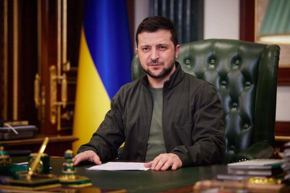
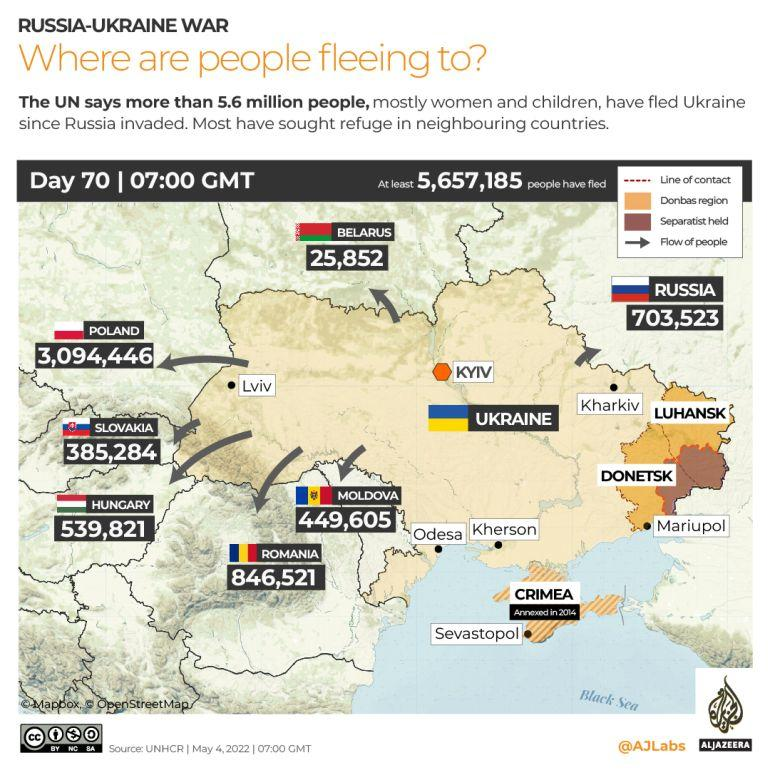
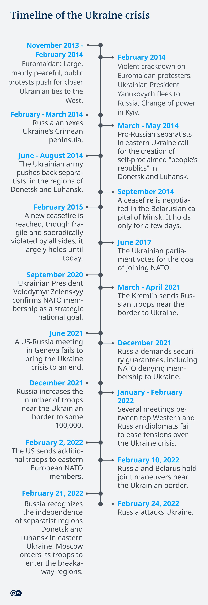
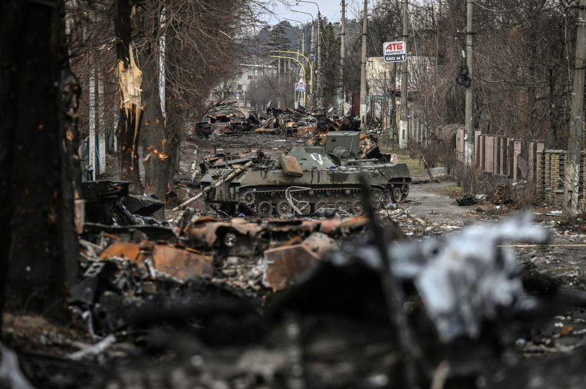
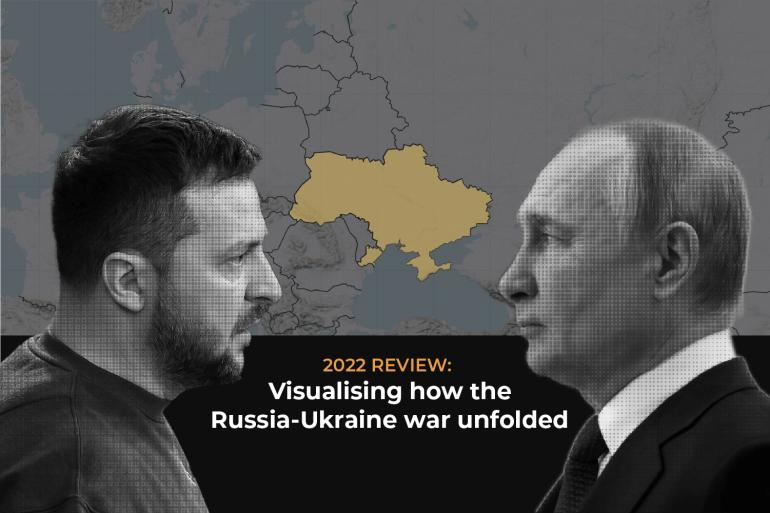
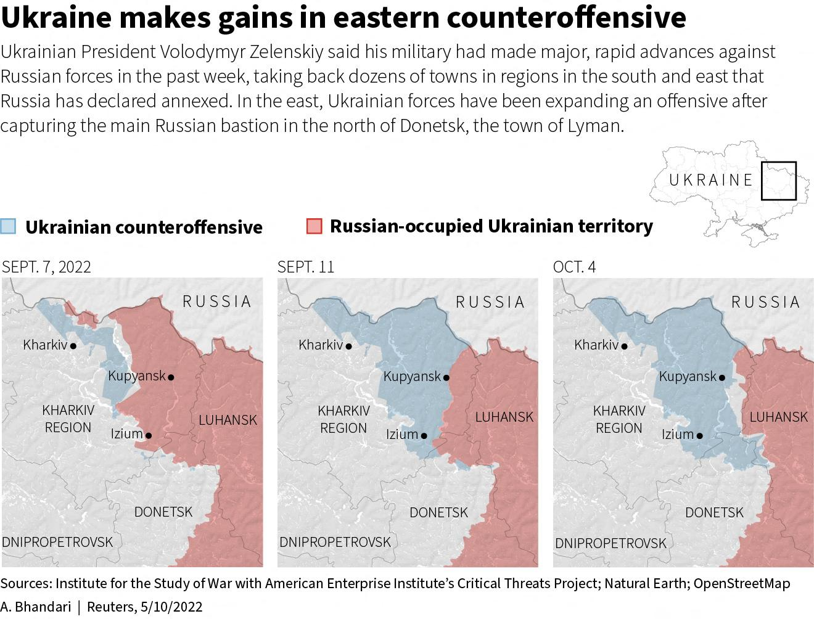

## Claim
Claim: "Ukrainian President Volodymyr Zelenskyy started the 2022 war in Ukraine with Russia."

## Actions
```
image_search("Volodymyr Zelenskyy Russia war 2022")
```

## Evidence
### Evidence from `image_search`
The PBS article discusses Zelenskyy and the war in Ukraine (). Al Jazeera published an article on March 22, 2022, about Zelenskyy renewing an offer of talks with Putin ().

The NBC News article contains an image of Volodymyr Zelenskyy ().


## Elaboration
The evidence includes images of Zelenskyy and mentions articles about the war in Ukraine and offers of talks with Putin. However, the evidence does not provide any information about who started the war.

More information is needed to verify the claim.


## Actions
```
image_search("timeline of 2022 Russia Ukraine war")
image_search("causes of 2022 Russia Ukraine war")
```

## Evidence
### Evidence from `image_search`
Al Jazeera published a timeline of the Russia-Ukraine war, showing the flow of people fleeing Ukraine after the Russian invasion (). The DW article provides a timeline of the Ukraine crisis, starting in November 2013 and ending with Russia attacking Ukraine on February 24, 2022 ().


### Evidence from `image_search`
The article from [The Strategist](https://www.aspistrategist.org.au/what-caused-the-war-in-ukraine/) discusses the causes of the war in Ukraine (). Al Jazeera published an article reviewing how the Russia-Ukraine war unfolded (). The Brookings article discusses the Russia-Ukraine war and mentions Ukrainian President Volodymyr Zelenskyy ().


## Elaboration
The DW article provides a timeline of the Ukraine crisis, indicating that Russia attacked Ukraine on February 24, 2022. The evidence does not support the claim that Zelenskyy started the war.


## Final Judgement
The evidence includes timelines and articles about the Russia-Ukraine war, including the date of the Russian invasion. The evidence does not support the claim that Zelenskyy started the war.

The claim is demonstrably false because the evidence indicates that Russia initiated the war. `false`


### Verdict: FALSE

### Justification
The claim is demonstrably false. Evidence, including a timeline from [DW](https://www.dw.com/en/ukraine-crisis-timeline-how-events-unfolded/g-60998676), indicates that Russia initiated the war on February 24, 2022, not Ukrainian President Volodymyr Zelenskyy.
