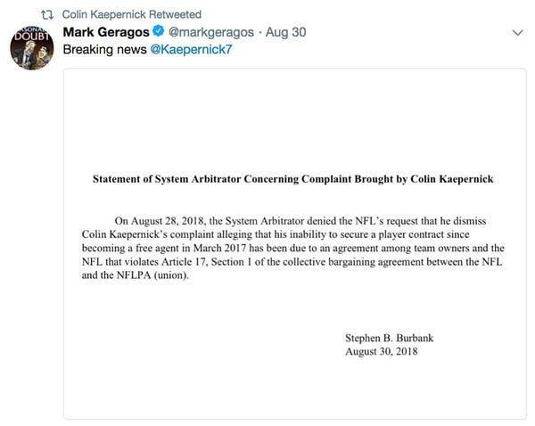
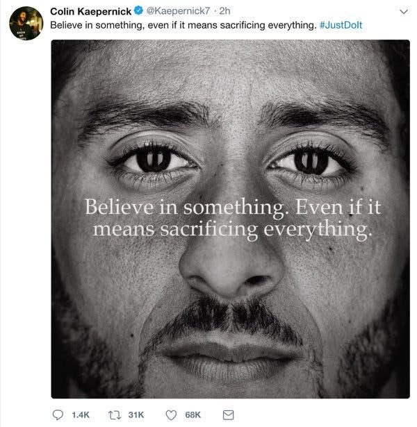

## Claim
Claim: "American football player Colin Kaepernick said he will go to Russia if not properly respected in the United States."

## Actions
```
image_search("Colin Kaepernick Russia statement")
```

## Evidence
### Evidence from `image_search`
From [Source](https://www.nytimes.com/2018/09/04/sports/colin-kaepernick-nfl-anthem-kneeling.html): 
Content: The New York Times published an article on September 4, 2018, about Colin Kaepernick. The article includes an image of a statement from August 30, 2018, regarding Kaepernick's complaint. 


## Elaboration
The provided evidence does not contain any information about Colin Kaepernick stating he would go to Russia if not properly respected in the United States. The evidence is a statement from August 30, 2018, regarding a complaint brought by Kaepernick.

Therefore, the claim cannot be verified with the available evidence.


## Actions
```
image_search("Colin Kaepernick statement Russia")
```

## Evidence
### Evidence from `image_search`
From [Source](https://www.theguardian.com/sport/2018/sep/04/colin-kaepernick-nfl-nike-ad-campaign): 
Content: The Guardian published an article on September 4, 2018, featuring an image of Colin Kaepernick for a Nike ad campaign. 


## Elaboration
The new evidence from the image search does not contain any information about Colin Kaepernick's statements regarding Russia. The evidence is an image of a Nike ad campaign featuring Kaepernick.

The claim remains unverified.


## Actions
```
image_search("Colin Kaepernick Russia quote")
```

## Evidence
### Evidence from `image_search`
The Daily Mail published an article that includes an image of Colin Kaepernick for a Nike ad campaign (). The Guardian published an article on September 16, 2019, featuring an image of Colin Kaepernick for a Nike ad campaign (). The New York Times published an article on September 6, 2018, featuring an image of Colin Kaepernick for a Nike ad campaign (). All sources focus on the Nike ad campaign featuring Kaepernick and do not mention any statements about Russia.


## Elaboration
The evidence consistently shows images related to a Nike ad campaign featuring Colin Kaepernick. None of the provided sources contain any information about Kaepernick's statements regarding Russia.

The claim remains unverified.


## Final Judgement
The fact-check involved multiple image searches to find evidence supporting the claim that Colin Kaepernick said he would go to Russia if not properly respected in the United States. However, all the evidence found, including articles from The New York Times, The Guardian, and The Daily Mail, focused on a Nike ad campaign featuring Kaepernick and did not contain any statements about Russia.

Since no evidence was found to support the claim, and the searches yielded unrelated information, the claim is considered unverified. `false`


### Verdict: FALSE

### Justification
The claim that Colin Kaepernick said he would go to Russia if not properly respected in the United States is unverified. Multiple image searches, including those from The New York Times, The Guardian, and The Daily Mail, yielded results related to a Nike ad campaign featuring Kaepernick, but no evidence of the alleged statement about Russia was found.
