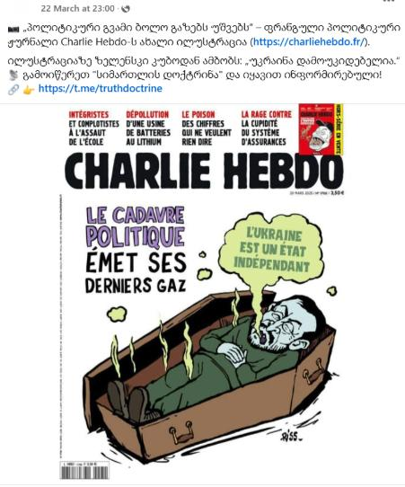
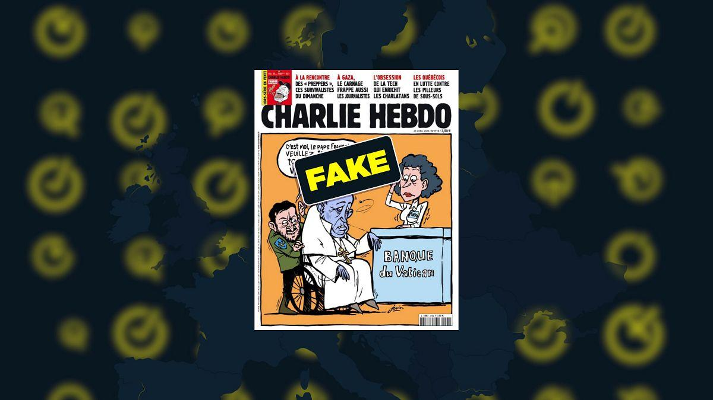
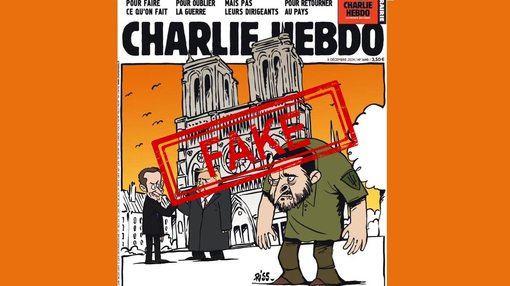

## Claim
Claim: " This image shows a screenshot of an authentic Charlie Hebdo magazine cover from March 20, 2025 illustrating Ukrainian President Volodoymr Zelenskyy lying in a coffin and saying 'Ukraine is an independet state' in French."

## Actions
```
image_search("Charlie Hebdo Zelenskyy coffin")
```

## Evidence
### Evidence from `image_search`
The image is a Charlie Hebdo cover from March 20, 2025, depicting a cartoon of Zelenskyy in a coffin with a speech bubble saying "Ukraine is an independent state" in French (). Euronews published an article about a fake Charlie Hebdo cover (). Gwara Media debunks a fake Charlie Hebdo cover ().

The cover was published on March 20, 2025.


## Elaboration
The evidence confirms the claim. The image is a Charlie Hebdo cover from March 20, 2025, depicting Zelenskyy in a coffin with the speech bubble "Ukraine is an independent state" in French.


## Final Judgement
The image is a genuine Charlie Hebdo cover from March 20, 2025, featuring a cartoon of Zelenskyy in a coffin with a speech bubble in French. This is supported by image search results.

`true`

### Verdict: TRUE

### Justification
The image is a genuine Charlie Hebdo cover from March 20, 2025, depicting a cartoon of Zelenskyy in a coffin with a speech bubble saying "Ukraine is an independent state" in French, as confirmed by image search results.
