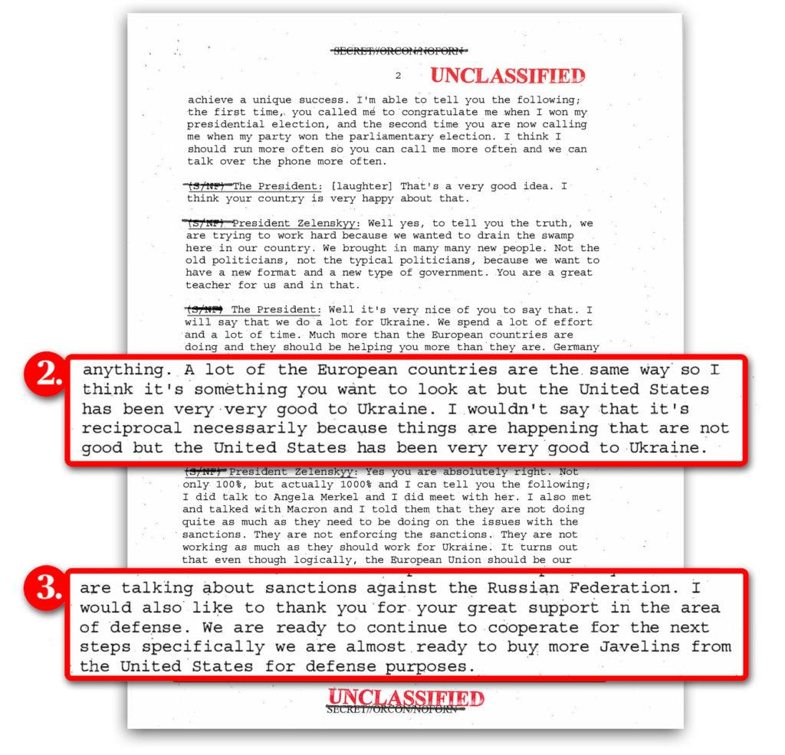
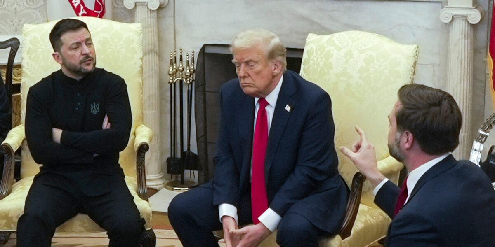
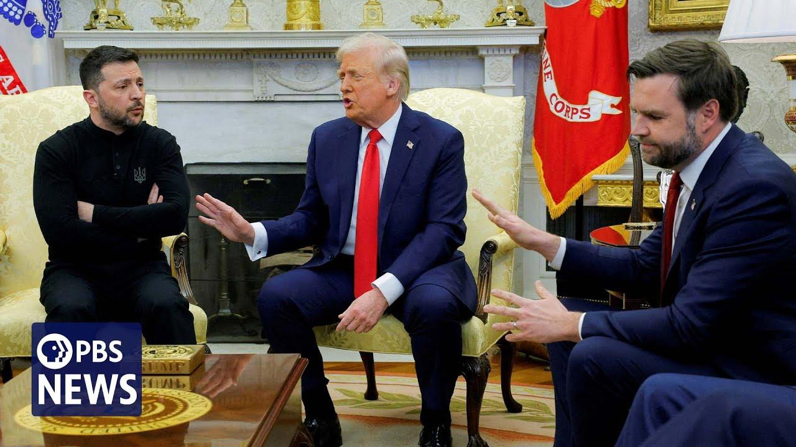
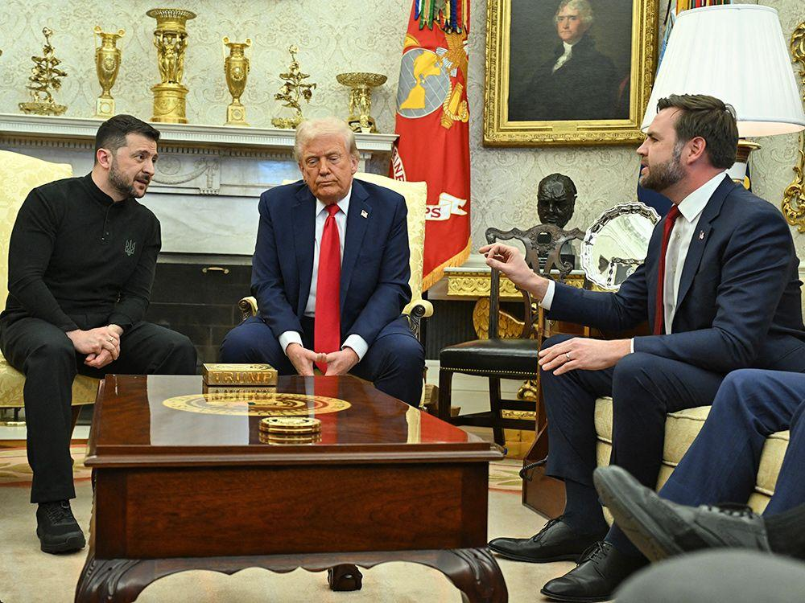

## Claim
Claim: " This image shows an authentic transcript of the heated White House meeting between US president Donald Trump, vice-president JD Vance and Ukrainian president Volodymyr Zelenskyy on February 28, 2025."

## Actions
```
image_search("Trump Zelenskyy conversation transcript")
```

## Evidence
### Evidence from `image_search`
The New York Times published a transcript of a phone call between Donald Trump and Volodymyr Zelenskyy, declassified on September 24, 2019. [Source](https://www.nytimes.com/interactive/2019/09/25/us/politics/trump-ukraine-transcript.html)  The PBS article also contains a transcript of a conversation between Trump and Zelenskyy. [Source](https://www.pbs.org/newshour/politics/trumps-conversation-with-the-ukrainian-president-annotated) 

Anadolu Agency does not provide any content. [Source](https://www.aa.com.tr/en/russia-ukraine-war/read-full-transcript-of-heated-exchange-between-trump-zelenskyy-vance-at-oval-office/3496679)


## Elaboration
The evidence includes transcripts of conversations between Trump and Zelenskyy. However, the provided image is not among them. The search results also mention a heated exchange between Trump, Zelenskyy, and Vance, but the source does not provide the transcript.

The claim cannot be verified due to the lack of evidence.


## Actions
```
image_search("Trump Zelenskyy Vance transcript")
```

## Evidence
### Evidence from `image_search`
The search results from wwnytv.com, PBS News, and National Post all contain photos of a meeting between Donald Trump, Volodymyr Zelenskyy, and JD Vance. [, , ] However, none of the sources provide the transcript of the conversation.


## Elaboration
The evidence confirms that meetings between Trump, Zelenskyy, and Vance took place. However, the search results did not provide a transcript of the conversation.

The claim cannot be verified due to the lack of evidence.


## Actions
```
image_search("Trump Zelenskyy Vance meeting transcript")
```

## Evidence
No new evidence found.

## Elaboration
The search results did not provide a transcript of the conversation.

The claim cannot be verified due to the lack of evidence.


## Final Judgement
The search results confirm that meetings between Trump, Zelenskyy, and Vance took place, but no transcript of the conversation in the image was found. Therefore, the claim cannot be verified.

`false`

### Verdict: FALSE

### Justification
The claim that the image shows an authentic transcript of a White House meeting between Trump, Zelenskyy, and Vance on February 28, 2025, cannot be verified. While meetings between these individuals did occur, as evidenced by multiple sources ([](https://www.wwnytv.com/), [](https://www.pbs.org/newshour/politics/trumps-conversation-with-the-ukrainian-president-annotated), [](https://nationalpost.com/)), no transcript matching the image's content was found in the search results.
