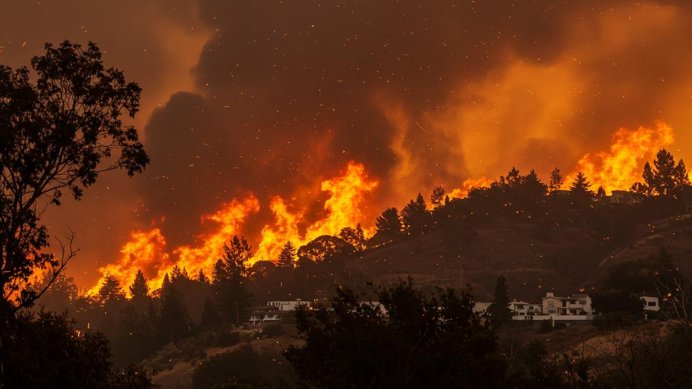
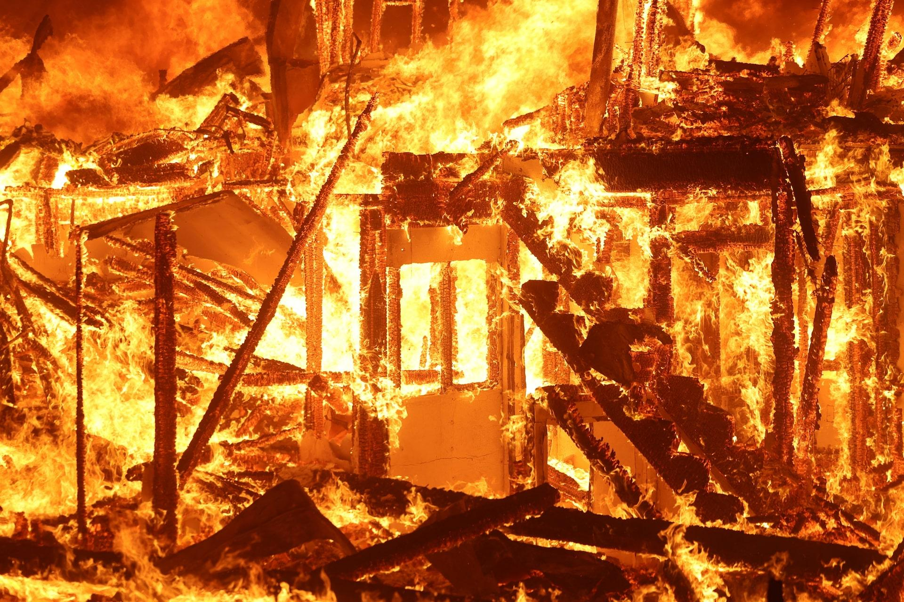
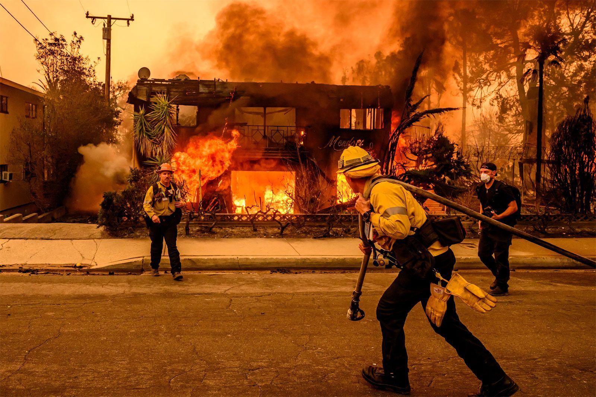
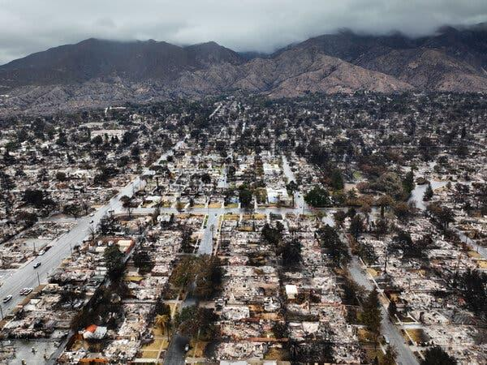
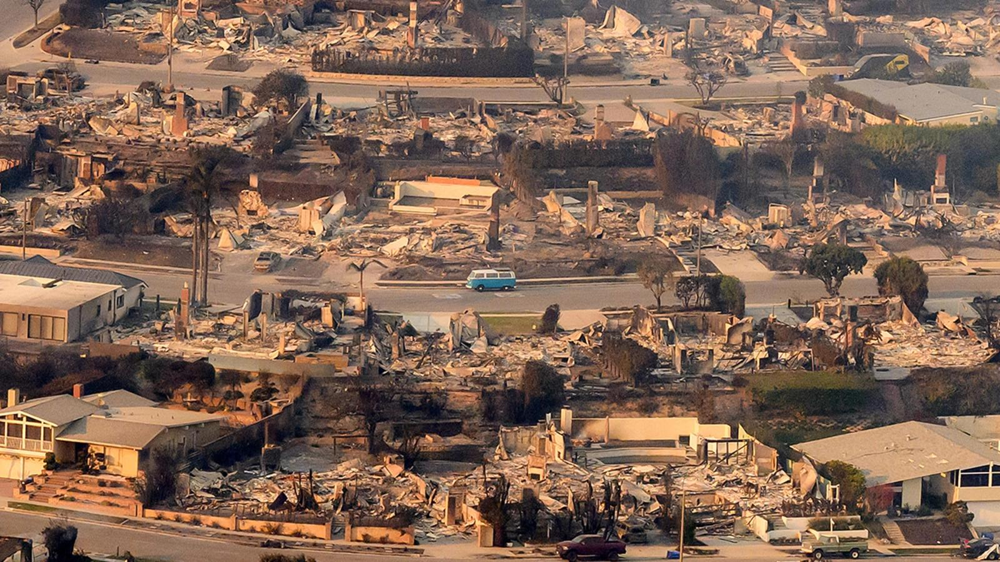
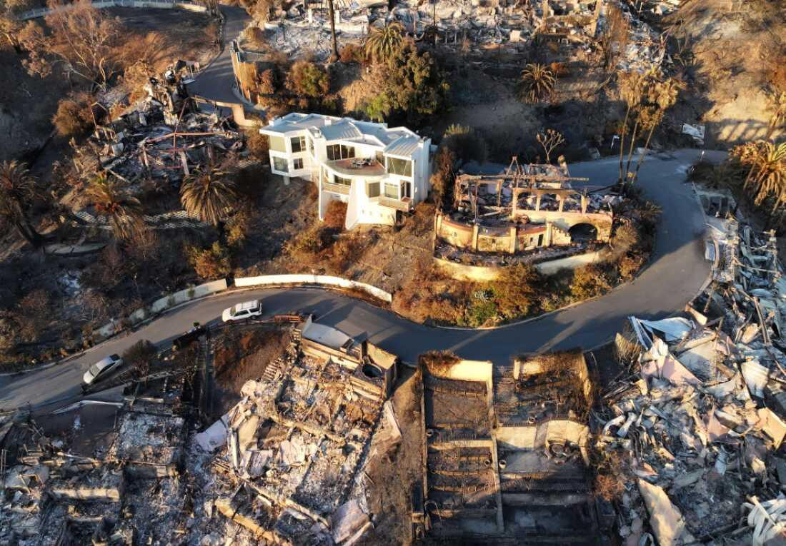
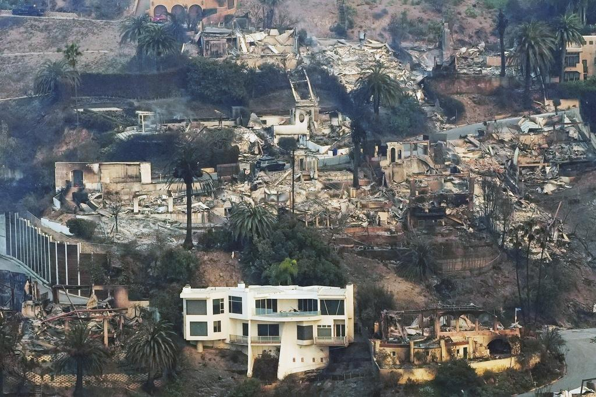
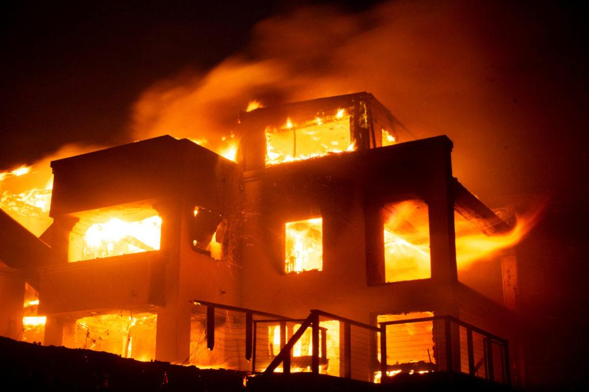
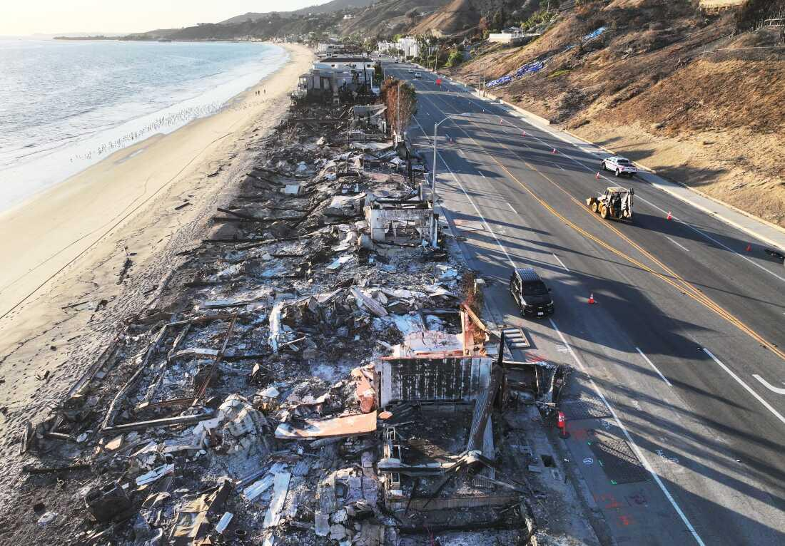

## Claim
Claim: "During the January 2025 wildfires, eight mansions belonging to Ukrainian military officials burned down in Los Angeles, California."

## Actions
```
image_search("January 2025 wildfires Los Angeles")
image_search("Ukrainian military officials mansions burned Los Angeles")
```

## Evidence
### Evidence from `image_search`
The search results contain images of wildfires in Los Angeles. One source mentions the January 2025 Los Angeles wildfires and includes an image of the fires (). Reuters also published images of the wildfires (). Another source from Britannica.com shows a house on fire during the Los Angeles wildfires ().

The sources are: [Source](https://unu.edu/inweh/collection/january-2025-los-angeles-wildfires-once-generation-events-now-happen-frequently), [Source](https://www.reuters.com/pictures/scenes-los-angeles-wildfires-rage-2025-01-08/3TQRCJ3GGFNF5I6YEQ3524YLTE/), and [Source](https://www.britannica.com/event/Los-Angeles-wildfires-of-2025).


### Evidence from `image_search`
The search results include articles and images related to wildfires in Los Angeles. One source from NPR contains images of structures destroyed by fire (). Another source from The New York Times, published on February 2, 2025, also includes an image of the damage caused by the Los Angeles wildfires ().

Additionally, a source from the Council on Foreign Relations contains an image of a neighborhood destroyed by fire ().
*   [Source](https://www.npr.org/transcripts/nx-s1-5259842)
*   [Source](https://www.nytimes.com/2025/02/02/us/la-wildfires-palisades-eaton-preparations.html)
*   [Source](https://www.cfr.org/expert-brief/after-fires-how-rebuild-los-angeles)


## Elaboration
The evidence confirms that wildfires occurred in Los Angeles in January 2025. However, the search results do not mention any Ukrainian military officials or their mansions.

Therefore, the claim cannot be verified with the provided evidence. The information about the mansions belonging to Ukrainian military officials is missing.


## Actions
```
image_search("Los Angeles wildfires damage mansions")
image_search("Ukrainian military officials Los Angeles mansions")
```

## Evidence
### Evidence from `image_search`
The search results include articles and images related to the Los Angeles wildfires. NPR published an article with an image of houses that survived and were destroyed by the fire (). CBS42.com contains an image of mansions damaged by the wildfires (). PBS NewsHour reported that nearly 2,000 structures were destroyed, including homes ().

The sources are: [Source](https://www.npr.org/2025/01/17/nx-s1-5261859/los-angeles-wildfires-houses-survived-defensible-space), [Source](https://www.cbs42.com/news/national/interactive-maps-show-homes-damaged-destroyed-in-los-angeles-wildfires/), and [Source](https://www.pbs.org/newshour/nation/nearly-2000-structures-destroyed-by-los-angeles-area-fires-so-far-including-homes-of-several-celebrities).


### Evidence from `image_search`
From [Source](https://www.npr.org/2025/01/16/nx-s1-5259842/los-angeles-california-fires-russia-ukraine): 
Content: The NPR article, published on January 16, 2025, contains an image of structures destroyed by the Los Angeles wildfires (). The article also mentions the Russia-Ukraine conflict.


## Elaboration
The evidence confirms that the Los Angeles wildfires in January 2025 destroyed numerous structures, including homes and mansions. However, the search results do not mention any Ukrainian military officials or their mansions being affected by the fires. The NPR article mentions the Russia-Ukraine conflict, but it does not link it to the destroyed structures.

Therefore, the claim remains unverified due to a lack of evidence.


## Final Judgement
The search results confirm the occurrence of the January 2025 wildfires in Los Angeles and the destruction of structures, including mansions. However, there is no evidence to support the claim that eight mansions belonging to Ukrainian military officials burned down. The search results do not mention any Ukrainian military officials or their properties.

`false`

### Verdict: FALSE

### Justification
The fact-check confirms the occurrence of the January 2025 wildfires in Los Angeles and the destruction of structures, including mansions, as evidenced by sources like [NPR](https://www.npr.org/2025/01/16/nx-s1-5259842/los-angeles-california-fires-russia-ukraine). However, the search results do not provide any information about Ukrainian military officials or their mansions being affected by the fires. Therefore, the claim is unsupported by the available evidence and is deemed false.
