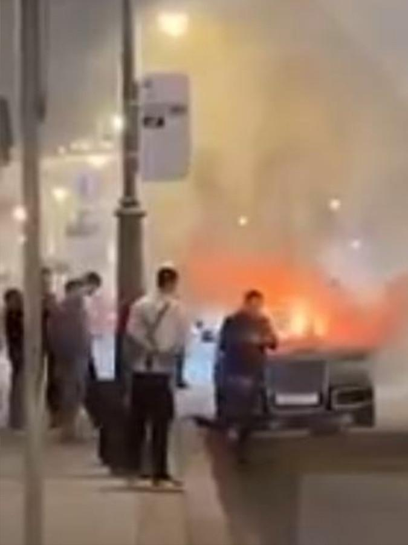
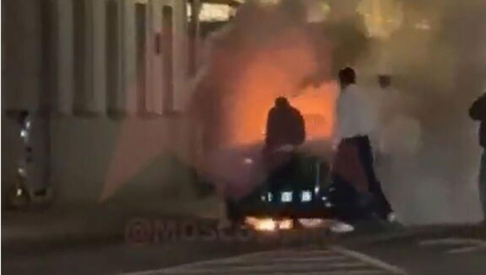
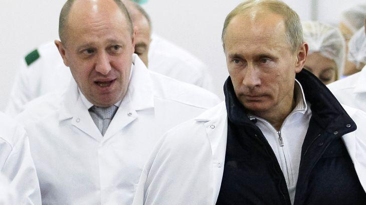
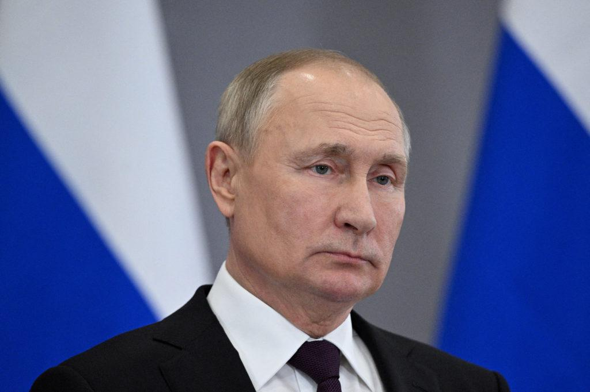

## Claim
Claim: "Russian President Vladimir Putin has died in an explosion in one of his limousines."

## Actions
```
image_search("Vladimir Putin limousine explosion")
```

## Evidence
### Evidence from `image_search`
India Today reports on a limousine from Vladimir Putin's fleet exploding in Moscow and catching fire (). The Northeast Live TV shows an image of a car on fire ().

The Financial Express does not provide any content.
*   [https://www.indiatoday.in/world/story/limousine-from-vladimir-putins-fleet-explodes-in-moscow-catches-fire-report-2701228-2025-03-30](https://www.indiatoday.in/world/story/limousine-from-vladimir-putins-fleet-explodes-in-moscow-catches-fire-report-2701228-2025-03-30)
*   [https://www.financialexpress.com/world-news/limousine-from-putins-official-car-fleet-explodes-near-fsb-secret-service-headquarters-details-inside/3793071/](https://www.financialexpress.com/world-news/limousine-from-putins-official-car-fleet-explodes-near-fsb-secret-service-headquarters-details-inside/3793071/)
*   [https://northeastlivetv.com/topnews/putins-2-75-lakh-luxury-limo-explodes/](https://northeastlivetv.com/topnews/putins-2-75-lakh-luxury-limo-explodes/)


## Elaboration
The evidence indicates that a limousine from Vladimir Putin's fleet exploded and caught fire in Moscow. However, the provided sources do not confirm that Putin was in the car or that he died in the explosion.

The India Today article ([https://www.indiatoday.in/world/story/limousine-from-vladimir-putins-fleet-explodes-in-moscow-catches-fire-report-2701228-2025-03-30](https://www.indiatoday.in/world/story/limousine-from-vladimir-putins-fleet-explodes-in-moscow-catches-fire-report-2701228-2025-03-30)) and Northeast Live TV ([https://northeastlivetv.com/topnews/putins-2-75-lakh-luxury-limo-explodes/](https://northeastlivetv.com/topnews/putins-2-75-lakh-luxury-limo-explodes/)) report on the explosion. The Financial Express article ([https://www.financialexpress.com/world-news/limousine-from-putins-official-car-fleet-explodes-near-fsb-secret-service-headquarters-details-inside/3793071/](https://www.financialexpress.com/world-news/limousine-from-putins-official-car-fleet-explodes-near-fsb-secret-service-headquarters-details-inside/3793071/)) does not provide any content.

Therefore, the claim cannot be verified based on the available evidence. More information is needed to confirm Putin's presence in the car and his death.


## Actions
```
image_search("Vladimir Putin death explosion")
```

## Evidence
### Evidence from `image_search`
Al Jazeera reports on Vladimir Putin offering condolences after the presumed death of Yevgeny Prigozhin (). PBS reports on Russia accusing Ukraine of a failed assassination attempt on Putin ().


## Elaboration
The new evidence provides conflicting information. Al Jazeera reports on Putin offering condolences, implying he is alive. PBS reports on a failed assassination attempt on Putin, also implying he is alive.

The claim that Putin died in an explosion is not supported by the new evidence.


## Final Judgement
The initial search revealed that a limousine from Vladimir Putin's fleet exploded, but there was no information about Putin's presence or death. Subsequent searches showed reports of Putin offering condolences and a failed assassination attempt, which contradict the claim.

The claim is demonstrably false because the evidence suggests that Putin is alive. `false`


### Verdict: FALSE

### Justification
The claim that Vladimir Putin died in an explosion is demonstrably false. While a limousine from Putin's fleet exploded in Moscow, there is no evidence to suggest Putin was in the car or died. Furthermore, subsequent reports from sources like Al Jazeera and PBS indicate that Putin is alive, with the latter reporting on a failed assassination attempt.
